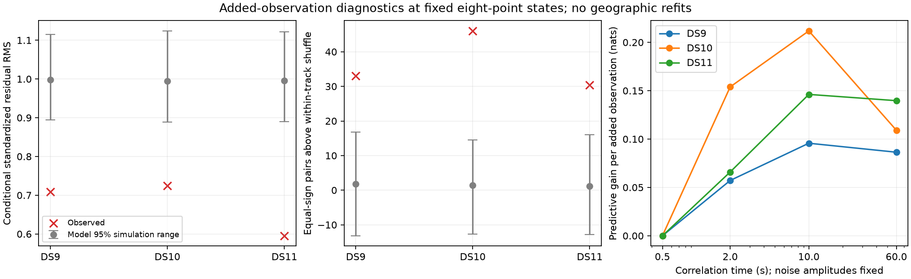

# Added observations expose a residual-model mismatch

At fixed eight-point fitted states and satellite identities, the added observations have **smaller residual magnitude but stronger temporal sign persistence** than simulations from the existing conditional model. A predeclared four-value correlation-time screen selects 10 seconds using donor datasets and improves conditional predictive density on every target. This motivates a covariance ablation; it is not a new geographic result or a promotion of sixteen-point fitting.

| Pilot | Checked tracks / added points | Standardized RMS | Model RMS 95% simulation range | Observed sign excess | Model sign-excess 95% range | Donor-selected time | Target predictive gain |
|---|---:|---:|---:|---:|---:|---:|---:|
| DS9 | 50 / 396 | 0.709 | 0.894–1.115 | 33.08 | −13.17–16.84 | 10 s | +0.096 nats/point |
| DS10 | 42 / 333 | 0.724 | 0.889–1.124 | 46.02 | −12.65–14.52 | 10 s | +0.212 nats/point |
| DS11 | 47 / 374 | 0.595 | 0.889–1.122 | 30.42 | −12.83–16.00 | 10 s | +0.146 nats/point |

These are descriptive conditional model checks, not independent significance tests. States and identities are fitted estimates, detection and track selection precede the check, and correlations between tracks are not integrated out. The reported simulation ranges condition on those fitted states and the model's independent-track assumption. They do not include geographic uncertainty or establish physical noise parameters.

## Exact conditional calculation

Transform the sixteen-point contrast vector into the original eight-point contrast coordinates plus one contrast for each added observation. Added contrasts subtract the first original observation, so the unknown constant frequency offset cancels. The transformation is invertible within the contrast space and retains the exact original marginal.

Partition residuals as `(r_old, r_new)` and the Student-t scale matrix as `[[A, Bᵀ], [B, D]]`. With original contrast dimension p and degrees of freedom ν = 4, the added residual conditional on the original residual has:

- Mean `B A⁻¹ r_old` and degrees of freedom `ν + p`.
- Scale `[(ν + r_oldᵀ A⁻¹ r_old)/(ν + p)] × (D − B A⁻¹ Bᵀ)`.

Its direct log density matches joint minus marginal log density to at most 4.27e-14 nats across the 139 checked tracks. The reconstructed original covariance agrees to at most 1.46e-11 Hz². Three mathematical tests verify conditional-density identity, marginal preservation/change of basis, and rejection of non-nested or duplicate IDs. Every checked fixed satellite remains eligible with the denser evidence.

The population is all signal-assigned tracks with added points in the same three pilot singles: 1,103 added observations. Two DS10 background-assigned tracks and one DS11 track with no added points are explicitly excluded from this conditional signal-model diagnostic. There is no deletion based on residual size or geographic error. This is not the full candidate/background predictive likelihood.

## Interpretation of magnitude and dependence

Innovations are divided by their conditional Student standard deviation, not by its scale parameter. DS11 has the smallest standardized RMS despite having the worst geographic regression in the denser fit. Thus that regression is not explained by uniformly larger added-point residuals under this diagnostic. It also does not follow that shrinking the noise scale would improve geography.

Sign excess is the observed number of consecutive equal-sign pairs minus its expected value after permuting signs within each track, retaining the track's sign counts. Positive excess alone could reflect the existing covariance. We therefore simulate 2,000 complete conditional datasets, retaining each track's full conditional covariance, Student shared scale and observation ordering. Their sign-excess ranges remain below the observed excess on all three pilots. This supports investigating residual dependence beyond the present covariance, while not identifying its physical cause.

## Frozen shape screen and transfer limits

The [screen plan](ADDED_COVARIANCE_SCREEN_PLAN.md) fixes times of 0.5, 2, 10 and 60 seconds before scoring. White and correlated amplitudes remain at their existing values, as do Student degrees, state, identity, point selection and all priors. The 0.5-second control exactly reproduces the original conditional scores, and every arm satisfies the joint/marginal density identity.

For each target, choose the time with the best equally weighted mean predictive density per added point on the other two datasets. Target added observations do not choose its time. All three choices are 10 seconds, an interior grid value; target gains are shown above. Each dataset still supplies its own original eight-point fitted state. This is covariance-parameter transfer conditional on fitted geometry, not geographic leave-one-dataset-out validation, independent site validation or untouched development data.

Earlier [temporal covariance work](../2026_09_28_correlated_residual_shadow/README.md) also favored 10 seconds under a different model and DS7/DS8/DS9 corpus. Its [geographic refits](../2026_09_28_covariance_position/README.md) had mixed accuracy outcomes. The current screen adds evidence on this exact nested-point model; it does not override that warning that predictive improvement need not improve location.

## Next discriminating control

Increasing correlation time changes both dependence and variance after removing a constant frequency offset. Before geographic refitting, compare the selected 10-second covariance with an independent-noise control having the same total variance in the dense contrast space for each track. Choose that control variance from the known time design and covariance matrix, without observing residuals or reference error. Recompute the exact eight-point marginal and conditional added-point density under both controls.

Trace matching will not equalize every conditional variance, so it is an informative ablation rather than a perfect causal separation. It tests whether the predictive gain requires temporal covariance beyond an overall change in effective contrast scale. Then freeze any bounded eight/sixteen-point covariance refit separately, retaining unchanged priors and numerical audits. No pairs/quads, new noise-scale fitting, thirty-two-point expansion or geographic selection is justified by the present screen alone.

Evidence: [conditional diagnostic](added-track-evidence-v1.json), [model-matched simulations](added-evidence-model-check-v1.json), [all covariance arms and donor selections](added-covariance-screen-v1.json), their SHA-256 sidecars, sources and parent bindings. All jobs are terminal; no localization fits or RF collection occurred in this diagnostic.
