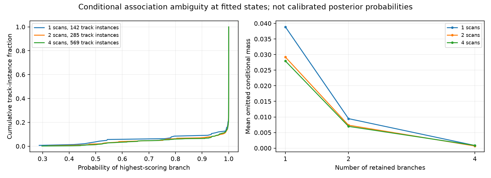

# A small but material subset of tracks retains association ambiguity

All nine metadata-first fixed-state diagnostics completed within their120second per-window caps, taking3.64–16.55seconds each. No state was refitted and no geographic reference was used. Most tracks strongly favor one branch at the fitted state, but about9–11percent have less than95percent conditional mass on their leading branch. This supports a bounded marginal-association experiment rather than assuming every hard assignment is effectively certain.

| Window size | Track instances | Leading mass below95% | Mean mass outside top1 / top2 / top4 | Worst mass outside top4 |
|---|---:|---:|---:|---:|
| Single | 142 | 15 (10.6%) | 3.89% / 0.95% / 0.085% | 8.58% |
| Pair | 285 | 25 (8.8%) | 2.92% / 0.74% / 0.069% | 7.68% |
| Quad | 569 | 49 (8.6%) | 2.79% / 0.70% / 0.087% | 10.81% |

These996track instances are correlated: observations recur across nested single/pair/quad windows. They are not996independent trials. Selected satellite epochs have been fitted while alternatives may remain near their priors, so these are conditional plug-in masses, not calibrated satellite posterior probabilities. They can understate ambiguity that would appear after profiling or integrating alternative nuisance parameters.

A top-four approximation loses little mass on average but as much as10.8percent on an individual track. A small average is insufficient justification for silently discarding those branches. Marginalization should retain the full catalogue unless an explicit approximation and its gradient error are validated.

## An exact full-catalogue prototype is feasible to test

The new experimental track score is `logsumexp(branch_scores)`. Its gradient is the probability-weighted sum of complete branch gradients, including visibility-dependent background terms. The signal residual derivatives use the repository's existing compact batch linearization with coordinates `[east, north, clock, drift0, drift1, epoch_i]`. Accumulating the first five columns and each satellite's epoch contribution avoids a dense candidate-by-global-state Jacobian. The visibility gradient likewise uses its existing linear-memory representation. No top-k branch cutoff is used.

Two mathematical tests pass: the compact visibility expectation matches the expanded branch-gradient sum, and the full marginal Student-t residual gradient matches finite differences. Three recorded-data checks then select the highest-entropy track from each first single, using only conditional entropy and no geography. They test east, north, clock, both drifts and the two leading signal-epoch coordinates. Maximum derivative discrepancies are3.12e-8 (DS9),6.78e-10 (DS10) and1.22e-9 (DS11), below the predeclared0.002 threshold. One full-catalogue track-gradient call takes0.015–0.073seconds in these checks; these are diagnostic timings, not optimizer performance.

An initial import-path test failure was fixed in the new module before the recorded checks; the frozen hard-model sources were not edited. The port is not yet connected to a full-window objective or fitting runner. Whole-window accumulation, priors, soft-objective auditing and matched-budget optimization remain to be verified. Passing track gradients is not evidence of a location improvement.

## Next experiment

First integrate the marginal score over a complete window and check its full gradient at saved single/pair/quad states. Then run a separately frozen model comparison from the same original baseline states and budgets, keeping visibility width, priors, fixed height and residual-curvature direction method unchanged. Compare the hard maximum objective with the marginal objective; do not compare their raw objective values as if they were the same model. The curvature based on leading residual branches would remain an approximate direction preconditioner, while the objective and gradient must include every branch.

Retain every timeout or failed audit. Numerical decisions must precede geographic scoring. Three single pilots followed by the same matched pair/quad pilots will test feasibility before any full-panel campaign. The continued original model remains the benchmark reference.

## Evidence

- [Sealed nine-window summary](association-ambiguity-summary-v1.json), individual source-bound probes under `association-ambiguity-v1/`, and [three diagnostic math tests](test_association_mass.py).
- [Full-catalogue marginal port](marginal_visibility_port.py), [two gradient tests](test_marginal_visibility_port.py) and [sealed recorded-track checks](marginal-visibility-gradient-check-v1.json).
- [Pre-diagnostic plan](ASSOCIATION_AMBIGUITY_PLAN.md), [complete hard-model window pilot](SHARED_WINDOW_PILOT_RESULTS.md), and [existing-mode ranking limits](MODE_RANKING_DIAGNOSTIC.md).
