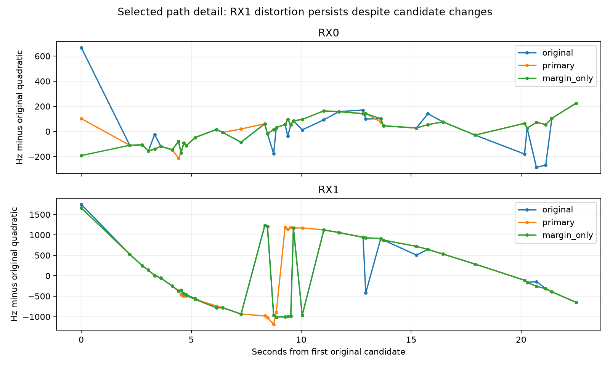

# Radio-only path search does not resolve the RX1 distortion

The public export recovered 351 margin-passing candidates across all 80 probe groups in the selected DS10 receiver pair, with 2–8 candidates per group. All 80 original candidates match exactly in every exported field. A second-order dynamic program finds different feasible paths, but RX1's large non-quadratic distortion remains. Do not promote this path rule to localization from this result.

| Path rule | RX0 changed / 40 | RX0 quadratic RMS | RX1 changed / 40 | RX1 quadratic RMS |
|---|---:|---:|---:|---:|
| Original | 0 | 158.8 Hz | 0 | 768.7 Hz |
| Primary: noise 100 Hz, acceleration 100 Hz/s² | 20 | 75.8 Hz | 19 | 765.4 Hz |
| Noise 300 Hz | 21 | 58.3 Hz | 18 | 762.1 Hz |
| Acceleration 300 Hz/s² | 21 | 75.2 Hz | 18 | 765.4 Hz |
| Highest margin per probe | 20 | 55.8 Hz | 8 | 776.9 Hz |

The primary RX1 path improves quadratic RMS by only 0.4%, despite changing nearly half the selected candidates. RX0 becomes smoother, but the margin-only control has smaller quadratic RMS than the primary path. That comparison does not contradict exact dynamic-programming optimality: the path objective penalizes local second-order innovations, not global quadratic RMS. Smoother radio data alone is not evidence of a correct satellite assignment or smaller geographic error.

## Model, controls and limitations

The exact finite-lattice search uses one candidate per probe group. It scores local slope changes with a fixed measurement-noise and acceleration scale and a weak relative-margin term. It uses candidate timestamps and RF-normalized frequencies only. No orbit prediction, satellite label or GPS enters the score. The complete formula and predeclared primary/control constants are in `CANDIDATE_PATH_PLAN.md`.

Coarse alias lifts are chosen nearest the original exported radio frequency at each probe. Consequently this is a conditional search in the original coarse band, not global trajectory reacquisition. Margin-passing public candidates are the only candidates available; absence from this export is not proof that the original raw detector had no alternative. Across-track source-group exclusivity is not yet implemented beyond this pair's disjoint RX probe groups.

The new path rule applies the ±15,000 Hz/s bound to adjacent measurements. The old trajectory builder applies its slope range to fitted line hypotheses and allows residual scatter; these are different admissibility rules. The original RX1 and margin-only paths violate the new adjacent-edge bound and therefore have infinite heuristic cost, represented as null in JSON. This does not invalidate the original exports. The new primary path is feasible, but feasibility does not remove the track distortion.

Local innovations overlap and are correlated. The score is a heuristic, not a calibrated probability. Neither its lower value nor the polynomial RMS supports a localization accuracy claim. The full candidate-band plot is `candidate-path-v1.png`; the detail figure excludes unselected candidates only for readable axes. Complete paths, candidate IDs and ablations are preserved in `candidate-path-v1.json` and its SHA sidecar.

## Verification and next step

Two binding tests reject missing, duplicate, corrupted or unexpected candidate groups while preserving alternatives. Three path tests verify exact agreement with exhaustive enumeration on an irregular-time lattice, frequency-offset invariance, and rejection when no slope-feasible path exists. Every reconstructed original frequency matches within 1e-7 Hz. Reader hashes match before/after export. The read-only export and bounded path job both completed successfully. No localization fit, RF collection or frozen input change ran.

This pair was selected after observing its failure, so this is diagnostic evidence only. Candidate substitution by itself has not fixed the problem. Next inspect whether the long RX1 track contains distinct coherent segments that warrant separate association, rather than forcing one satellite and one robust scale across the whole track. First test segmentation stability using only candidate/time evidence, with explicit complexity penalties and minimum support. Any resulting model must then be frozen and evaluated on metadata-selected blocks, followed by the same single/pair/quad benchmark. Do not delete this track or select segmentation using geographic error.
