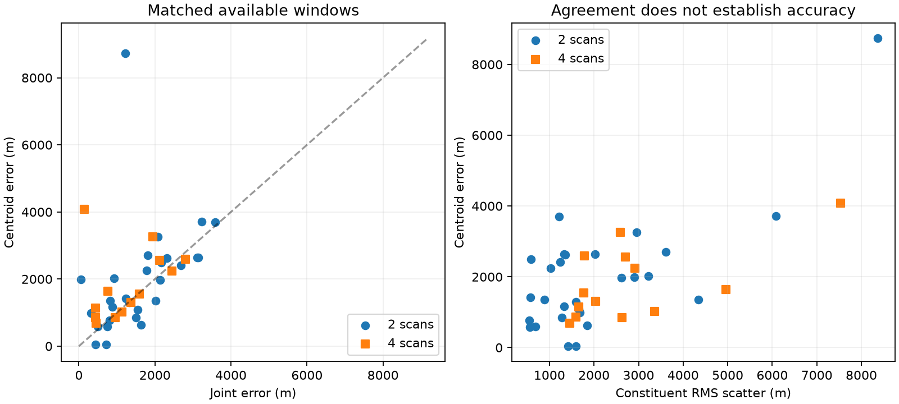

# Joint fitting earns its complexity over equal-weight averaging

The frozen no-refit ablation replaces the joint pair/quad location with the arithmetic mean of constituent single-fit E/N locations. It performs worse on matched median and p90 errors. Retain joint fitting. This is a deliberately simple control for the hypothesis that equal weighting might protect against overconfident scan likelihoods; it does not test all possible random-effects models.

Every constituent must have passed its original numerical audit. Failed singles are neither omitted nor replaced. All aggregate locations and availability decisions are fixed before reference scoring. The original three-start baseline is the comparator; no continuations or newer covariance models enter this study. Singles reproduce their original geographic errors within 1e-7 m.

| Window | Aggregate available / planned | Joint accepted / planned | Matched | Aggregate median / p90 | Joint median / p90 |
|---|---:|---:|---:|---:|---:|
| Single | 61/64 | 61/64 | 61 | 2,023 / 4,959 m | 2,023 / 4,959 m |
| Pair | 29/32 | 31/32 | 28 | 1,695 / 3,394 m | 1,519 / 3,123 m |
| Quad | 14/16 | 15/16 | 13 | 1,547 / 3,121 m | 1,136 / 2,378 m |

All error quantiles in this table use the matched population, which differs from the full baseline population. Among matched pairs, averaging improves 13 and worsens 15; among quads, it improves 6 and worsens 7. Median paired changes are +101 m and +232 m. A difference between two marginal medians is not the median paired change.

For DS10-B01-Q, constituent RMS scatter is 7,537 m, the centroid error is 4,086 m, and the joint error is 146 m. The joint fit can therefore extract a useful common location despite disagreement between independently selected single-scan modes. Conversely, DS11-B05-Q has 1,780 m scatter but a centroid error of 2,589 m. Agreement is not a calibrated confidence bound. These are descriptive examples chosen after viewing results, not selection rules for a new estimator.

## Model and limits

For scan estimates x_j in the common E/N frame, the ablation uses x_bar = sum(x_j)/n and scatter² = sum(||x_j-x_bar||²)/n. This is the location estimate under an isotropic equal-variance Gaussian model for these point estimates with a uniform position prior. It discards anisotropic geometry, competing modes, satellite associations and joint nuisance reoptimization. It is not a replacement likelihood for the raw observations.

The exact Euclidean identity mean(||x_j-x_ref||²) = ||x_bar-x_ref||² + scatter² separates centroid bias from within-window variation. Our geographic error column instead uses the same geographic distance helper as the baseline; we do not equate those two metrics or use this identity to calibrate geographic uncertainty. Shared bias remains invisible to scatter alone. Two or four points per block cannot establish a distribution of independent scan-specific errors, especially when local modes can be wrong.

Historical constituent inference costs are charged in full: matched pair medians are 85.3 s for constituent work versus 86.2 s for direct joint inference; quad medians are 165.3 versus 172.7 s. These exclude the tiny aggregation computation and subsequent audit/scoring and are not fresh cold timings or a new budget/convergence certification. If singles are already available, aggregation has little incremental computational cost, but the accuracy and availability losses remain.

Two tests pass: singleton identity/input validation and rotation/translation invariance with the variance decomposition. All 112 original window memberships and audit seals are checked; accepted constituent receipt hashes match the recorded audits. Reference helper and reference provenance hashes are verified. This analysis reuses original audits rather than rerunning their numerical checks. Outputs bind input and source hashes. No RF, orbit propagation or optimizer run was needed.

## Next hypothesis

A richer scan-discrepancy model must retain each scan's geometric likelihood and associations rather than treating its selected point as a sufficient statistic. Before fitting such a model, establish how it distinguishes scan-specific discrepancy from common geographic bias and satellite epoch errors. A proper zero-centered discrepancy prior alone cannot identify an unknown shared bias. Test that identifiability and the zero-discrepancy limit mathematically before paying for another panel of fits. The present result supports keeping joint inference and rejects promotion of equal-weight aggregation; it does not establish that extra discrepancy parameters will help.

Sources: [frozen plan](CENTROID_ABLATION_PLAN.md), [all window results and bindings](centroid-ablation-v1.json), [analysis code](centroid_ablation.py), and [baseline report](FULL_PANEL_BASELINE.md). All results remain development evidence against an unsurveyed operator reference, with overlapping windows within sixteen blocks.
