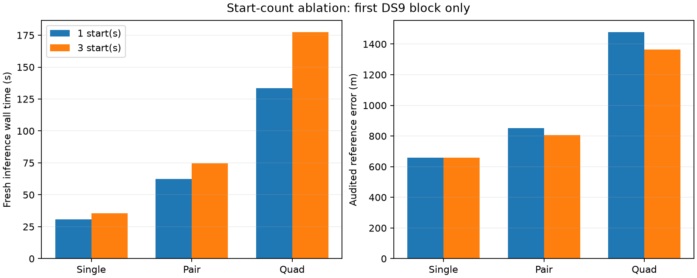

# One start saves measured time, with a modest accuracy cost in the first block

The three predeclared fresh-process comparisons are complete. All six outputs pass independent numerical audits. One start reduces observed wall time by 13%, 16% and 25% for the single, pair and quad, respectively. It gives identical single-scan error, but increases pair error by 46 m and quad error by 114 m. This supports a broader accuracy ablation, not immediate replacement of the three-start policy.

| DS9-B01 window | One / three starts accepted | Wall time, one / three | CPU time, one / three | Reference error, one / three |
|---|---|---:|---:|---:|
| Single S1 | Yes / Yes | 30.93 / 35.57 s | 29.70 / 34.63 s | 659 / 659 m |
| Pair D1 | Yes / Yes | 62.47 / 74.60 s | 59.72 / 71.86 s | 852 / 806 m |
| Quad Q | Yes / Yes | 133.64 / 177.56 s | 129.51 / 171.86 s | 1,479 / 1,365 m |

## Controlled change and verification

Both arms acquire from scratch using the original acquisition implementation, then initialize nuisance parameters to zero. Only the seed limit changes. The shared stationary position, independent scan clocks/drifts/satellite epochs, Student-t residual model, original uniform Sacramento prior, 100 ft MSL height, 64-iteration limit and external 90/180/360-second allowances remain fixed. No saved fitted state initializes either arm, and no faster-acquisition replacement enters this experiment.

Acquisition proposals are identical across both arms and the original baseline. First-fit states, assignments and objectives agree across arms. Additional summary checks verify that the one-start winner reproduces the saved original first fit and the three-start winner reproduces the saved original winner, within fixed numerical tolerances. Every equivalence check passes. Each independent audit checks physical input bindings, assignments, objective consistency and finite-difference stationarity before reference scoring.

The versioned runner has only four intended differences from the original: its description, a seed-limit argument, the recorded limit, and the fit-loop bound. A structural regression test verifies that isolation. Four additional tests cover summary failure handling and saved-prefix selection; two replay-materialization tests ensure that an unresolved first fit remains selected without mutating its parent receipt.

## What these results establish

The runtime benefit is now observed in fresh processes for all three window sizes, rather than inferred solely by subtracting saved fitting work. Measured savings are 4.64, 12.13 and 43.92 seconds. Timings cover process startup and inference from prepared inputs, excluding original observation/orbit preparation and the separately measured audit. The order alternates by window: (1,3), (3,1), (1,3). There is one measurement per arm, with uncontrolled host load and filesystem caches, so the percentages are observations rather than stable performance guarantees.

All windows belong to the same first DS9 block and share observations. They do not establish cross-dataset accuracy, independent geographic validation, or calibrated uncertainty. The unsurveyed operator reference is unchanged. In particular, the quad's error is higher than the pair's in this block, even though the full-panel distribution generally improves with more scans. More observations do not guarantee improvement for every realized case under this model.

The [expanded saved-fit screen](SEED_PREFIX_SCREEN.md) found position differences above 100 m in 13 singles, 6 pairs and 6 quads. Thus the next test is the [fixed first-start replay accuracy ablation](FIRST_START_REPLAY_PLAN.md): independently audit the original first fit in every window, without continuation, fallback or geographic selection. The first seven-window block is an implementation check before expanding in bounded batches. This replay will measure the accuracy/failure tradeoff, not a new cold-runtime distribution. The continued three-start model remains the full-panel reference; no published outcome is overwritten.

Artifacts: [sealed summary](cold-seed-limit-summary-v1.json), [summary and figure generator](summarize_cold_seed_limits.py), and all source, launch, receipt and audit files under `cold-seed-limit-v1/`. All cold pilot processes are terminal.

The first replay implementation check has also completed: all seven DS9-B01 first fits pass their independent audits. Parent hashes and exact preservation of the selected fit were verified for all seven; the three cold/replay cases have exactly matching reference errors. The [sealed block summary](first-start-replay-v1/DS9-B01/summary.json) records the outcomes. This seven-window result is partial, not the panel-wide ablation. DS10-B01 and DS11-B01 audits were launched next; consult `development-state.json` and its live process handle before resuming. Replay launch runtimes measure materialization only and must not be presented as inference speedups.
