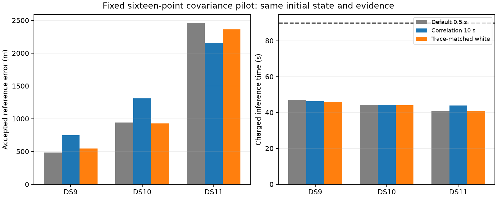

# Correlation improves prediction, but not consistently location

All six new covariance fits passed the original numerical audits. A 10-second correlation time improves conditional prediction on all three pilots, including against a control with matched total contrast scale. Geographic errors nevertheless worsen on DS9 and DS10 and improve on DS11 relative to the default sixteen-point model. Stop this covariance expansion; retain the existing full-panel baseline. Do not choose a different covariance for each dataset using reference errors.

## Hypothesis and scale control

The preceding added-point diagnostic found temporal residual dependence. The hypothesis was that modeling this dependence would improve both prediction and location. The earlier fixed-state screen selected 10 seconds using the other two datasets' predictive scores for each target, without target geographic errors.

For observation times t, the correlated arm uses C[i,j] = 100² I[i,j] + 100² exp(-|t[i]-t[j]|/10), in Hz². With dense Helmert contrast matrix B, the control uses C_white = v I, where v = trace(B C Bᵀ) / trace(B Bᵀ). This matches total contrast scale using only times and the covariance model. It does not match every conditional variance or geographic information direction. Both arms retain one multivariate Student-t distribution with four degrees of freedom per track; zero covariance correlation does not make its scalar components independent because they share a latent scale.

At the original eight-point fitted states and identities, the 139 eligible signal tracks provide 1,103 added observations:

| Pilot | 10 s gain over default, nats/added point | Matched-white gain | 10 s minus matched white |
|---|---:|---:|---:|
| DS9-B01-S1 | 0.0957 | 0.0169 | 0.0788 |
| DS10-B01-S1 | 0.2118 | -0.0185 | 0.2303 |
| DS11-B01-S1 | 0.1462 | 0.0324 | 0.1138 |

The correlation shape contributes beyond the matched scale. This is conditional prediction with fixed fitted geometry and associations, not independent geographic validation. Every conditional log density agrees with joint minus marginal density within 1e-8; trace matching errors are below 1e-7 Hz².

## Geographic refits

The [frozen plan](COVARIANCE_FIT_PILOT_PLAN.md) uses the same nested sixteen observations per track, original eight-point starting state, satellite catalogue, assignment policy, nuisance priors, Sacramento support, fixed height and optimizer for both new arms. The preceding default sixteen-point arm has the same evidence and starting state. Original cold inference work is charged to each warm refit within 90 seconds; audits run separately. These timings are historical sequential measurements, not cold speed comparisons.

| Pilot | Default 0.5 s error | 10 s error | Matched-white error | Charged times: default / 10 s / white |
|---|---:|---:|---:|---:|
| DS9-B01-S1 | 486 m | 749 m | 547 m | 46.9 / 46.3 / 46.0 s |
| DS10-B01-S1 | 940 m | 1,308 m | 929 m | 44.2 / 44.2 / 44.0 s |
| DS11-B01-S1 | 2,464 m | 2,158 m | 2,363 m | 40.7 / 43.8 / 40.9 s |

The DS11 improvement does not recover its original eight-point error of 1,628 m. There is no consistent geographic gain supporting full-panel, pair or quad expansion. Better residual prediction alone cannot establish better position: it changes the weighting of evidence in an already approximate model, and may favor residual directions that carry little useful geographic information.

## Verification and interpretation

Two scale-control tests and five admission/budget tests pass. Prerequisites check all 142 tracks in each covariance arm, including normalized signal/background densities and covariance construction. Full-objective finite differences at eight directions and two step sizes pass on all six scan/arm combinations; maximum error is 0.000134 against the unchanged 0.002 threshold. All six refits then pass separate objective, assignment, gradient and stationarity audits before geographic scoring. The summary verifies identical observations, parent receipts and initial states across arms and verifies frozen source/input hashes.

These are three previously exposed development singles, not a new test set. All use an operator location reference rather than a surveyed truth. No uncertainty calibration or generalization claim follows from acceptance. The experiment is useful negative evidence: further correlation-time tuning is not the next justified optimization. A subsequent investigation should target cross-scan disagreement and shared model bias, retaining the possibility that a nuisance model can improve fit without identifying the true location.

Evidence: [matched-scale screen](trace-matched-noise-screen-v1.json), [port prerequisites](covariance-port-check-v1.json), [audited fit summary](covariance-pilot-summary-v1.json), and per-fit sealed receipts in `covariance-pilot-v1/`. Earlier [added-point diagnostics](ADDED_EVIDENCE_RESULTS.md) and [denser fits](DENSER_PILOT_RESULTS.md) remain separate immutable experiments.
