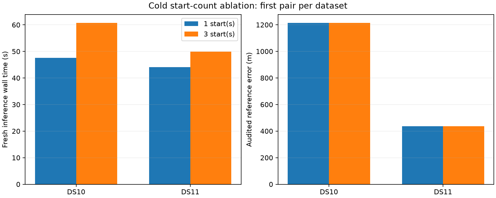

# Cold one-start pairs: lower measured cost, essentially unchanged locations

All four DS10/DS11 pair fits pass their independent audits, process limits and acquisition/saved-fit equivalence checks. One start reduces observed wall time by 21.8% on DS10 and 11.7% on DS11. Geographic errors are identical on DS10 and differ by approximately 3.7 cm on DS11. This supports the simpler policy on these two development windows without establishing a general accuracy or timing guarantee.

| First pair | One / three starts wall time | One / three starts CPU time | One / three starts error |
|---|---:|---:|---:|
| DS10-B01-D1 | 47.55 / 60.80 s | 47.50 / 60.72 s | 1,215.341 / 1,215.341 m |
| DS11-B01-D1 | 44.06 / 49.87 s | 44.01 / 49.83 s | 437.758 / 437.794 m |

Observed savings are 13.25 and 5.81 seconds. DS11's winning states are not exactly identical, although both arms' first fits agree within the unchanged tolerances and each winner reproduces its corresponding saved original fit.

The [frozen plan](CROSS_DATASET_COLD_SEED_PLAN.md) uses the unchanged scientific worker, acquisition, original eight-point evidence, nuisance priors, fixed 100 ft MSL height and 64-iteration limit. Both arms acquire from scratch and initialize nuisance parameters to zero. Only the number of optimized starting locations changes. Order is (1,3) for DS10 and (3,1) for DS11. Each inference and separate audit retains a 180-second external cap; all complete within their limits. No fit is retried or replaced.

Acquisition proposals match across both arms and the original baseline. First-fit state, assignments and objective agree across arms; the one-start winner matches the saved first fit and the three-start winner matches the saved original winner. State tolerance remains absolute 1e-5, objective tolerance 1e-6, with exact assignment equality. The summary verifies process outcomes and sealed launch/receipt/evaluation bindings plus frozen source/input hashes. The worker's structural isolation regression test passed before this staged campaign; no worker or scientific-source change occurred between stages.

Times include startup and inference from prepared inputs, excluding original extraction/propagation, coordinator preparation and separate audits. These are single measurements with uncontrolled host/cache conditions and fixed alternating order, not randomized speed estimates. The windows overlap the earlier single stage and were already exposed in development. Errors use the existing unsurveyed operator reference. The [full-panel first-start replay](FIRST_START_RESULTS.md) supplies broader accuracy/failure evidence; these fresh processes add implementation and runtime evidence.

The pair stage is terminal and all gates pass. The two fixed quad comparisons have now been launched sequentially. No quad result is inferred here. A queue-launch import error occurred before any quad process or output directory was created; correcting that shell orchestration did not change frozen scientific files, limits or outcomes.

Artifacts: [sealed pair summary](cross-dataset-cold-seed-pair-v1.json), [single-stage report](CROSS_DATASET_COLD_SINGLE_RESULTS.md), [comparison driver](check_cross_dataset_seed_limit.py), [stage summarizer](summarize_cross_dataset_cold_seeds.py), and completed pair directories under `cross-dataset-cold-seed-v1/`.
