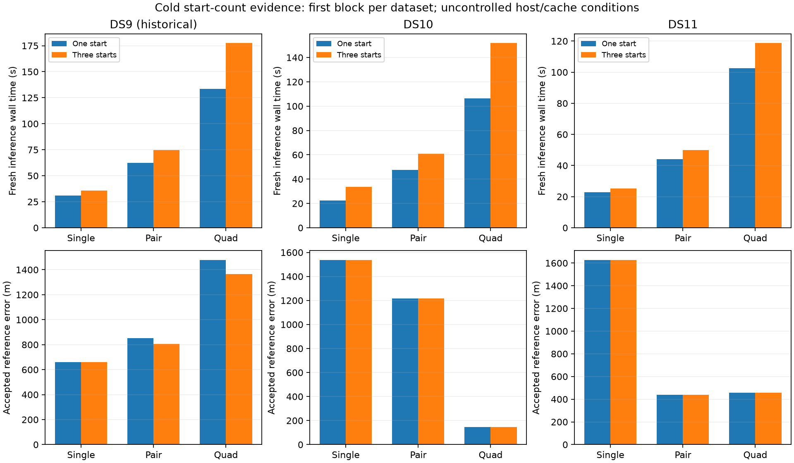

# Cold start-count comparison complete across datasets and window sizes

All twelve new DS10/DS11 cold fits pass their process limits, independent numerical audits and acquisition/saved-fit equivalence checks. Together with the six historical DS9 fits, all eighteen outcomes are accepted. One acquisition-ranked starting location saves observed wall time in every tested window, by 9–34%. Accuracy is essentially unchanged in the six new comparisons; the historical DS9 pair and quad have modest regressions. Keep one start as the leading simpler research configuration, with the original three-start arm preserved as a comparator.

## Every cold comparison

| Dataset / window | One / three starts wall time | Observed saving | One / three starts error |
|---|---:|---:|---:|
| DS9 single, historical | 30.93 / 35.57 s | 13.0% | 659 / 659 m |
| DS9 pair, historical | 62.47 / 74.60 s | 16.3% | 852 / 806 m |
| DS9 quad, historical | 133.64 / 177.56 s | 24.7% | 1,479 / 1,365 m |
| DS10 single | 22.31 / 33.55 s | 33.5% | 1,538 / 1,538 m |
| DS10 pair | 47.55 / 60.80 s | 21.8% | 1,215 / 1,215 m |
| DS10 quad | 106.28 / 151.90 s | 30.0% | 146 / 146 m |
| DS11 single | 22.90 / 25.29 s | 9.5% | 1,628 / 1,628 m |
| DS11 pair | 44.06 / 49.87 s | 11.7% | 438 / 438 m |
| DS11 quad | 102.60 / 118.74 s | 13.6% | 455 / 455 m |

The new quad CPU times are 106.18 / 151.76 seconds for DS10 and 102.55 / 118.64 seconds for DS11. Their one/three-start geographic errors are exactly equal in the recorded results. DS11 single and pair differences are about 6 mm and 3.7 cm; all other new comparisons have exact recorded error equality. Historical DS9 pair and quad errors worsen by 46 and 114 m. Rounded table equality should not be interpreted as universal equality of fitted states.

These are nine related windows from only three first blocks, not nine independent geographic trials. There is one timing observation per arm, with fixed alternating orders, uncontrolled host load/cache conditions and different collection times for the historical DS9 measurements. We do not pool them into a general speed guarantee or an accuracy confidence interval. Timings include process startup and inference from prepared inputs, excluding original observation/orbit extraction, coordinator preflight and separate audit.

## What changed

The physical model is unchanged: shared stationary horizontal position across each window; independent scan clocks, receiver drifts and satellite epoch parameters; hard satellite assignments alternating with a robust joint continuous fit. Both arms use the same uniform Sacramento prior, fixed 100 ft MSL height, eight-point track evidence and original acquisition implementation. Nuisances initialize to zero. The one-start arm optimizes only the first acquisition-ranked location; the three-start arm optimizes up to three and selects its lowest final objective. No fitted location or reference coordinate initializes either arm.

The [frozen plan](CROSS_DATASET_COLD_SEED_PLAN.md) admitted singles, pairs and quads in bounded stages, requiring the preceding stage's process, numerical and equivalence checks before expansion. All stages are terminal. Inference and separate audits retained their original 90/180/360-second process limits. No fit was retried, no failed result replaced and no numerical threshold relaxed.

Every comparison reproduces its original acquisition proposals and first-fit states, assignments and objectives. One-start winners match the saved original first fits; three-start winners match the saved original winners. State and objective tolerances remain absolute 1e-5 and 1e-6, with exact label equality. The unchanged worker's structural isolation test passes. The final overview verifies all stage-summary seals, input/source hashes and nested freeze bindings, and preserves process/fit/equivalence flags rather than assuming success from a receipt alone.

## Relation to full-panel accuracy

The [112-window first-start replay](FIRST_START_RESULTS.md) supplies broader development accuracy/failure evidence: one start accepts 61/64 singles, 32/32 pairs and 16/16 quads, versus 61/64, 31/32 and 15/16 for three starts. Accepted medians are 2,023 / 1,501 / 775 m versus 2,023 / 1,494 / 1,136 m. Acceptance populations differ; matched median error changes are zero. Most locations remain unchanged, while some improve or worsen. The cold results here validate selected replay outcomes and measure actual inference cost; they are not a full-panel cold benchmark.

One start therefore has stronger support as a lean research policy than the added covariance or scan-discrepancy models, whose geographic effects were mixed. It does not fix incorrect modes, DS11's broader errors, or uncertainty calibration. All error evidence still uses an exposed development corpus and an unsurveyed operator reference at one site. No production estimator is replaced.

## Next bounded experiment

The existing faster-acquisition implementation passed separate cold numerical-equivalence checks on the first DS9 single/pair/quad, but it has not been combined with this one-start policy across datasets. Inspect and test that composition separately: first verify identical proposals and likelihood behavior, then freeze a bounded cold comparison with the one-start worker held fixed. Do not add the separate measured percentage savings or infer the combined runtime without measurement. Keep this computational optimization separate from further likelihood changes.

Artifacts: [complete overview and bindings](cold-seed-cross-dataset-overview-v1.json), [overview generator](summarize_cold_seed_overview.py), [new quad-stage summary](cross-dataset-cold-seed-quad-v1.json), [single report](CROSS_DATASET_COLD_SINGLE_RESULTS.md), [pair report](CROSS_DATASET_COLD_PAIR_RESULTS.md), and [historical DS9 report](COLD_SEED_RESULTS.md). New cold receipts and audits are retained under `cross-dataset-cold-seed-v1/`.
