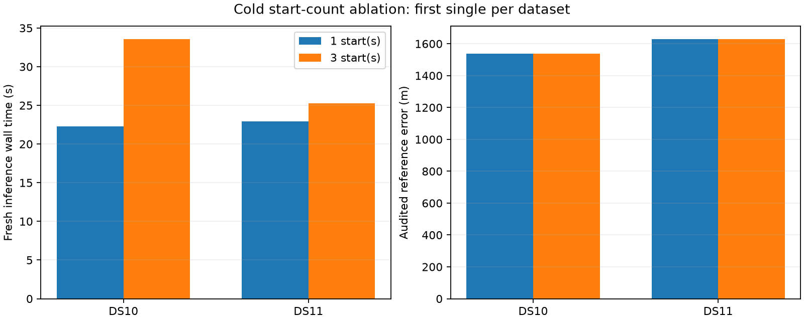

# One-start cold singles transfer to DS10 and DS11

All four new fresh-process single-scan fits pass their independent numerical audits and every acquisition/fit equivalence check. One start reduces observed wall time by 33.5% on DS10 and 9.5% on DS11, with unchanged error to meter precision. This extends the first-DS9-block cold evidence across datasets; it does not establish a stable runtime distribution or a fresh accuracy validation set.

| First single | One / three starts wall time | One / three starts CPU time | One / three starts error |
|---|---:|---:|---:|
| DS10-B01-S1 | 22.31 / 33.55 s | 22.24 / 32.02 s | 1,538.240 / 1,538.240 m |
| DS11-B01-S1 | 22.90 / 25.29 s | 22.87 / 25.26 s | 1,628.172 / 1,628.178 m |

Observed savings are 11.24 and 2.40 seconds. DS11's error difference is approximately 6 mm, not exact equality of the winning states. The three-start arm's first fit still agrees with the one-start fit within the fixed tolerances.

The [frozen cross-dataset plan](CROSS_DATASET_COLD_SEED_PLAN.md) keeps the original acquisition, eight-point likelihood, shared geographic support, nuisance priors, fixed 100 ft MSL height and 64-iteration limit. Both arms acquire from scratch and initialize nuisance parameters to zero. No saved location initializes inference and no faster acquisition implementation is substituted. The order is (3,1) for DS10 and (1,3) for DS11. Both inference and independent audits retain their 90-second process caps. The comparison driver differs from the historical DS9 driver only in membership/order, baseline path, output path and source/plan bindings; the scientific worker is unchanged. Its structural isolation regression test passes.

Acquired proposals agree across both arms and the original baseline. First-fit state, assignments and objective match across arms. The final summary also verifies each one-start winner against the saved original first fit, and each three-start winner against the saved original winner. All state comparisons use the original absolute 1e-5 tolerance, objectives 1e-6, and exact assignment equality. Launch, receipt and evaluation hashes and frozen sources/inputs are checked. Every numerical audit precedes geographic scoring. No failure was replaced and no retry was used.

Timing includes process setup and inference from prepared inputs, excluding the original radio/orbit extraction, coordinator preflight and separate audit. There is one measurement per arm, with uncontrolled host load and cache effects; reported percentages are observations, not speed guarantees. The two scans were already exposed in development and use the same unsurveyed operator reference as the baseline. They do not supersede the full-panel accuracy/failure ablation.

The [historical DS9 cold comparison](COLD_SEED_RESULTS.md) remains separate, as does the [completed 112-window first-start replay](FIRST_START_RESULTS.md). With this single stage passing, the fixed DS10/DS11 pair stage has been launched sequentially. Quad comparisons remain gated on the pair stage's process, numerical and equivalence results. No multi-scan result is implied by this report.

Artifacts: [sealed single-stage summary](cross-dataset-cold-seed-single-v1.json), [versioned driver](check_cross_dataset_seed_limit.py), [stage summarizer](summarize_cross_dataset_cold_seeds.py), and completed single-scan comparison directories under `cross-dataset-cold-seed-v1/`.
