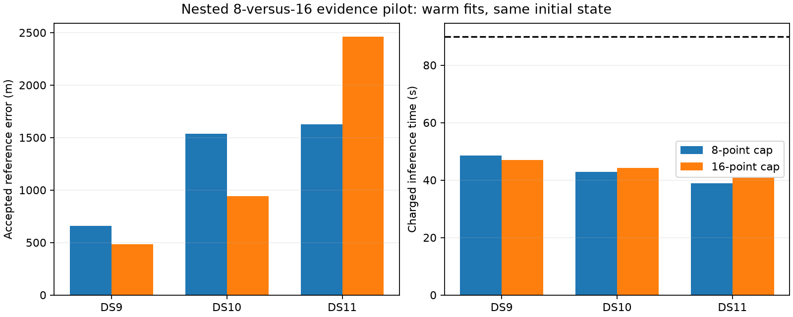

# Denser evidence improves two singles and worsens the third

All six pilot fits pass independent numerical audits within the charged 90-second allowance. Sixteen nested points improve DS9 and DS10, but DS11 worsens by 836 m. Do not promote this evidence policy or automatically expand to pairs/quads on this three-case result. The next useful test is a conditional predictive diagnostic for the added observations, keeping the original model outcomes intact.

| First single | Error, 8 / 16 points | Change | Charged time, 8 / 16 | Iterations, 8 / 16 |
|---|---:|---:|---:|---:|
| DS9-B01-S1 | 659 / 486 m | −173 m | 48.50 / 46.92 s | 1 / 11 |
| DS10-B01-S1 | 1,538 / 940 m | −598 m | 42.89 / 44.24 s | 2 / 9 |
| DS11-B01-S1 | 1,628 / 2,464 m | +836 m | 38.84 / 40.70 s | 1 / 8 |

These are exposed, metadata-first development singles. Three cases do not establish a population accuracy distribution, calibrated uncertainty or geographic generalization. Reporting only the improved median would obscure the DS11 regression.

## Controlled experiment

Both arms start from the same original three-start winner, including its nuisance coordinates. The eight-point arm is a control refit; the sixteen-point arm preserves every original selected observation and adds deterministic time-coverage points. Neither arm initializes the other. The robust Student-t4 likelihood, hard association, covariance, priors, fixed height, geographic support and optimizer remain unchanged.

Original cold work is charged to each arm independently. Incremental launch times are 7.21 / 3.24 / 3.00 seconds for controls and 5.63 / 4.59 / 4.86 seconds for denser fits. The smaller DS9 dense wall time despite more iterations is not evidence that denser fitting is cheaper: these sequential timings include setup and uncontrolled system variation. All controls were already near stationary states. This is a warm local-model experiment, not a cold acquisition benchmark.

Source/input gates, parent/initial-state bindings, nested physical IDs and budgets are verified. Each fresh audit reconstructs the model and checks support, assignments, objective consistency, monotonicity and finite-difference stationarity before reference scoring. Five policy tests pass for budget subtraction and invalid/insufficient-budget rejection, supplementing seven selector tests and the recorded numerical prerequisites. No tolerance or model was changed after seeing results.

## The fitted states reveal different mechanisms

Re-evaluate each model at both fitted states. The entries below are objective changes **within the same model** when moving from the eight-point state to the sixteen-point state; negative is better. They are not comparisons of absolute likelihoods across observation dimensions.

| Pilot | Eight-point objective change | Sixteen-point objective change | Nuisance prior penalty increase | Endpoint satellite-label changes |
|---|---:|---:|---:|---:|
| DS9 | −1.433 | −16.803 | +15.361 | 2 |
| DS10 | +6.578 | −11.879 | +19.257 | 1 |
| DS11 | +3.893 | −7.468 | +5.634 | 0 |

DS9's dense result is a feasible state with a lower original eight-point objective, proving the original local fit did not find the best available eight-point objective. It does not establish global optimality. Using this state in an eight-point estimator would draw on extra observations and must not be reported as a pure eight-point result.

DS11 moves 1,038 m between endpoints without changing endpoint assignments. Under its sixteen-point model, negative log likelihood improves by 13.103 units while the prior penalty increases by 5.634, giving net objective improvement 7.468. Under eight points, the likelihood improvement is only 1.741, so the same prior increase makes the new state worse. Satellite-epoch penalties account for 4.905 of that increase; receiver-drift and clock penalties account for the rest. This identifies a continuous evidence/prior tradeoff at these endpoints, not a physical timing fault or proof that priors should be widened. Endpoint agreement also does not prove labels never changed during optimization.

DS10 likewise prefers different states under the two evidence models, with a larger epoch-penalty increase and one endpoint label change. Its geographic improvement does not establish that the same tradeoff will help DS11 or other scans.

## Next diagnostic before expansion

Keep the original eight-point state and identities fixed. Express the sixteen-point data as the original seven independent contrasts plus contrasts for the added points. Under the existing multivariate Student-t model, compute the normalized predictive density of the added contrasts conditional on the original ones. Verify the conditional density against the joint/marginal density ratio and verify exact reconstruction of the eight-point marginal covariance.

Apply this to all three pilots using the same metadata-selected cases. Inspect conditional residual magnitude and temporal structure without deleting tracks, selecting by reference error or retuning covariance on these outcomes. Fitted-state uncertainty and possibly incorrect identities limit interpretation: a predictive discrepancy need not identify measurement noise. The diagnostic can tell us whether the added evidence is surprising under the current residual assumptions; it cannot by itself prove a geographic improvement. Any covariance or nuisance-prior change must become a separate frozen ablation.

The [sealed pilot summary](denser-pilot-summary-v1.json), [within-model state diagnostic](denser-state-tension-v1.json), source freezes, logs and independent audit receipts preserve all outcomes. The full first-start benchmark and every original fit remain unchanged. All pilot and diagnostic jobs are terminal. No denser pair/quad, thirty-two-point or cold acquisition campaign is running.
