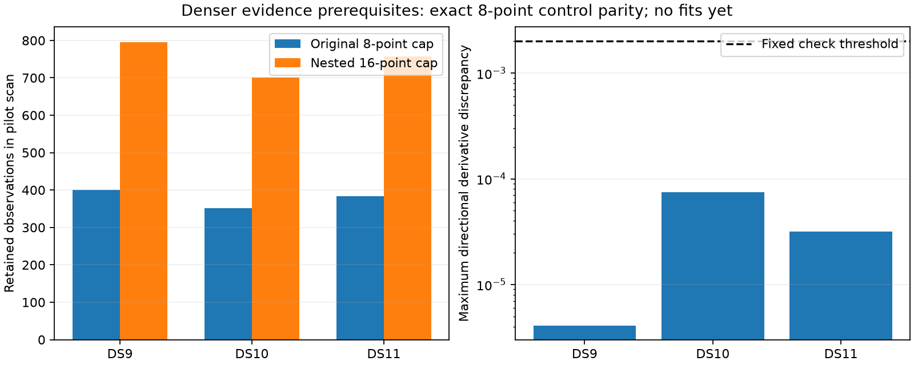

# Nested denser evidence passes recorded numerical prerequisites

The eight-point control exactly reproduces the original scores and predictions on all 142 tracks in the three metadata-first DS9/DS10/DS11 singles. The nested sixteen-point ports retain every original selected observation and pass covariance, background normalization, signal density and finite-difference checks. This establishes readiness for a bounded fit pilot; it does not establish improved position accuracy, runtime or uncertainty calibration.

| Pilot single | Tracks | Original / nested points | Maximum eight-point score/prediction discrepancy | Maximum full-objective derivative discrepancy |
|---|---:|---:|---:|---:|
| DS9-B01-S1 | 50 | 400 / 796 | 0 / 0 | 4.10e-6 |
| DS10-B01-S1 | 44 | 352 / 701 | 0 / 0 | 7.46e-5 |
| DS11-B01-S1 | 48 | 383 / 757 | 0 / 0 | 3.16e-5 |

## Selection and model

Begin with the original time-spread selection of at most eight physical observations per track. Repeatedly add the observation farthest in time from the selected set, breaking ties in chronological order and then original index order. Return the selected observations chronologically. This preserves the original eight, supports nested sixteen/thirty-two-point sets, and retains all observations when a track is shorter than the requested cap. Seven tests cover nesting, exact baseline retention, extension consistency, ordering, tied times, short tracks and invalid inputs.

Rebuild the existing `TrackPort` on the selected subset with its matching point limit. The physical model, satellite bank, fixed height, priors, Student-t4 residual family and temporal covariance are unchanged. Only evidence selection/dimension changes. Port construction checks that the likelihood uses exactly the requested IDs and rejects reuse of physical observations across tracks.

For every dense track, the check reconstructs the raw temporal covariance and its contrasted form, verifies the signal/background covariance dimensions, checks background Student-t normalization independently through a Cholesky/log-gamma formula, and verifies that visible-satellite and background prior masses sum to one. The eight-point control checks all branch scores and every originally selected signal prediction, including its Jacobian and covariance. One dense signal branch per dataset additionally passes independent density and six-coordinate derivative checks.

## Whole-scan derivative check

The full objective includes all track branches, background likelihoods and the complete Gaussian nuisance prior. Its analytic gradient is compared with central finite differences in the two position axes, clock, two receiver drifts and three deterministic active-epoch directions. Both 0.0005 and 0.0001 steps are checked. The objective recomputes all branch scores and requires assignments to remain unchanged at each perturbation; an association crossing would fail this prerequisite as inconclusive rather than being hidden by conditioning on an obsolete label.

All discrepancies are below the frozen 0.002 threshold. These are local directional checks at saved states, not an exhaustive Jacobian test, stationarity result, or proof of global smoothness. The original hard visibility rule remains piecewise constant. Any horizon discontinuity or unresolved fit encountered later must remain a reported failure; this evidence does not justify loosening the audit.

The scripts read no reference coordinates, run no localization optimization and collect no RF. Source/input bindings are sealed in [port checks](denser-track-port-check-v1.json) and [whole-scan checks](denser-scan-objective-check-v1.json). The implementation and checks are now frozen; changes require versioning.

## Next bounded test

Follow the [denser-evidence plan](DENSER_TRACK_EVIDENCE_PLAN.md): separately refit eight- and sixteen-point controls from the same original state on these three singles, retaining original acquisition work in the time accounting. Hold optimizer, priors, visibility and all other policies fixed. Independently audit each outcome before geographic scoring. Label the result as a warm local-model diagnostic, not a cold pipeline benchmark. Do not compare raw objective values across different observation dimensions, and do not expand to pairs/quads or thirty-two points merely because these prerequisite checks passed.

No denser localization fits have run yet; all prerequisite processes are terminal.
