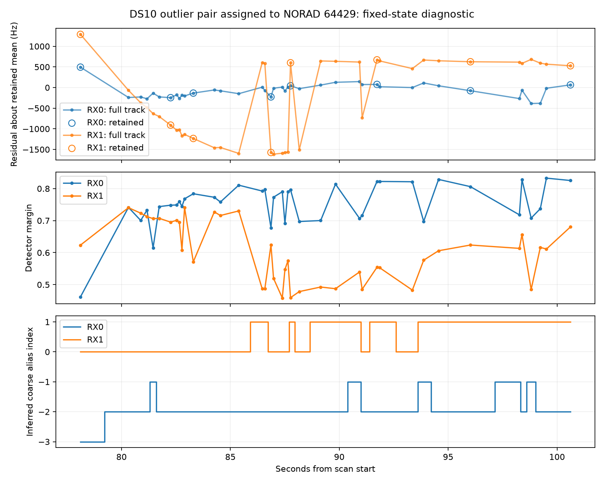

# DS10 outlier: switching structure survives coarse de-aliasing

The selected RX1 track is not well described by a single extra drift. Its full 40-observation residual has repeated approximately 2.2 kHz switches. These coincide with changes between inferred coarse-alias indices zero and one. RX0 is substantially steadier over the same 22.5-second span.

| Receiver | Full observations / retained | Full centered RMS | RMS after descriptive linear fit | Largest adjacent residual change |
|---|---:|---:|---:|---:|
| RX0 | 40 / 8 | 165 Hz | 164 Hz | 736 Hz |
| RX1 | 40 / 8 | 946 Hz | 808 Hz | 2,204 Hz |

The original eight retained observations sample both RX1 branches. Their centered RMS is 998 Hz and remains 966 Hz after a descriptive linear fit. The fitted slope differs materially between full and retained samples (80.3 versus 36.1 Hz/s), another reason not to interpret it as a measured receiver drift. RX0's corresponding full/retained slopes are 1.35 and −5.39 Hz/s.

## Alias audit

The pinned trajectory config has canonical RF 11.2 GHz, base alias spacing 227,272.727 Hz and a 2,500 Hz track residual gate. Source inspection verifies that the lane's coarse alias spacing is scaled by canonical RF / actual RF. For this pair it is 232,249.502 Hz. Algebraically reconstructing the integer alias from scaled raw CFO minus exported normalized de-aliased CFO agrees with integers within 4.45e-16. Source snapshot, config and verified reader hashes are retained in `ds10-pair-summary-v1.json`.

The observed 2.2 kHz residual switches are therefore not an omitted whole coarse-alias correction: that correction is already present in the frozen export. The remaining switches fit inside the public trajectory builder's 2.5 kHz residual tolerance. This suggests inspecting candidate-path continuity or mixed trajectory membership; it does not prove the detector's cause, a particular replacement candidate, or true satellite identity. Alias indices were reconstructed from the verified public formula, not independently exported from the graph.

## Scope and verification

This pair was chosen after finding it contributes over 99% of the matched DS10 residual energies. It is an outlier-selected diagnostic, not an unbiased accuracy evaluation. Predictions retain the original state, satellite 64429 assignment, receiver drift, time shifts, height and orbit inputs. Centered residuals remove the retained-sample mean only. Full observations are used for inspection, not a denser localization fit. No point was removed, no measurement changed, and no GPS score was computed.

The direct Doppler calculation is checked against the original prediction contrasts to 1e-6 Hz; all joins and source/input seals pass. The worker and public-source inspection completed successfully under bounded limits. The alias reconstruction provides a separate check of RF normalization. Existing numerical contrast tests cover offset invariance and covariance propagation; the reporting script introduces no estimator change.

## Next model direction

Test candidate-path continuity before fitting another clock or variance parameter. Retrieve competing public candidates for these same probes, preserve their source-group exclusivity, and determine whether a coherent alternative path exists using only RF/time evidence. An improvement confined to this selected case would be insufficient: freeze a general path policy and compare it on metadata-selected blocks, then singles/pairs/quads with the same prior and compute accounting.

The mathematical distinction matters: the current localization model assigns one satellite and one robust residual scale to an entire exported track. A track that switches measurement branches can violate that unit of association. Candidate-level path selection or explicit track segmentation addresses that assumption; simply widening a global timing prior does not. This remains a hypothesis pending candidate evidence, not a model promotion.
