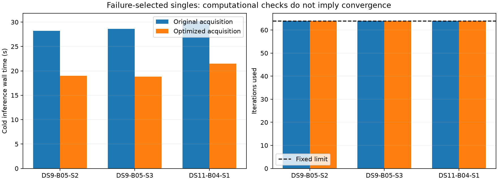

# Optimized acquisition preserves all three unresolved first starts

All three computational-equivalence comparisons pass, while all six localization fits remain numerically rejected. Optimized acquisition reproduces the same 64-iteration failures with exactly equal recorded final states and full objective histories. Observed inference wall time falls by 29–34%. This extends the earlier successful-window checks to every unresolved single in the first-start development panel; it does not recover any failed location.

| Failure-selected single | Original / optimized wall time | Original / optimized CPU time | Wall reduction | Fit outcome, both arms |
|---|---:|---:|---:|---|
| DS9-B05-S2 | 28.22 / 18.97 s | 28.19 / 18.93 s | 32.8% | Rejected; 64-iteration limit |
| DS9-B05-S3 | 28.62 / 18.81 s | 28.60 / 18.75 s | 34.3% | Rejected; 64-iteration limit |
| DS11-B04-S1 | 30.27 / 21.49 s | 30.22 / 21.44 s | 29.0% | Rejected; 64-iteration limit |

There are no geographic error estimates for these unresolved fits. They remain in the denominator, and the full-panel one-start acceptance result remains 61/64 singles. DS11-B04-S1's original three-start winner passed, but its first fit did not: this experiment deliberately compares the saved first fit, not that later winner.

## Hypothesis and controlled model

The [plan](FAILURE_COMPOSITION_PLAN.md) selected exactly the three unresolved singles from the sealed first-start replay, using numerical status rather than geography. The hypothesis was that the computational substitution would preserve failed trajectories as well as successful ones. This is a failure-selected diagnostic, not a representative performance or accuracy sample.

Both arms use the existing one-start worker, with original or optimized acquisition respectively. The shared-position robust physical model, hard associations, scan nuisance priors, eight-point evidence, uniform Sacramento disk, fixed 100 ft MSL height, 64 iterations and 90-second inference cap are unchanged. Original/optimized order is used on DS9-B05-S2 and DS11-B04-S1; the order is reversed on DS9-B05-S3. Runs are sequential under the shared lock. No retries, continuation, fallback or relaxed tolerances occurred.

All three prerequisite checks finish before any fits. They cover 43 / 41 / 42 track appearances, 126 in total. Finite and visibility masks agree exactly at nine fixed prior positions plus saved acquisition seeds. The maximum score error is 1.18e-10, below 1e-6. Complete optimized acquisition reproduces seeds, requested/unique counts and spacing exactly, with scores within tolerance. These checks do not run localization or geographic scoring.

## Verification distinguishes failure preservation from acceptance

Seven tests pass. They require more than equal rejection flags: changed trajectories, states, assignments, stop reasons, iteration counts, proposals, observation bindings, timeouts, missing receipts, wrong audit failures or geographic scoring of a rejected fit cannot pass equivalence.

Each real comparison passes all twenty-three flags. Both inference and audit processes complete within their separate 90-second limits. Both arms preserve model bindings/configuration, a single fitted seed, the saved first-fit assignments and stop condition, final states within 1e-5 and full objective histories within 1e-6. Cross-arm state and history differences are exactly zero in the recorded output. Receipt, launch, audit and source/input hashes are verified again by the summary generator.

The original auditor rejects specifically at `unresolved` status. It therefore does not perform its later stationarity/gradient calculation on these states. A completed audit process and a passing equivalence check must not be described as a numerically accepted location. Its geographic error field stays null. All six cold fits and six audit subprocesses are terminal.

## What this suggests next

The failures are preserved iteration-limit outcomes, rather than acquisition changes or process-budget failures. In the saved first-fit histories, objective decrease on the last accepted step is 1.97e-6 / 5.78e-7 / 4.37e-6 respectively. All three still show decreasing objectives near iteration 64. This is evidence for testing a bounded extension, not proof that a longer fit will converge, improve accuracy or pass the finite-difference audit.

A useful next policy ablation is to allow up to 96 iterations for one optimized-acquisition start while retaining the original 90-second total process budget and every acceptance threshold. Freeze the three unresolved cases and successful first-single controls from all three datasets before running it. Compare against the existing 64-iteration receipts, preserve the original proposal and objective prefix, and verify that controls which stopped before 64 remain unchanged. Only independently accepted outputs may then receive reference scores. This changes optimization effort, not the statistical likelihood; it should remain separate from the completed equivalence experiment.

The current timing evidence is one observation per arm with fixed alternating order and uncontrolled host/cache effects. Inference excludes earlier data extraction, prerequisites and separate audits. These are exposed development scans from one unsurveyed operator reference site. The successful-window and failure-selected timing samples should not be pooled into a general speed distribution. Production and all historical results remain unchanged.

Artifacts: [sealed summary](failure-composition-summary-v1.json), [comparison driver](check_failure_composition.py), [preservation checks](failure_composition_checks.py), [tests](test_failure_composition_checks.py), [prerequisites](check_failure_composition_prerequisite.py), [figure generator](summarize_failure_composition.py), and sealed per-arm receipts under `failure-composition-cold-v1/`. The preceding [single/pair/quad computational comparison](ACQUISITION_COMPOSITION_RESULTS.md) retains its eighteen accepted outcomes separately.
