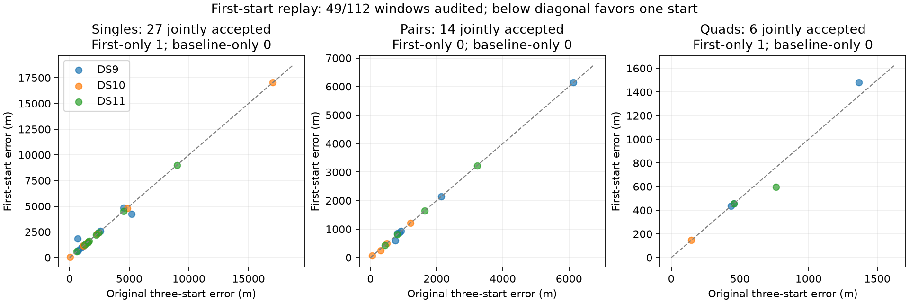

# First-start replay: seven blocks audited

The first 49 of 112 frozen windows have independent first-start audits: 28 singles, 14 pairs and 7 quads. All 49 pass. The corresponding original three-start selection passes 47/49. This is partial development evidence, with 63 windows still pending; it does not replace the full-panel baseline or establish that one start is globally preferable.

| Window | Accepted, first / original | Median error, first / original | p90 error, first / original | Within 1 km, first / original |
|---|---:|---:|---:|---:|
| Single | 28/28 / 27/28 | 1,583 / 1,538 m | 5,543 / 4,978 m | 5/28 / 6/28 |
| Pair | 14/14 / 14/14 | 867 / 849 m | 2,898 / 2,898 m | 9/14 / 9/14 |
| Quad | 7/7 / 6/7 | 455 / 455 m | 949 / 1,064 m | 6/7 / 5/7 |

Quantiles condition on acceptance, so the single and quad populations differ between arms. Within-threshold denominators include every window in this completed subset. These are neither 49 independent trials nor an unbiased new test set: windows overlap, earlier baseline outcomes were already inspected, and every reference is the same unsurveyed operator site.

Among jointly accepted cases, first-start errors improve by more than 1 m in 4 singles, 2 pairs and 1 quad, and worsen by more than 1 m in 2 singles, 1 pair and 1 quad. The remaining 21 singles, 11 pairs and 4 quads are within 1 m. The median matched change is zero for every window size. More successful convergence alone does not establish a useful accuracy improvement.

## Why the acceptance changes

The original rule chooses the lowest objective among all fitted starts, even when that result has not converged. The one-start policy selects the first acquisition-ranked fit unconditionally. It does not choose the first converged result, use an error threshold, or fall back after failure.

DS10-B02-Q's first fit passes its audit at 182 m error, while the original selected fit is unresolved. DS9-B03-S3's first fit also passes, but is 7,189 m from the reference. Both acceptance differences remain visible; neither supplies an error for the original rejected output. The maximum accepted single error in this subset is still 17,038 m for both policies. A numerically stationary fit is not a calibrated indication of location accuracy.

The comparator here is the original three-start result without continuation. The separate continued baseline can improve an unresolved selected mode, but adding continuation to just one side would confound this start-count ablation. No original outcome has been overwritten.

## Model, provenance and costs

The physical model, prior support, fixed height, nuisance priors, residual likelihood and hard associations are unchanged. We copy only the original first fitted state into an explicitly labelled replay receipt and run the original independent numerical audit in a new bounded process. Parent seals, exact fit preservation, launch bindings, source/input hashes, audit receipts and original evaluation bindings are verified by the summarizer before reporting. Missing or failed audits remain failures and have no geographic score.

No optimization or acquisition is performed in this replay. Runtime fields in its evaluation receipts describe materialization, not inference. The [separate cold pilot](COLD_SEED_RESULTS.md) provides the limited measured runtime evidence. The summarizer has two passing tests for planned denominators, asymmetric failures, absent accepted results and the matched tie tolerance; the replay helper's two tests preserve unresolved first fits and immutable parents.

The completed blocks are DS9-B01/B02/B03, DS10-B01/B02 and DS11-B01/B02. The next bounded batch is DS10-B03, DS11-B03, DS9-B04 and DS10-B04, in that order. Continue the [unchanged plan](FIRST_START_REPLAY_PLAN.md) across all sixteen blocks before deciding the panel-wide tradeoff; do not stop because this early subset looks favorable or unfavorable.

Evidence: [sealed 49-window summary](first-start-seven-blocks-v1.json), [summary/figure script](summarize_first_start_replay.py), and block receipts under `first-start-replay-v1/`. The completed batch process is terminal; the next batch may be running, as recorded in `development-state.json`.
