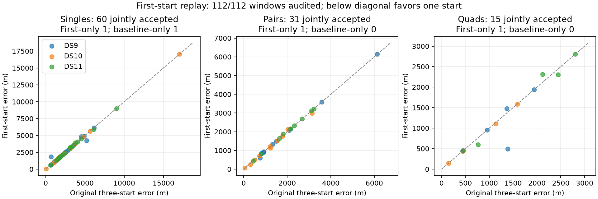

# Full-panel start-count ablation supports a simpler research configuration

All 112 frozen windows have completed independent first-start audits. One acquisition-ranked start accepts 109/112 outputs versus 107/112 for the original three-start selection. The strongest result is for quads: all sixteen pass, with median error 775 m and p90 2,310 m. Single-scan performance is mixed, and there is no calibrated geographic uncertainty claim. One start is the leading reduced-search configuration for further experiments, while the original and continued baselines remain preserved reference arms.

| Window | Accepted, one / three starts | Median error, one / three | p90 error, one / three | Within 1 km, one / three | Within 3 km, one / three |
|---|---:|---:|---:|---:|---:|
| Single | 61/64 / 61/64 | 2,023 / 2,023 m | 4,901 / 4,959 m | 6/64 / 7/64 | 42/64 / 42/64 |
| Pair | 32/32 / 31/32 | 1,501 / 1,494 m | 3,104 / 3,137 m | 12/32 / 12/32 | 28/32 / 26/32 |
| Quad | 16/16 / 15/16 | 775 / 1,136 m | 2,310 / 2,312 m | 9/16 / 7/16 | 16/16 / 15/16 |

Error quantiles condition on acceptance; within-threshold fractions retain every planned window. These are correlated development windows made from the same 64 scans, not 112 independent tests. All use the exposed, unsurveyed operator reference at one site.

## What changed, and why the medians need care

Select `fits[0]` from each original receipt without consulting convergence, objective, reference location or geographic error. This is the acquisition-ranked first start, initialized with zero nuisance coordinates. The original policy selects the lowest final objective among up to three fits, including unresolved fits. We independently audit the selected first fit; there is no fallback or continuation.

The physical model remains a shared stationary horizontal position within each window, with independent scan clocks, receiver drifts and satellite epoch offsets, hard satellite assignments and a joint robust continuous fit. The uniform Sacramento disk and fixed 100 ft MSL height remain unchanged. This is a search-policy ablation, not a new likelihood or prior.

| Jointly accepted comparison | One start improves >1 m | Worsens >1 m | Within 1 m | Median paired change |
|---|---:|---:|---:|---:|
| Singles, 60 | 6 | 6 | 48 | 0 m |
| Pairs, 31 | 6 | 3 | 22 | 0 m |
| Quads, 15 | 4 | 2 | 9 | 0 m |

On the same fifteen accepted quads, the median is 953 m for one start versus 1,136 m for three; adding the newly accepted 182 m case lowers the one-start median to 775 m. Thus the headline median improvement reflects both changed solutions and changed acceptance. It is not a uniform 361 m improvement per block. DS9-B05-Q improves by 892 m; two jointly accepted quads worsen by 114 and 198 m. Most matched estimates are unchanged.

## Every acceptance difference is retained

- DS9-B03-S3 passes only under one start, at 7,189 m error. It is numerically accepted but inaccurate.
- DS11-B04-S1 is unresolved under one start; the original three-start winner passes at 4,959 m. Its first-start geographic error is not reported.
- DS9-B05-S2 and DS9-B05-S3 remain unresolved under both policies.
- DS11-B04-D1 passes only under one start, at 2,163 m.
- DS10-B02-Q passes only under one start, at 182 m.

The maximum accepted errors remain 17,038 m, 6,139 m and 2,803 m for singles, pairs and quads. Reduced search does not solve incorrect local modes or make a convergence flag trustworthy as a location-confidence estimate.

The original continued baseline is a separate policy with additional optimization. It accepts all windows and has median errors 1,972 / 1,410 / 1,044 m. Those values provide context, not the controlled start-count comparison: continuation is absent from both arms in the table above. The complete continuation record, including its 46 km single-scan error, remains unchanged.

## Dataset variation remains substantial

| Dataset | One-start singles accepted; median / p90 | Pairs accepted; median / p90 | Quads accepted; median / p90 |
|---|---:|---:|---:|
| DS9 | 22/24; 2,007 / 4,894 m | 12/12; 1,127 / 3,440 m | 6/6; 723 / 1,711 m |
| DS10 | 20/20; 1,724 / 4,867 m | 10/10; 1,171 / 2,214 m | 5/5; 443 / 1,395 m |
| DS11 | 19/20; 2,460 / 4,809 m | 10/10; 2,162 / 3,127 m | 5/5; 2,308 / 2,607 m |

DS11's quad errors remain materially higher. Five blocks do not identify hardware, geometry, orbit or residual-model error as the cause. The result supports investigating the available measurement evidence rather than repeatedly searching the same objective more aggressively.

## Cost evidence and next experiment

This full-panel analysis reuses saved first fits and runs fresh numerical audits. Its receipt launch times describe materialization, not acquisition or inference. The separate [cold pilot](COLD_SEED_RESULTS.md) measured one-start wall times of 30.93 / 62.47 / 133.64 seconds versus 35.57 / 74.60 / 177.56 seconds for three starts on the first DS9 single/pair/quad. All six passed, with unchanged original acquisition. These observed 13–25% savings are limited to one related block and uncontrolled host/cache conditions; they are not a measured full-panel runtime distribution.

The ablation warrants keeping one start as a simpler candidate for subsequent experiments, especially for quads. It does not warrant weakening acceptance rules or claiming broad generalization. A future bounded continuation of first-start failures would be a new policy and must be evaluated separately.

The next measured opportunity is [nested denser track evidence](DENSER_TRACK_EVIDENCE_PLAN.md). The estimator currently uses 23,208 of 134,822 retained points, capped at eight per track. Test whether additional trajectory evidence improves identification and geometry, while retaining the original points and the temporal covariance model. More points may expose or amplify mismatch; improvement is a hypothesis, not a conclusion. No denser localization fits have run.

## Reproducibility

[The sealed full summary](first-start-complete-v1.json) includes all outcomes, per-dataset statistics, asymmetric failures, parent/source/input bindings and the exact baseline comparison. All sixteen block summaries and their process/audit receipts are under `first-start-replay-v1/`. The summarizer verifies exact first-fit preservation and numerical audit provenance before reporting errors. The two summary tests cover planned denominators, asymmetric failure accounting, empty accepted sets and tie tolerance; two materialization tests preserve unresolved first fits and immutable parents. All audit jobs are terminal. No production estimator, golden fixture, original receipt or published baseline was modified.
