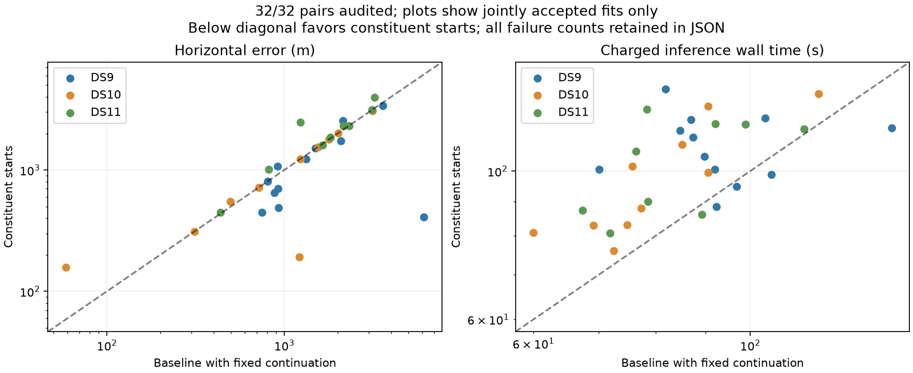

# Complete constituent-start pair study

All 32 fixed pairs from the 64-scan development panel have completed. The constituent-start policy improves some difficult solutions but does not establish a reliability gain over the baseline with bounded continuation. Retain the continued baseline as the reference; do not promote this replacement based on the pooled median alone.

| Approach | Accepted / planned | Median accepted error | p90 accepted error | Within 3 km / planned | Median charged wall time |
|---|---:|---:|---:|---:|---:|
| Original baseline | 31/32 | 1,494 m | 3,137 m | 26/32 | 86.2 s |
| Baseline + continuation | 32/32 | 1,410 m | 3,135 m | 27/32 | 86.2 s |
| Constituent starts | 31/32 | 1,231 m | 3,059 m | 27/32 | 103.4 s |

All three have 12/32 outcomes within 1 km. Constituent-start maximum accepted error is 3,965 m versus 6,139 m for baseline. Error quantiles condition on acceptance; they omit the rejected fit and must be read with the success denominators. Runtime charges historical constituent work and target inference; this is warm replay accounting rather than a fresh integrated cold pipeline.

Relative to the continued baseline, eleven jointly accepted pairs improve by more than one metre, eleven worsen and nine remain within one metre. Median paired change is effectively zero. One pair is accepted only by the continued baseline. The 28 cases outside the original pilot show median accepted error of 1,519 m for continued baseline versus 1,544 m for constituent starts, with acceptance falling from 28/28 to 27/28. This subgroup is still exposed development data, not held out.

| Dataset | Continued baseline accepted; median / p90 | Constituent accepted; median / p90 |
|---|---:|---:|
| DS9 | 12/12; 1,127 / 3,440 m | 12/12; 939 / 2,470 m |
| DS10 | 10/10; 1,223 / 2,132 m | 10/10; 975 / 2,125 m |
| DS11 | 10/10; 1,990 / 3,127 m | 9/10; 2,315 / 3,286 m |

DS11 drives the unfavorable reliability result. DS11-B03-D2 is optimizer-converged but fails the unchanged independent finite-difference audit; it remains rejected. DS11-B04-D1 passes the constituent fit at 2,466 m, but its continued baseline is 1,228 m. Neither receives a geography-based override. The audit failure still requires a separate causal diagnosis; do not assume it is the same discontinuity seen in earlier experiments.

## Model interpretation and next experiment

The tested change replaces aggregate zero-nuisance acquisition with two constituent single-scan positions and their scan-specific fitted nuisance values, followed by the unchanged joint robust fit and hard satellite assignments. The [mode diagnostic](constituent-modes-twelve-v1.json) shows it often finds different assignments, including an important improvement on the deliberately selected difficult pilot. Better search and better geographic ranking are separate problems: some lower-objective fits are farther from the reference.

The next bounded experiment tests a different use of these states: initialize quads from their two disjoint pair winners. It may exploit stronger constituent estimates, but it inherits pair failures and spends pair computation before quad refinement. The [recursive plan](RECURSIVE_QUAD_PLAN.md) preserves all sixteen outcomes and identifies the first block of each dataset as a pilot. The [real-data preflight](recursive-quad-preflight-v1.json) verifies exact nuisance transfer, prior and input bindings for those three pilots. Six transfer and policy tests pass, including explicit missing-input and insufficient-budget outcomes. Full preparation occurs inside the timed worker; pair totals include singles and are charged once. No recursive quad performance is claimed in this report.

The [complete sealed comparison](full-pairs-complete-v1.json) binds all inputs, failures, dataset and pilot membership, runtime and objective changes. These 32 pairs share observations with the singles and quads in sixteen blocks. The same operator reference and fixed-height assumptions apply; neither geographic generalization nor calibrated uncertainty follows from this development study.
