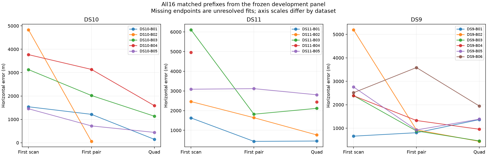

# Full 64-scan development panel

All sixteen frozen blocks are complete: six from DS9, five from DS10 and five from DS11. The 64 scans produce 64 independent single-scan fits, 32 disjoint pair fits and 16 quad fits. These 112 windows reuse observations across sizes; they are not 112 independent examples. This is development evidence, not a fresh test set. Twelve scans overlap the previous 64-scan benchmark and 52 are new.

The joint model shares one stationary horizontal position across a window, retaining independent scan clocks, receiver drifts and catalogue epoch offsets. It alternates satellite assignments with a robust continuous fit, using three acquisition starts. Every window starts from the same uniform 250 km Sacramento disk and fixes height at 30.48 m above sea level. Recorded position is used only after numerical auditing to measure error against the operator reference. No reference position selects starts or outcomes.

| Window | Accepted / planned | Median error | 90th percentile | Maximum accepted error | Within 3 km / planned | Median inference wall time |
|---|---:|---:|---:|---:|---:|---:|
| Single | 61/64 | 2,023 m | 4,959 m | 17,038 m | 42/64 | 40.8 s |
| Pair | 31/32 | 1,494 m | 3,137 m | 6,139 m | 26/32 | 86.2 s |
| Quad | 15/16 | 1,136 m | 2,312 m | 2,803 m | 15/16 | 176.4 s |

Error quantiles condition on acceptance; threshold fractions retain every planned window. Wall times include cold process setup and inference, excluding original radio-track/orbit preparation and subsequent audit. Median recording spans are 302, 726 and 1,574 seconds: quads contain scheduled gaps and cover about 26.2 minutes, not twenty continuous minutes of IQ.

## Matched comparisons and dataset variation

Among jointly accepted endpoints, the first pair improves on the first scan in 12/15 blocks, the quad improves on the first scan in 14/15, and the quad improves on the first pair in 10/14. Median paired error changes are respectively −1,057, −1,430 and −400 m. The first-scan/quad comparison also has one accepted single with an unresolved quad; the pair/quad comparison has one case accepted only at each endpoint. These cases remain explicit rather than becoming invented error changes.

| Dataset | Single accepted; median / p90 | Pair accepted; median / p90 | Quad accepted; median / p90 |
|---|---:|---:|---:|
| DS9 | 21/24; 1,669 / 4,901 m | 12/12; 1,127 / 3,440 m | 6/6; 1,159 / 1,664 m |
| DS10 | 20/20; 1,671 / 4,912 m | 10/10; 1,223 / 2,132 m | 4/5; 790 / 1,451 m |
| DS11 | 20/20; 2,729 / 5,074 m | 9/10; 2,161 / 3,138 m | 5/5; 2,116 / 2,659 m |

The later blocks materially increase the pooled quad median relative to early pilot reports. DS11's residual error deserves investigation; five blocks cannot establish whether hardware, geometry, orbit accuracy or model mismatch causes the difference. All blocks use the same operator reference location, so this experiment does not establish geographic generalization or physical stationarity from independent motion measurements.

## What the first follow-up experiments teach us

All five baseline failures reached the iteration limit. The fixed bounded-continuation policy recovered all five within the original total inference allowances, giving 64/64 singles, 32/32 pairs and 16/16 quads. Their median / p90 errors become 1,972 / 5,126 m, 1,410 / 3,135 m and 1,044 / 2,280 m. However, recovered single DS9-B05-S2 is **46,067 m wrong**. Numerical acceptance means a checked local optimum, not a trustworthy location. Continuation improves completeness but does not solve incorrect modes. This is a replay with original work charged, not a new integrated cold benchmark; the baseline above remains unchanged.

The four fixed constituent-start pair pilots also pass their numerical audits. They use only their two constituent single-scan fitted states, copy each scan's nuisance parameters, and then jointly refit; original constituent work is charged to the pair budget. The three metadata-selected first-block results change from 806 to 806 m (DS9), 1,215 to 193 m (DS10), and 438 to 447 m (DS11). The separately reported difficult DS9-B03-D2 case changes from 6,139 to 411 m. That last case was selected after inspecting failure and is diagnostic evidence, not an unbiased performance estimate. Original pair inference takes 70/91/79/140 seconds; charged constituent replay takes 97/128/93/113 seconds respectively. Better starts can cost more even when they improve error.

The immediate hypothesis is that preserving useful constituent modes can improve joint initialization. The next fair test should freeze this policy and apply it to every pair, retaining failures and charging all constituent work. A recursive pair-to-quad variant should be a separate arm. The 46 km converged single also motivates retaining competing modes or checking cross-scan predictive consistency, rather than using a convergence flag as a reliability score. Neither hypothesis is already validated here.

Independent clocks remain the baseline: the earlier common-clock pilot worsened all three tested quads. Local curvature ellipses also substantially undercovered in the nine-block diagnostic, so no calibrated uncertainty claim accompanies these errors. Cold numerical-equivalence checks for the faster acquisition implementation are running separately; their results must not be conflated with the initialization experiment.

## Reproducible evidence

- [Full per-dataset, runtime and matched analysis](full-panel-baseline-v1.json), with SHA-256 sidecar and all 112 audited outcomes.
- [Standard full-panel snapshot](panel-full-baseline-v1.json), preserving every original failure.
- [Frozen membership](selection.json), [reference admission](reference-admission-v1.json) and [post-baseline experiment plan](post-baseline-v1/plan.json).
- [Constituent-start policy](CONSTITUENT_START_PLAN.md), [missed-mode diagnostic](PILOT_UPDATE_08.md) and [uncertainty diagnostic](PILOT_UPDATE_10.md).

The final reporting code has two passing tests for failure denominators, runtime inclusion and asymmetric matched outcomes. The constituent transfer and admission policy have nine passing tests. Per-fit numerical audits additionally check finite states, objective/assignment consistency and finite-difference stationarity before measuring geographic error. Reports describe research prototypes; publication of the evidence does not imply promotion into the production estimator.
