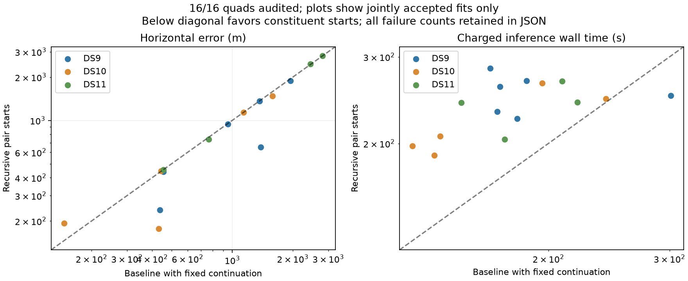

# Complete recursive quad evaluation

All sixteen fixed quads have terminal outcomes. Recursive pair-to-quad initialization improves some locations but is not a clear replacement for the continued baseline: it loses one acceptance, costs more, and gives only an 8 m median improvement among matched accepted quads. Keep the continued baseline as the reference for subsequent modeling experiments.

| Approach | Accepted / planned | Median accepted error | p90 accepted error | Within 1 km | Within 3 km | Median known charged time |
|---|---:|---:|---:|---:|---:|---:|
| Original quad baseline | 15/16 | 1,136 m | 2,312 m | 7/16 | 15/16 | 176.4 s |
| Baseline + continuation | 16/16 | 1,044 m | 2,280 m | 8/16 | 16/16 | 176.4 s |
| Recursive pairs → quad | 15/16 | 738 m | 2,238 m | 9/16 | 15/16 | 242.7 s |

Error quantiles condition on acceptance. Recursive runtime is known for fifteen outcomes; the failed admission has unknown total cost and is not treated as zero. These are replay costs charging the two pair totals (including their singles) plus timed quad setup and fitting, not fresh integrated cold-pipeline measurements.

Relative to the continued baseline, nine accepted quads improve by more than one metre, three worsen and three stay within one metre. The median paired change is −8.5 m; the much larger difference between pooled medians is not a typical per-quad improvement. DS11-B03-Q fails admission because constituent pair D2 failed its independent numerical audit. Its baseline with continuation remains accepted. All other recursive quads pass within 360 seconds of charged inference work.

| Dataset | Continued baseline accepted; median / p90 | Recursive accepted; median / p90 |
|---|---:|---:|
| DS9 | 6/6; 1,159 / 1,664 m | 6/6; 799 / 1,622 m |
| DS10 | 5/5; 443 / 1,406 m | 5/5; 445 / 1,341 m |
| DS11 | 5/5; 2,116 / 2,659 m | 4/5; 1,606 / 2,704 m |

The thirteen quads outside the original first-block pilot have continued-baseline median/p90 of 1,136/2,378 m versus recursive 842/2,415 m, with acceptance falling from 13/13 to 12/13. These remain exposed development cases, not held out. Subgroup p90 and failure behavior prevent a blanket accuracy improvement claim.

An experimental elevation differential helper now passes three synthetic tests: batched finite differences with a changing receiver normal, vector-scale invariance and explicit rejection of singular zenith/nadir geometry. It is not connected to the benchmark fitter. The actual fixed-height receiver mapping and orbit-interpolation derivatives still need validation. The nine existing recursive-policy, transfer and shared-threshold tests also pass.

## What the initialization studies support

The [full pair study](FULL_PAIR_RESULTS.md) and this recursive study show that constituent fits sometimes find useful alternate modes, but copying them does not reliably improve every dataset or justify added computation. They are useful candidate proposals, not a validated replacement policy. A future combined proposal search must explicitly budget the extra starts and test whether gains survive outside the selected difficult cases. Do not select proposals using recorded geographic error.

The next distinct scientific issue is the visibility-dependent background discontinuity. The [diagnosis](GRADIENT_DIAGNOSIS.md), [rejected product-gate model](VISIBILITY_COUNT_FINDING.md), and [shared-threshold local probe](SHARED_THRESHOLD_PROBE.md) narrow the hypothesis: a track-level uncertain horizon can remove the recorded jump without duplicate-observation sensitivity, but it still needs full geometry derivatives and consistent solver/audit treatment of ties. No baseline or recursive outcome is relabeled by that future work.

The [complete sealed comparison](recursive-quads-complete-v1.json) includes all sixteen outcomes, per-dataset and pilot membership, both baseline references, objective differences and explicit failure types. Together with the [full single/pair/quad baseline](FULL_PANEL_BASELINE.md), these reports complete the fixed initialization comparisons. Numerical acceptance is not a guarantee of accurate position; all results use the same unsurveyed operator reference and fixed-height assumptions.
