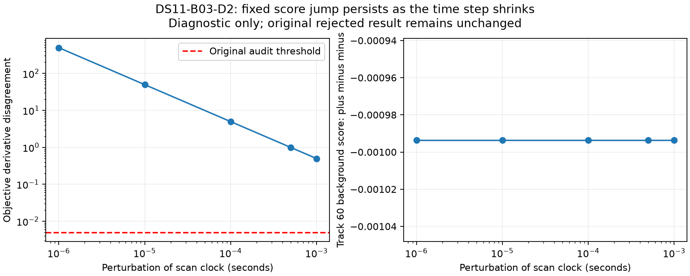

# The rejected pair lies at a background-score discontinuity

The fixed-state diagnostic reproduces DS11-B03-D2's maximum finite-difference disagreement of 0.9935618. The offending global coordinate is 1265, corresponding to the DS11-F036 scan clock. One background-assigned track (index 60) contributes a score jump of −0.0009935421 across the perturbation. That jump is unchanged as the perturbation shrinks from 0.001 seconds to 0.000001 seconds; derivative disagreement grows from about 0.497 to 496.771. This is a discontinuity signature, not ordinary truncation error improved by taking a smaller step.

The source explains a mechanism for this jump. In `reports/2026_10_01_fixed_height_greedy/acquire.py`, the background prior is

\[
\pi_{\mathrm{bg}}(x)=\pi_{\mathrm{bg},0}+\pi_{\mathrm{signal}}\frac{N-N_{\mathrm{visible}}(x)}{N}.
\]

Visibility is a hard all-observations elevation threshold. A candidate crossing that threshold changes the background probability even when the track remains assigned to background. The background residual likelihood itself is fixed. The adapter's background score calls the full catalogue scorer, while the optimizer/audit's smooth local gradient assigns zero score derivative to background. Thus a visibility boundary makes the smooth derivative comparison invalid at that state. The diagnostic localizes the jump but does not identify the crossing satellite independently.

No fitted state, assignment, objective, reference coordinate or audit threshold was changed. The original rejected outcome remains rejected. This does not demonstrate that the location is accurate or justify accepting it with a looser tolerance. The saved analytic objective derivative in that coordinate is about −0.00647, but a derivative inside one smooth region is not a certificate across a discontinuity.

## A model change worth testing separately

One candidate is a smooth visibility probability \(v_i(x)\in[0,1]\), with signal mass \(\pi_s v_i(x)/N\) and background mass \(\pi_{b,0}+\pi_s[1-\sum_i v_i(x)/N]\). Both selected-signal and background derivatives must include the visibility terms; smoothing only one scoring path would make acquisition, optimization and audit inconsistent. The width requires a physically and numerically defensible choice, followed by sensitivity ablation on the same fixed panel. This is a proposed model, not an implemented fix.

An alternative is explicit optimization across discrete visibility regions, with boundary-aware acceptance rather than pretending the objective is differentiable everywhere. It preserves the original model but adds search and verification complexity. Test numerical consistency before comparing geographic performance; do not tune either approach specifically to accept this one failed receipt.

The [sealed diagnostic](pair-gradient-diagnostic-v1.json) binds the original receipt and audit, checks their source/input hashes, retains the fixed assignments and decomposes the worst-coordinate finite differences by track at five step sizes. No new localization fit or geographic scoring is performed.
