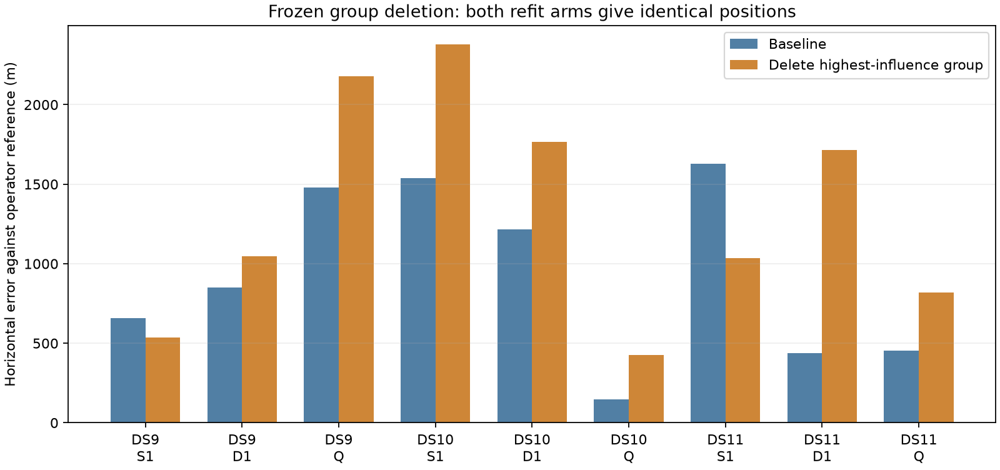

# Influence-directed deletion worsens seven of nine locations

Do not promote removal of the highest-influence satellite group. Separate geographic evaluation of the frozen fits finds improvement on two singles, deterioration on the remaining single, and deterioration on every pair and quad. All18 numerical fits were accepted; the two arms give identical outputs, representing nine unique overlapping windows rather than18 independent trials.

| Window | Baseline horizontal error | After deletion | Change |
|---|---:|---:|---:|
| DS9 single | 659 m | 537 m | -122 m |
| DS9 pair | 852 m | 1,046 m | +194 m |
| DS9 quad | 1,479 m | 2,181 m | +701 m |
| DS10 single | 1,538 m | 2,378 m | +840 m |
| DS10 pair | 1,215 m | 1,767 m | +551 m |
| DS10 quad | 146 m | 426 m | +280 m |
| DS11 single | 1,628 m | 1,036 m | -592 m |
| DS11 pair | 438 m | 1,713 m | +1,276 m |
| DS11 quad | 455 m | 817 m | +362 m |

Negative change means improvement against the admitted operator reference. These are actual horizontal errors, unlike the displacement figures in the preceding influence reports.

| Size | Unique windows | Median error, baseline to deletion | Median paired change | Improved / worsened |
|---|---:|---:|---:|---:|
| Single | 3 | 1,538 to 1,036 m | -122 m | 2 / 1 |
| Pair | 3 | 852 to 1,713 m | +551 m | 0 / 3 |
| Quad | 3 | 455 to 817 m | +362 m | 0 / 3 |

The difference between aggregate medians is not the median paired change. Both are reported to avoid confusing those quantities. No confidence intervals or population estimates are supported by three exposed, overlapping cases per size.

## What we learned

The preceding experiment established that local influence predicts deletion direction closely. This evaluation shows that sensitivity does not establish measurement error: the selected group often pulls the answer toward the reference. DS11 pair is the clearest example: deleting its selected group moves a438m-error fit to1,713m. DS10 quad also loses an accurate146m solution. This is evidence against the particular deletion heuristic, not against all robust modeling or all possible group deletions.

Combining scans remains valuable in these examples, and the existing per-track Student-t model should be retained as the control. A new group model must distinguish shared inconsistency from useful geometric information. Hard rejection based only on predicted position movement is not a suitable substitute.

One mathematically explicit next hypothesis is a shared residual scale per satellite group. The current model corresponds to independent latent precisions lambda_i~Gamma(nu/2,nu/2) for each track, with r_i|lambda_i~N(0,C_i/lambda_i). A group model would instead share lambda_G across its tracks. For a group with total contrast dimension D_G and total Mahalanobis sum Q_G, integrating that shared precision yields a Student-t group loss proportional to (nu+D_G)/2 log(1+Q_G/nu), plus the required normalization and covariance terms. Its common IRLS weight is (nu+D_G)/(nu+Q_G).

That is a different probabilistic assumption, not a penalty on influence: all tracks in a group share evidence about residual scale. It agrees exactly with the original likelihood for singleton groups, preserves observations, and requires no geographic threshold. It can also spread one bad track's effect to otherwise good tracks, so improvement is not guaranteed. The shared satellite epoch parameter already models one kind of group mean discrepancy; a shared residual scale would model a different aspect and should not be described as an entirely new shared-satellite mechanism.

Before fitting, a bounded research implementation should verify normalized singleton equivalence and gradients, handle backgrounds explicitly, and use fixed baseline group memberships as a clearly labeled conditional pilot. Dynamic grouping under changing identities couples association decisions and cannot be implemented by silently multiplying independent per-track scores. If the conditional shared-scale pilot fails on the same predetermined windows, stop expansion instead of tuning its degrees of freedom against these geographic outcomes.

## Evaluation integrity

`GROUP_DELETION_EVALUATION_PLAN.md` fixed the evaluation scope before geographic scoring. `evaluate_group_deletion.py` verifies all18 receipt/source/input/launch/audit chains and duplicate-arm states, then accesses the existing `reference-admission-v1.json` and hash-verified geographic helper. No fits, choices or thresholds changed after error evaluation. All windows use their own accepted parent baseline and the same reference admission artifact. The scientific output is `group-deletion-evaluation-v1.json` with SHA256 sidecar.

The reference is unsurveyed operator metadata. This is development evidence, not held-out validation. The group was selected from the fitted data, and these blocks have been used repeatedly. No new RF collection or production change occurred. The earlier hypothesis, negative receiver-curvature result, sensitivity analysis and nonlinear validation remain available as separate immutable artifacts.
