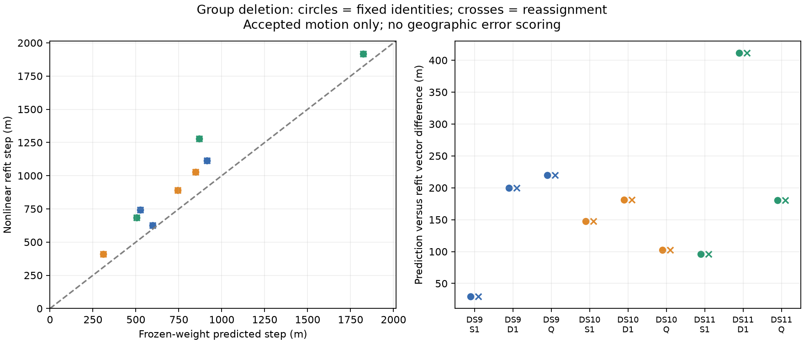

# Nonlinear refits validate direction, not magnitude, of group influence

All 18 planned warm deletion refits pass the numerical audit. Across nine windows, the frozen-weight prediction closely matches the direction of actual motion but underestimates its length. Actual motion is 1.05–1.47 times the prediction. Fixing satellite identities and permitting normal reassignment produce identical fitted states in every window; no retained observation changes assigned identity. This isolates the observed discrepancy from reassignment in these cases.

| Window | Predicted motion | Actual motion, either arm | Vector disagreement | Actual / predicted length |
|---|---:|---:|---:|---:|
| DS9 single | 596 m | 625 m | 30 m | 1.05 |
| DS9 pair | 915 m | 1,115 m | 200 m | 1.22 |
| DS9 quad | 525 m | 744 m | 220 m | 1.42 |
| DS10 single | 743 m | 889 m | 148 m | 1.20 |
| DS10 pair | 847 m | 1,027 m | 181 m | 1.21 |
| DS10 quad | 309 m | 411 m | 103 m | 1.33 |
| DS11 single | 1,823 m | 1,919 m | 96 m | 1.05 |
| DS11 pair | 869 m | 1,277 m | 411 m | 1.47 |
| DS11 quad | 504 m | 683 m | 180 m | 1.36 |

These values measure movement from the original fit, **not distance to the true location**. The study does not establish whether deleting any group improves accuracy. Direction cosines range from 0.99899 to 0.999997. Each case deletes the group selected by largest local predicted horizontal shift in the preceding diagnostic; actual worst-case deletion across all groups was not enumerated.

## Controlled experiment

The frozen hypothesis and selection rules are in `GROUP_DELETION_PLAN.md`. Use the first single, pair and quad from DS9/DS10/DS11, and their previously accepted optimized one-start fits. A group is an assigned NORAD within one scan, including both receivers. Remove exactly the original tracks in the selected group. Keep the same prior, fixed height, observations on remaining tracks, full orbit catalogues and independent scan nuisance coordinates. Start from the unchanged original fitted state.

The fixed-identity arm suppresses all alternative branches without renormalizing the selected physical score. The ordinary arm uses the original ports and allows reassignment. Both use the existing joint Student-t4 optimizer with at most64 updates and60 seconds fitting time; each process has a90-second external cap including its audit. Removed observations never re-enter. Three tests verify the fixed-port behavior on signal and background branches, including exact selected-score preservation.

The audit checks convergence, support, monotone objective history, final objective equality, branch consistency under the applicable arm, active finite-difference gradients and the scaled stationarity decrement. The largest gradient discrepancy is2.84e-5, below0.005; the largest decrement is4.87e-8, below1e-5. All18 processes finish within budget, totaling166.17 seconds. Sources and parent inputs are sealed and verified before and after execution. The paired fits also have zero disagreement with unrestricted best branches at their endpoints.

## Implications for models

The inexpensive influence calculation is useful for selecting a group whose removal produces substantial motion. It is not an accurate bound on that motion: all nine actual refits move farther than predicted, with vector differences up to411m. The frozen local approximation omits changes in robust weights and nonlinear geometry during refitting. Identical fixed/reassigned results rule out reassignment as the explanation here, but do not separate those other effects or establish behavior on other windows.

A group-level robust model remains a testable hypothesis, not a demonstrated improvement. Influence alone does not identify bad measurements: a group can be influential because it supplies essential correct geometry. The next decision should use a separately sealed evaluation of these already-fixed outputs against the admitted development reference, reporting every accepted window and paired changes. That evaluation must not alter which group was removed or be described as held-out validation. If deletion is mixed or harmful, avoid a deletion heuristic and instead test a specified probabilistic group discrepancy or shared residual-scale model against the original per-track Student-t control.

No geographic reference was accessed in the diagnostic or used in group selection. No production change, cold-start performance claim, new collection or full-panel accuracy claim follows from this pilot. The nine windows are overlapping development examples.

## Artifacts

`fixed_association_port.py` and its tests implement the identity control. `check_group_deletion.py` runs and audits both arms under the shared lock, writing immutable `group-deletion-v1` receipts. `summarize_group_deletion.py` accounts for all18 planned arms, verifies their manifests, and produces the summary JSON and figure. The original group-influence predictions and baseline fits remain unchanged.
