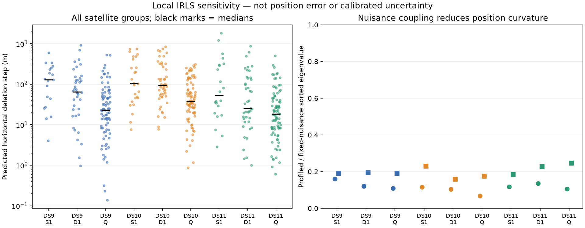

# Satellite-group influence across singles, pairs and quads

Quads reduce individual-group sensitivity in each of three fixed development blocks. Pairs are mixed: adding the second scan can introduce a more influential group even while reducing median sensitivity. Nuisance coupling remains strong at every window size. These findings support a bounded nonlinear deletion check before considering a satellite-group robustness model; they do not authorize dropping measurements.

| Window | Groups | Median predicted deletion shift | Largest predicted deletion shift |
|---|---:|---:|---:|
| DS9 single | 19 | 128 m | 596 m |
| DS9 pair | 40 | 64 m | 915 m |
| DS9 quad | 83 | 23 m | 525 m |
| DS10 single | 26 | 104 m | 743 m |
| DS10 pair | 49 | 94 m | 847 m |
| DS10 quad | 87 | 38 m | 309 m |
| DS11 single | 22 | 52 m | 1,823 m |
| DS11 pair | 43 | 25 m | 869 m |
| DS11 quad | 89 | 18 m | 504 m |

These are local sensitivity estimates in meters, **not horizontal errors**. All 458 group deletions have positive-definite remaining IRLS metrics. Windows overlap and groups repeat across windows, so 458 is a computational count, not an independent sample size. Cases are the first accepted optimized one-start single S1, pair D1 and quad Q in block B01 from each dataset, fixed before analysis.

## Mathematical diagnostic

At the accepted fitted state x, hold satellite identities and covariances fixed. For residual r_i, prediction Jacobian J_i, covariance C_i and dimension d_i, the Student-t4 IRLS weight is

    w_i = (4+d_i)/(4+r_i' C_i^-1 r_i).
    g_i = -w_i J_i' C_i^-1 r_i.
    H_i = w_i J_i' C_i^-1 J_i.

Add the unchanged nuisance prior precision P: g=Px+sum(g_i), H=P+sum(H_i). A group contains all tracks from one assigned NORAD identity within one scan, across both receivers. Distinct scans remain separate because the fitted nuisance blocks and orbit evidence are scan-specific. Background assignments provide no selected-satellite residual and are counted outside this calculation.

The local response to deleting group G is

    delta_G = -(H-H_G)^-1 (g-g_G).

The table reports 1000 times the norm of its east/north components, whose native units are kilometers. This is the solution of a frozen-weight quadratic approximation. It is not a full Student-t refit: geometry, robust weights, identities and visibility could change after motion. Maximum generalized leverage of (H_G,H), directions and prior-scaled nuisance steps are recorded for every group in the receipts. High leverage can lie in nuisance directions and must not be interpreted as position leverage alone.

To measure coupling, partition H into position p and nuisance n. The profiled position curvature is the Schur complement

    S = H_pp - H_pn H_nn^-1 H_np.

Across these windows, ratios of the sorted eigenvalues of S to those of H_pp range from 0.068 to 0.246. These are spectra comparisons, not ratios along identical eigenvectors. Allowing nuisance parameters to adjust removes much of the curvature that would be attributed to position if nuisance values were treated as known. H is a positive IRLS approximation, not the exact posterior Hessian, and its inverse is not calibrated uncertainty.

## What this suggests

The DS11 single has a particularly large local response to one group (NORAD 65512 in DS11-F001), whereas its quad has a smaller worst-group response. More scans can help by supplying additional constraints when a particular group is removed. The maximum response is not monotonic from single to pair on DS9 or DS10, so scan count alone cannot be used as a quality certificate.

Three model directions remain distinguishable. Group-level robustness could limit several correlated tracks from one satellite dominating together; a hierarchical model could represent a shared group discrepancy; a geometry-aware acceptance rule could flag sensitivity without changing the estimator. None follows automatically from this diagnostic: an influential group may provide essential correct information, and deleting it may worsen accuracy.

Next, freeze one group per window using the largest diagnostic shift, then run bounded warm nonlinear deletion fits. Compare actual displacement vectors to these predictions before scoring geography. This tests whether the inexpensive approximation is useful for selecting further experiments. A new weighting/prior model would require a separate frozen hypothesis and an ablation against the existing per-track Student-t robustness. Avoid tuning rejection thresholds on these exposed geographic answers.

## Verification and scope

Three tests pass: local deletion equals an exact synthetic quadratic refit, the Schur inverse equals the position block of the full inverse, and singular deletion is an explicit failure. Real checks verify parent acceptance and source/input seals, exact scan/observation/precision bindings, selected branch argmax, and the full fitted scaled-gradient decrement below 1e-5. All nine sequential single-thread workers finish within the 90-second cap, taking 37.19 seconds in total. No localization refits, new radio observations or geographic scoring occurred.

The plan is `GROUP_INFLUENCE_PLAN.md`; implementation and tests are `group_influence.py` and `test_group_influence.py`. `check_group_influence.py` writes immutable case receipts under `group-influence-v1`; `summarize_group_influence.py` verifies them and writes the summary JSON and figure. No baseline or production model is replaced.
