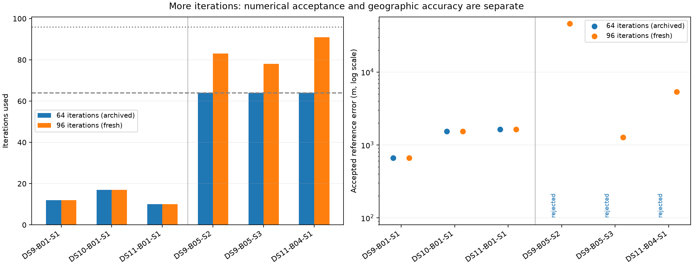
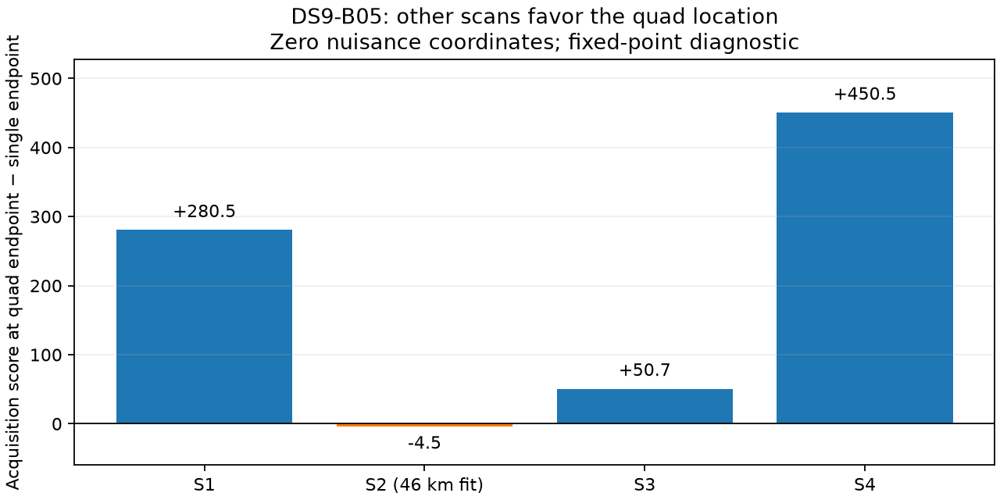

# More iterations recover numerical acceptance, including an inaccurate mode

The 96-iteration cold pilot recovers all three formerly unresolved singles within the unchanged 90-second inference budget. All three successful controls remain exactly unchanged in recorded state, objective history, assignments, stopping iteration and reference error. All six numerical audits pass. However, one newly accepted solution is 46,067 m from the reference: this is improved optimization completeness, not a reliable accuracy improvement.

| Case | Iterations, 64-cap / 96-cap | Fresh 96-cap wall / CPU | Numerical outcome | Accepted reference error |
|---|---:|---:|---|---:|
| DS9-B01-S1, control | 12 / 12 | 14.20 / 14.19 s | Pass / pass | 659 m, unchanged |
| DS10-B01-S1, control | 17 / 17 | 15.50 / 15.47 s | Pass / pass | 1,538 m, unchanged |
| DS11-B01-S1, control | 10 / 10 | 15.53 / 15.48 s | Pass / pass | 1,628 m, unchanged |
| DS9-B05-S2 | 64 / 83 | 22.54 / 22.48 s | Rejected / pass | 46,067 m |
| DS9-B05-S3 | 64 / 78 | 20.90 / 20.86 s | Rejected / pass | 1,269 m |
| DS11-B04-S1 | 64 / 91 | 24.73 / 24.70 s | Rejected / pass | 5,367 m |

The reference-error axis is logarithmic so the 46 km outcome remains visible alongside the controls. Rejected 64-iteration results have no geographic score. The earlier [warm continuation study](POST_BASELINE_RESULTS.md) already found the distant DS9-B05-S2 solution; this experiment reproduces it from cold acquisition with one start and optimized computation. It is not a newly discovered accuracy gain or independent geographic confirmation.

## Controlled change and verification

The [plan](ITERATION96_PLAN.md) fixed three successful first-single controls and the three unresolved first-start singles before running. Only the reported maximum iterations and the argument passed to the existing fitter change from 64 to 96. Two structural tests establish those exact changes and preservation of the acquisition wrapper/startup timer. Three behavioral tests reject changed control states, rewritten objective prefixes, altered proposals, wrong caps and missing fits. Five tests pass in total.

The physical model remains a shared stationary position, hard satellite/background assignments and joint robust continuous fitting with the original nuisance priors. Each single starts from the uniform Sacramento disk, with fixed 100 ft MSL height, eight-point track evidence, zero nuisance initialization and one acquisition-ranked seed. Acquisition, support, priors and stopping thresholds are unchanged. Internal/external inference limits remain 85/90 seconds; acquisition remains capped at 50 seconds; each separate audit has a 90-second cap.

All controls passed before the unresolved cases ran. Every new receipt preserves input/model bindings, proposals and the complete old objective history as a prefix within 1e-6. Controls also preserve their complete history lengths and fitted states within 1e-5, with exact assignments and stopping fields. The unresolved cases retain their endpoint assignments and move only 2.909 / 0.824 / 0.166 m after iteration 64. Thus the extension settles existing modes rather than discovering new ones. Intermediate states were not recorded, so objective-prefix agreement is not presented as an intermediate-state check.

Every inference and audit completes within budget. The unchanged independent audit checks source/input bindings, physical assignments, objective consistency, monotonicity, finite-difference gradients and stationarity before reference scoring. The summary rechecks receipt/launch/audit seals and frozen dependencies. No retries, fallback, new starting point or tolerance relaxation occurred. All jobs are terminal.

These six cases are exposed development controls and failure-selected cases, not a representative new sample. Old 64-iteration times are historical: small control runtime changes despite identical trajectories show why they should not be interpreted as a causal timing effect. The experiment does not constitute a fresh 64-single or 112-window evaluation of the composed implementation, and no full-panel acceptance rate is newly claimed.

## Why a joint window can help the distant single

A separate [post-result diagnostic](ITERATION96_WINDOW_DIAGNOSTIC.md) examines DS9-B05. Its accepted first-start pair AB has 923 m error and its quad has 493 m error, despite S2 alone settling 46 km away. The diagnostic evaluates the original acquisition score at four saved coordinates: single and quad first seeds, and their fitted endpoints. All nuisance coordinates are fixed to zero, exactly as in acquisition. It performs no search, profiling or localization fit.

For scan s, define `A_s(x) = sum_tracks logsumexp_branches score(track, branch, x, nuisance=0)`. The table reports the quad coordinate's score minus the single coordinate's score; positive values favor the quad coordinate under this fixed score.

| Scan within DS9-B05 | Quad seed − single seed | Quad endpoint − single endpoint |
|---|---:|---:|
| S1 | +142.3 | +280.5 |
| S2, the distant single | −114.2 | −4.5 |
| S3 | +40.0 | +50.7 |
| S4 | +396.4 | +450.5 |
| Sum | +464.5 | +777.2 |

The problematic scan prefers its own acquired seed, while the other scans collectively favor the quad seed. The same direction holds for the summed endpoint contrast. This provides a concrete example of how accumulating raw scan evidence can distinguish locations that one scan confuses. It does not show that zero-nuisance acquisition ranks all fitted modes correctly: the fitted single moved about 16 km from its seed while optimizing nuisance parameters, and fixed-nuisance scores are not profiled scores.

The diagnostic covers 170 track appearances across four scans and finishes in 5.23 seconds. Original and optimized scores agree within 1.18e-10 at all four coordinates with identical finite/visibility masks. The contrasts are neither calibrated Bayes factors nor mode probabilities. This is one error-selected case at data-selected coordinates; it cannot define a general confidence threshold or prove why every quad improves.

## Decision and next direction

The 96-iteration configuration is useful for reaching stationarity at modest cost, but it does not solve geographic ambiguity. Retain it as a bounded research option, preserve the 64-iteration reference, and do not promote it based on acceptance alone. Further gains should target competing location modes and the evidence that distinguishes them.

Next, quantify this fixed-coordinate acquisition comparison across the frozen sixteen blocks using existing single, pair and quad candidates, with membership and ranking fixed before examining new error summaries. That can separate missing candidate locations from incorrect score ranking, and identify where nuisance profiling or marginalization is worth testing. Any reference-error oracle must remain a diagnostic upper bound on that finite candidate set, never an inference selector. No full cold campaign or production change follows from this pilot.

Artifacts: [sealed six-case summary](iteration96-summary-v1.json), [96-cap worker](run_seed_limit_96.py), [wrapper](run_one_start_blas_96.py), [supervisor](check_iteration96.py), [comparison checks](iteration96_checks.py), [summary/figure generator](summarize_iteration96.py), [fixed-point diagnostic](iteration96-window-diagnostic-v1.json), [diagnostic source](diagnose_iteration96_window.py), and complete receipts under `iteration96-v1/`.
