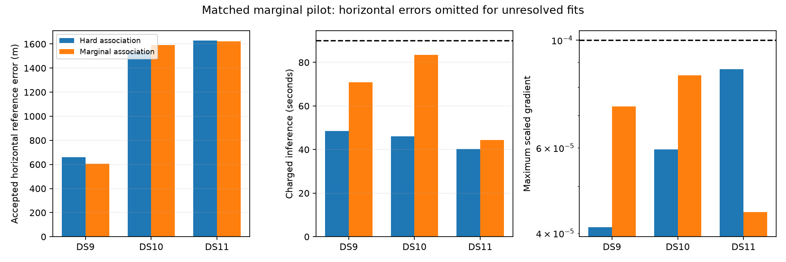

# Full-catalogue marginal pilot: three passes, mixed accuracy and higher cost

All three predeclared single-scan marginal fits pass the independent numerical audit within their original90second charged allowances. Relative to the same-start hard shared-visibility model, two errors improve and one worsens, with no convincing aggregate accuracy gain. Keep the original full-panel reference and preserve this as a separate model arm.

| First single | Hard error | Marginal error | Error change | Charged hard / marginal time | Hard / marginal iterations |
|---|---:|---:|---:|---:|---:|
| DS9-B01-S1 | 659.46 m | 604.30 m | -55.16 m | 48.56 / 70.81 s | 2 / 25 |
| DS10-B01-S1 | 1,538.16 m | 1,592.87 m | +54.71 m | 46.09 / 83.41 s | 5 / 45 |
| DS11-B01-S1 | 1,628.20 m | 1,623.27 m | -4.93 m | 40.19 / 44.47 s | 1 / 6 |

Marginal-model positions move593.20,71.73and5.47meters from their original baseline starts, with1,3and0changed leading branch assignments. DS9's large displacement produces only a55meter reference-error improvement; displacement alone is not accuracy. These are three exposed development cases using the same unsurveyed operator reference, not held-out evidence. All starts and settings were fixed before fitting; no geographic choice was made between arms.

## Model and implementation

For branch log scores s_i(x), the hard track score is `max_i s_i(x)`; the new track score is `logsumexp_i s_i(x)`. Its gradient is `sum_i p_i(x) gradient(s_i(x))`, with p obtained by normalizing all branch scores. Satellite and background branches are all included. No fixed top-k cutoff is used. Gaussian nuisance priors are included once in the complete window objective.

The likelihood remains Student-t4 with shared-threshold horizon width0.1degrees. Position support, fixed30.48m MSL height, observations, orbit banks and nuisance priors are unchanged. Both arms use the same residual-curvature direction method and line search. The direction preconditioner still uses leading-branch residual rows; it is an approximation, while objective and gradient always marginalize the full catalogue. Argmax labels returned by the objective are diagnostic and do not condition it, even when the common optimizer/audit passes labels back.

Compact batched candidate Jacobians keep full-catalogue gradients practical without constructing a candidate-by-global-state matrix. A new synthetic window test verifies shared-position accumulation, separate nuisance columns, prior gradients, duplicate-observation rejection and invariance to supplied diagnostic labels. Complete-window directional checks at a saved single, pair and quad then pass with maximum discrepancies2.04e-7,1.67e-7and5.67e-7. Those checks performed no fitting or geography and supplemented the previously validated track-level marginal gradients.

## Audit and budgets

The [pre-fit plan](MARGINAL_PILOT_PLAN.md) keeps64iterations,24Armijo halving trials,5km spatial step cap, scaled-gradient stopping threshold1e-4 and original-cost charging. Each fit begins from the original baseline state, not the hard-refinement output. Extra preparation/fitting takes29.52,43.76and8.63seconds. DS10 reaches83.41charged seconds, leaving limited budget margin. Separate audit times are25.36,21.45and25.09seconds.

Final scaled gradients are7.30e-5,8.45e-5and4.42e-5. All source/input, objective, assignment, monotonicity, prior, state and budget checks pass. Maximum selected finite-difference errors are8.22e-6,2.05e-5and4.65e-6, below0.002. The audit evaluates the marginal objective at every perturbation, with no fixed-label substitution. Reference coordinates are read only after all numerical decisions are fixed. These audits are not exhaustive curvature checks or uncertainty calibration.

Within the marginal model, objective reductions from the original states are4.6100,0.3659and0.00446. They demonstrate optimization progress under this model, not superiority to hard association: objective values across different models are not directly comparable. Continuous nuisance values are still fitted by MAP; marginalizing categorical associations does not integrate their nuisance uncertainty or produce calibrated location probabilities.

## Decision and next test

The pilot establishes feasibility and a genuine effect on association/position, but its higher cost and mixed error changes do not justify promotion. Run the same preselected metadata-first pairs and quads next, as a separately frozen size-scaled pilot, retaining every budget or convergence failure. This tests whether more shared-position evidence changes the tradeoff. Do not launch a full112window campaign on the strength of these three singles, and do not increase budgets after seeing outcomes.

If marginal fitting stalls under the existing preconditioner, a separate optimizer-only comparison could use probability-weighted residual curvature. That would be a distinct change requiring tests and matched-budget evaluation; it is not part of the current results.

## Evidence

- [Sealed three-case comparison](marginal-pilot-summary-v1.json) and per-case source/launch/audit receipts under `marginal-pilot-v1/`.
- [Complete-window checks](marginal-window-gradient-check-v1.json), [window objective](marginal_window_objective.py) and [synthetic test](test_marginal_window_objective.py).
- [Pilot runner](run_marginal_pilot.py), [summary/figure generator](summarize_marginal_pilot.py), and [ambiguity motivation](ASSOCIATION_AMBIGUITY_RESULTS.md).

All three jobs are terminal. No baseline, hard-visibility, constituent or recursive result has been replaced.
