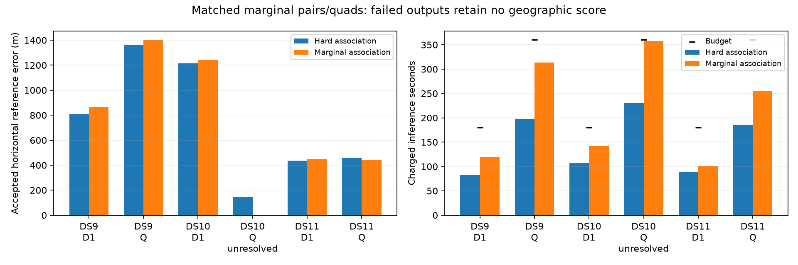

# Marginal pairs/quads: higher cost, lower completion, no accuracy advantage

The six-window pilot is complete. Marginal association passes5/6windows versus6/6for hard association. Four of the five matched accepted errors worsen; one improves by12meters. DS10's quad reaches its inference deadline before convergence. This arm is not promoted, and the continued original model remains the full-panel reference.

| Window | Hard error | Marginal accepted error | Error change | Charged hard / marginal time |
|---|---:|---:|---:|---:|
| DS9-B01-D1 | 805.93 m | 863.48 m | +57.55 m | 82.77 / 119.82 s |
| DS9-B01-Q | 1,364.72 m | 1,402.48 m | +37.76 m | 197.18 / 313.89 s |
| DS10-B01-D1 | 1,215.24 m | 1,240.03 m | +24.79 m | 107.05 / 142.81 s |
| DS10-B01-Q | 146.13 m | Unresolved | — | 230.31 / 357.66 s |
| DS11-B01-D1 | 437.77 m | 450.59 m | +12.82 m | 88.41 / 101.01 s |
| DS11-B01-Q | 455.42 m | 443.00 m | -12.43 m | 184.89 / 254.81 s |

The comparison uses the same original baseline starts, observations, priors, fixed height, visibility model and direction method. Only hard maximum association versus full-catalogue log-sum-exp changes. All original work plus additional preparation/fitting is charged to180/360seconds. These are exposed warm development cases and historical sequential timings, not held-out or cold-pipeline results. The same unsurveyed operator reference applies.

The three pairs require23,25and8iterations, respectively; the quads take29,24and23iterations, with DS10 stopping at its wall budget. Additional inference ranges22.39–161.89seconds. No budget was increased, and no failed output receives a geographic score. The five accepted outputs pass the unchanged1e-4scaled-gradient stop and selected finite-difference threshold0.002. Independent audits take42.14–87.39seconds outside inference.

DS10-B01-Q has final scaled gradient0.003288, above the stopping threshold. Its source/input, objective, assignment, monotonicity, budget and derivative checks pass, but convergence and stationarity fail. The unresolved result remains explicit despite an improved within-model objective. Its unaccepted position is neither scored nor substituted for another output.

## What the nine-case model comparison supports

Combined with the three [single pilots](MARGINAL_PILOT_RESULTS.md), hard association passes9/9cases and marginal association8/9. Among jointly accepted cases, marginalization improves three reference errors and worsens five. This is enough to reject a general superiority claim from this pilot, not enough to conclude that categorical marginalization is universally harmful.

Conditional association ambiguity was real in the [fixed-state diagnostic](ASSOCIATION_AMBIGUITY_RESULTS.md), but representing that ambiguity more smoothly did not consistently improve geographic accuracy. Plausible explanations include residual-likelihood mismatch, nuisance parameters fitted by MAP rather than integrated, and local-mode effects. This experiment does not identify a unique cause. A larger campaign using the same settings is not justified solely by the theoretical appeal of marginalization.

The separate shared-threshold visibility repair remains useful numerical evidence: it fixed the known boundary failure while leaving ordinary locations essentially unchanged. That result must not be conflated with the marginal objective tested here.

## Weighted-curvature prerequisite checks

The candidate-weighted residual-curvature implementation has now passed recorded-state checks on a single, pair and quad with1107,2246and4508state dimensions. Independently applying the original batched Jacobians to the proposed direction verifies `H d = -g` with relative residuals3.40e-16,2.75e-16and8.11e-16. The single's direction also agrees with an explicitly assembled dense solve to4.50e-16relative error. All three are descent directions. Block assembly and solve take0.57,1.03and2.09seconds in these diagnostics; they are not optimizer timings.

Three assembly/solve tests and two optimizer tests pass. The separate optimizer preserves the marginal objective, full gradient, line search, budgets and stopping criterion while changing only the positive direction preconditioner. No weighted-curvature radio fit has been run. Its [pre-fit plan](WEIGHTED_MARGINAL_PILOT_PLAN.md) allows a small optimizer-only pilot after these checks, but faster convergence would not by itself repair the accuracy regressions above. Any pair/quad extension should depend on what those first tests establish, rather than automatically launching another full-panel study.

## Reproducibility

- [Sealed six-window summary](marginal-window-pilot-summary-v1.json), source-bound receipts under `marginal-window-pilot-v1/`, and [pre-fit plan](MARGINAL_WINDOW_PILOT_PLAN.md).
- [Recorded curvature checks](weighted-curvature-check-v1.json), [check implementation](check_weighted_curvature.py), [separate optimizer](weighted_marginal_optimizer.py), and [optimizer tests](test_weighted_marginal_optimizer.py).
- [Complete hard-model pilot](SHARED_WINDOW_PILOT_RESULTS.md) and [DS9-only progress snapshot](MARGINAL_WINDOW_PROGRESS_01.md), preserved rather than overwritten.

All six fits and the recorded curvature diagnostics are terminal. No baseline outcome has changed, no failed case was replaced, and no geographic reference selected an inference output.
