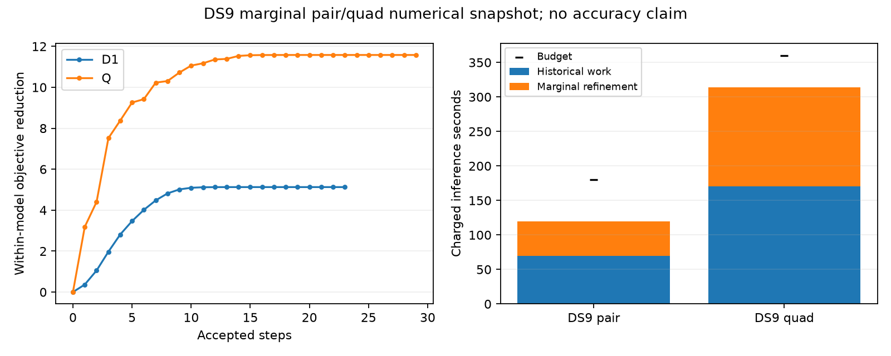

# DS9 marginal pair and quad pass; full comparison remains pending

The first dataset's two fixed windows have passed their independent marginal-model audits. This is a numerical-progress snapshot, not a six-window result or accuracy comparison. Geographic scoring is deferred until all six numerical outcomes are fixed.

| Window | Accepted steps | Final scaled gradient | Maximum checked derivative error | Added inference | Charged total / limit | Changed leading labels |
|---|---:|---:|---:|---:|---:|---:|
| DS9-B01-D1 | 23 | 5.55e-5 | 2.21e-5 | 49.81 s | 119.82 / 180 s | 1 |
| DS9-B01-Q | 29 | 6.87e-5 | 2.51e-5 | 143.76 s | 313.89 / 360 s | 4 |

The same-start hard-association refinements used12.77and27.05additional seconds. Marginalization therefore carries a material computational cost here, especially on the quad. This comparison uses historical sequential timings, not a randomized timing trial. Audits are timed separately and excluded consistently from inference. The original work is charged once, and no budget or acceptance threshold has changed.

The [six-case pre-fit plan](MARGINAL_WINDOW_PILOT_PLAN.md) and [separate wrapper](run_marginal_window_pilot.py) retain the original source states, full-catalogue marginal objective, complete gradient and existing leading-branch curvature optimizer. The remaining DS10/DS11 pair/quad windows continue sequentially; every failure will remain in the final comparison. Do not infer a full-panel reliability or accuracy gain from the first two successes.

## Separate curvature work, not used by the active fits

The increased iteration counts and runtime motivate a possible optimizer-only ablation. The [candidate-weighted design](WEIGHTED_CURVATURE_DESIGN.md) uses all branch probabilities and Student-t residual weights in a positive residual-curvature approximation. Its compact candidate blocks couple five scan coordinates to one epoch. Diagonal epoch elimination reduces the solve to shared position and scan clock/drift variables, without constructing a dense all-epoch Hessian.

Three tests now pass across the two helpers: weighted two-scan blocks match a dense solve, missing position geometry fails explicitly, and probability/Student-t-weighted Jacobian assembly plus the resulting direction match an independently constructed dense reference. These are synthetic checks. No recorded-data curvature check or optimizer integration has been run, and no current fit uses this new helper. Exact marginal Hessian covariance and visibility-curvature terms remain omitted, so it is a preconditioner, not an uncertainty estimate.

The [DS9 pair audit](marginal-window-pilot-v1/DS9-B01-D1/evaluation.json) and [quad audit](marginal-window-pilot-v1/DS9-B01-Q/evaluation.json), with sealed source and launch receipts, support this snapshot. The final six-window summarizer is prepared but must not run until all planned outcomes are terminal.
