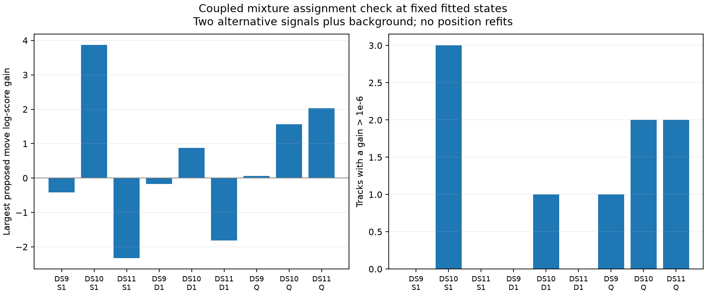

# Fixed mixture labels have a few local inconsistencies

The bounded coupled-label check finds10score-improving proposed moves on9tracks across5of9windows. Four windows have no improving proposal. Several improvements lower the moved track's individual physical score but improve the full group mixture, confirming that independent per-track argmax is not a valid association update for this model.

| Window | Tracks | Evaluated moves | Improving moves / tracks | Largest log-score gain |
|---|---:|---:|---:|---:|
| DS9 single | 50 | 150 | 0 / 0 | -0.4193 |
| DS10 single | 44 | 130 | 3 / 3 | +3.8699 |
| DS11 single | 48 | 144 | 0 / 0 | -2.3332 |
| DS9 pair | 96 | 288 | 0 / 0 | -0.1679 |
| DS10 pair | 93 | 277 | 1 / 1 | +0.8756 |
| DS11 pair | 96 | 288 | 0 / 0 | -1.8193 |
| DS9 quad | 191 | 573 | 1 / 1 | +0.0611 |
| DS10 quad | 188 | 562 | 3 / 2 | +1.5618 |
| DS11 quad | 190 | 570 | 2 / 2 | +2.0289 |

All2982proposals were evaluated; none were ineligible. Counts include overlapping windows, so they are not independent examples. A negative maximum means every proposed change is worse than retaining the current assignment. Positive means gain greater than1e-6. These are changes in natural-log physical mixture score at a fixed state, not geographic error changes or model probabilities.

## Bounded alternatives and exact objective

The frozen candidate rule takes each track's two highest finite alternative signal scores under the original physical model and adds background when it is finite and different from the current label. It uses no geographic answer. Current mixture states and continuous nuisance coordinates remain fixed. Other satellite epoch values are not profiled, which can disadvantage alternative assignments.

Moving one track changes membership of its source and destination (scan,NORAD) groups. Compute the physical selected-score difference plus changes in each affected group's correction log(.5p_I+.5p_S)-log p_I. Empty and singleton groups have zero correction. Background has no group correction. This exactly evaluates each proposed single move without a full location refit.

Two synthetic tests verify incremental versus complete reconstruction, including background, disappearing singleton and cross-scan cases. For each of9windows, the first eligible and largest-gain proposals agree with complete `MixtureObjective` reconstruction; the maximum discrepancy is1.74e-12. Original saved objectives also reconstruct within1e-6. All source/input/receipt checks pass and all9bounded processes finish successfully.

## Examples and implications

DS10 single track0 can move from assigned NORAD57607 to62591: its individual physical log score falls0.0404, but the full mixture score rises3.8699. DS11 quad track97 can move from65928 to59602: the individual score falls0.2050 while the full score rises2.0289. Thus a reassignment implementation must account for coupled groups rather than merely rescore tracks independently. These identities remain model assignments, not verified satellite ground truth.

The worst earlier geographic deterioration, DS9 quad, has only a0.0611maximum gain in this candidate set. DS9 and DS11 pairs deteriorated yet have no improving proposal here. Therefore this check does not establish assignment inconsistency as a general explanation for multi-scan deterioration. Nor can it rule it out: alternative sets are truncated, simultaneous moves are untested, and nuisance parameters are frozen.

The specific positive proposals support one limited next experiment: freeze the single highest-gain move per affected window, apply it once, and warm-refit the same mixture with that modified membership fixed. Keep the four windows with no positive move unchanged. Audit numeric outcomes and only then score geography, accounting separately for five changed fits and four no-change outcomes. Do not repeat selection based on geographic results or run an unbounded reassignment campaign. Even a lower final mixture objective need not improve true location.

## Artifacts

`MIXTURE_LABEL_PLAN.md` fixes the proposal set and checks. `mixture_label_delta.py` and its tests implement exact fixed-state deltas. `check_mixture_labels.py` writes immutable case records under `mixture-label-check-v1`; `summarize_mixture_labels.py` verifies them and writes the summary and figure. Every proposed move and per-track best alternative is retained. No localization fits, geographic scoring, production changes or new RF collection occurred.
