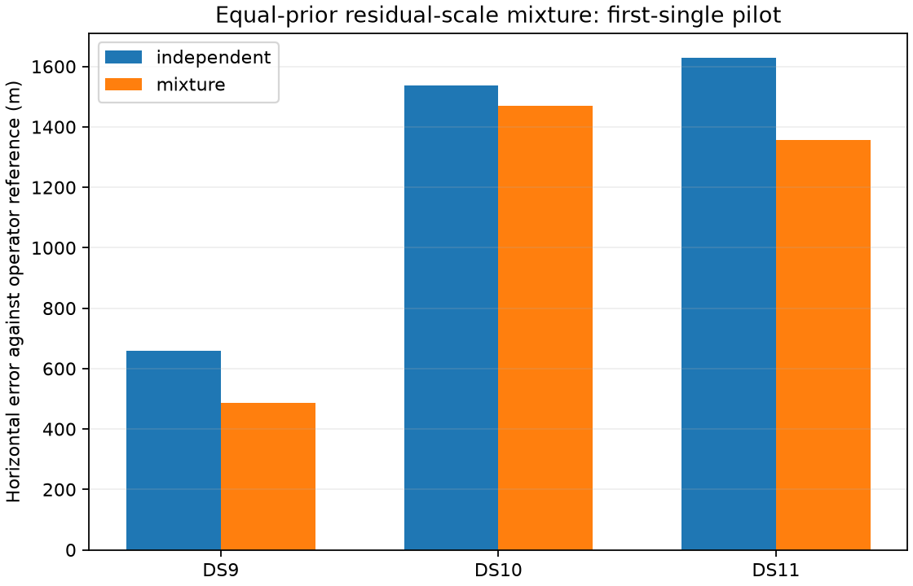

# Equal-prior mixture improves all three conditional single-scan pilots

The normalized independent/shared residual-scale mixture passes the predefined first-single accuracy gate. All6 planned fits are numerically accepted, controls reproduce the baseline, and each mixture fit reduces horizontal error against the admitted operator reference. This supports the next bounded first-pair/first-quad extension, not full-panel or production promotion.

| First single | Independent control | Equal-prior mixture | Paired change | Mixture updates |
|---|---:|---:|---:|---:|
| DS9 | 659 m | 486 m | -173 m | 7 |
| DS10 | 1,538 m | 1,471 m | -67 m | 12 |
| DS11 | 1,628 m | 1,357 m | -272 m | 7 |

Median paired change is-173m. Median error across these three cases changes from1,538m to1,357m. These are exposed warm fits with fixed satellite identities and memberships, using an unsurveyed operator reference. Three cases do not establish independent generalization.

## Mathematical model

For each fixed (scan,NORAD) group, p_I is the product of independent normalized Student-t4 residual densities, and p_S is the normalized Student-t4 density of concatenated residuals with block-diagonal original covariance. The residual density is p_M=.5p_I+.5p_S. The physical objective retains original branch scores and Gaussian nuisance priors, replacing only the residual-density terms. All observations are retained, including unchanged fixed background branches. Prior odds and degrees of freedom are fixed, with no geographic tuning.

The full-group posterior responsibility rho=p_S/(p_I+p_S) is recomputed at every trial state. Each track contributes to the gradient with effective weight(1-rho)*(4+d_i)/(4+q_i)+rho*(4+D)/(4+Q). This allows group-scale sharing when its normalized density is supported while preserving an independent heavy-tailed alternative. The positive weighted Jacobian metric is used for optimization only; it is not the exact posterior Hessian or calibrated covariance.

`MixtureObjective` implements independent, shared and mixture modes. A bounded fixed-membership IRLS optimizer uses the analytic gradient and positive metric, checks the full physical objective in a backtracking line search, and stops on scaled gradient decrement. It uses at most64updates,60seconds fitting and90seconds externally per arm including audit. This pilot tests a conditional continuous-state model; it neither performs cold acquisition nor solves coupled group reassignment.

## Verification and controls

Three objective tests pass for normalized physical endpoint scores, mixture state gradient including prior, and singleton value/gradient/metric invariance. Two optimizer tests pass for a known quadratic optimum with independent numerical audit and explicit deadline failure. The four earlier mixture-statistic tests remain separate prerequisite evidence.

On all three real scans, the independent endpoint agrees with the original physical objective exactly, and the shared endpoint agrees with the existing concatenated-group objective within4.55e-13. Endpoint gradient differences are below2.49e-14 and metric differences below2.28e-13. Full physical mixture finite-difference errors are at most3.78e-5 for step0.0005 and1.40e-6 for step0.0001, below the0.005 threshold. All baseline physical IDs and numerical prior bindings are preserved.

All6 final fits pass objective reconstruction, monotonicity, finite-gradient and stationary-state audits. Maximum final gradient error is2.18e-5; maximum numeric scaled decrement is7.95e-9, below1e-5. Independent controls pass the preset1m position and1e-5 objective equivalence limits. DS9 and DS11 controls are unchanged; DS10 makes a small submeter stationary refinement. Geographic evaluation occurs only after every numerical outcome is sealed and verified.

The plan required all six accepted, equivalent controls, negative median paired error change and no individual deterioration greater than1m. All conditions pass. The earlier full-sharing model failed this gate on DS10; the mixture avoids that particular deterioration in the conditional pilot. This comparison does not establish that the mixture dominates full sharing on every case: full sharing had slightly lower errors on DS9 and DS11.

## Next bounded extension

Run the identical fixed0.5prior,nu4 model on DS9/DS10/DS11-B01-D1 and then B01-Q against independent controls, using group keys that include scan identity. Reusing catalogue indices alone would incorrectly merge groups across independent scan blocks. Freeze the extension's process budgets, audit criteria and comparison rules before fitting; preserve all failures and original reports. Do not adjust prior odds or covariance to the pilot geography. Report these six windows separately from the three singles before deciding on the remaining development panel.

## Artifacts

`MIXTURE_LOCALIZATION_PLAN.md` fixes the hypothesis and gates. `mixture_localization.py` and `mixture_optimizer.py` implement the research model and fitter with component-owned tests. `check_mixture_localization.py` writes immutable endpoint/gradient receipts under `mixture-localization-check-v1`. `run_mixture_pilot.py` writes6 fit/audit records under `mixture-localization-pilot-v1`. `evaluate_mixture_pilot.py` writes the geographic summary and figure after verifying receipts. Sources, inputs and scientific outputs are SHA256-bound. No production change or new RF collection occurred.
