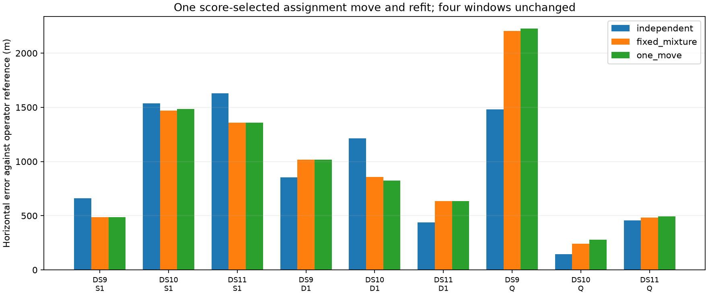

# One coupled reassignment does not rescue mixture accuracy

All5new one-move refits pass their numerical audits and improve the mixture objective. Nevertheless,4of5changed geographic estimates worsen; only DS10pair improves. The4windows with no positive proposal remain exactly unchanged. The multi-scan expansion gate still fails. Stop this equal-prior scale-mixture/reassignment branch and retain the original multi-scan model.

| Window | Original independent error | Fixed-label mixture | One move plus refit | Change versus fixed mixture |
|---|---:|---:|---:|---:|
| DS9 single | 659 m | 486 m | 486 m | unchanged |
| DS10 single | 1,538 m | 1,471 m | 1,484 m | +13 m |
| DS11 single | 1,628 m | 1,357 m | 1,357 m | unchanged |
| DS9 pair | 852 m | 1,016 m | 1,016 m | unchanged |
| DS10 pair | 1,215 m | 857 m | 824 m | -33 m |
| DS11 pair | 438 m | 635 m | 635 m | unchanged |
| DS9 quad | 1,479 m | 2,204 m | 2,227 m | +22 m |
| DS10 quad | 146 m | 241 m | 278 m | +36 m |
| DS11 quad | 455 m | 483 m | 492 m | +10 m |

These are errors against the admitted unsurveyed operator reference, not displacements. Positive change means worse. Windows are exposed and overlap; the accepted outcome count9comprises5newfits and4inherited unchanged fits, not9new independent trials.

## Frozen policy and checks

The choice manifest selects exactly one highest positive coupled-score proposal per affected window, with stored order breaking ties. It was sealed before launching any fit. No repeated association updates, odds tuning, geographic selection, rejected-case replacement or retries were performed.

Each changed fit starts from the prior accepted mixture state. The selected identity is changed once; (scan,NORAD) keys and active nuisance coordinates are rebuilt, including the new satellite epoch. All observations, original physical priors, fixed height, covariance and equal-prior nu4model remain unchanged. The changed initial objective reproduces the saved proposed gain within1e-6, and its finite-difference gradient passes before optimization. Fit limits remain64updates,60times scan-count seconds fitting and90times scan-count seconds externally including audits.

Two policy tests pass for positive-maximum/stable-tie selection and explicit no-change behavior. Every new fit passes reconstructed monotone objective, finite-gradient and stationarity checks. Sources and inputs verify before and after computation. Geographic scoring is separate, after all9outcomes are fixed. Unchanged geographic outputs are checked against their parent outputs exactly within numerical tolerance.

## What the additional optimization establishes

Local association inconsistency was real under the coupled mixture objective, but removing one such inconsistency does not repair the earlier geographic deterioration. Lowering the objective is not a reliable geographic selection criterion in these cases. The result does not prove that all alternative associations are wrong, nor that a global association search could never improve accuracy. It does make further iterations of this particular local reassignment policy a low-priority direction without a new independent hypothesis.

Relative to original controls, singles still improve on all3examples, pairs improve on1and worsen on2, and all3quads worsen. Median paired changes versus original are-173m for singles,+164m for pairs,+132m for quads. The median pair error becomes824m versus852m original despite two deteriorations, again showing why paired rows matter more than a favorable aggregate median alone.

## Model-family conclusion

The sequence now separates four claims. Shared residual scale can predict some held-track energies; an independent/shared mixture avoids some full-sharing tail losses; the conditional mixture improves these first single scans; neither its multi-scan fits nor one coupled reassignment provides consistent multi-scan geographic improvement. Mathematical correctness and numeric convergence have been verified, so this negative result should not be attributed to an unresolved gradient or solver failure.

Retain the original independent-track Student-t joint model as the multi-scan control. Preserve the promising single-scan result as limited development evidence, not a promoted size-dependent policy. Before another flexible likelihood or additional optimizer search, review information missing from the current measurement model and candidate evidence—especially which frozen physical constraints distinguish wrong but well-fitting locations. A new model should explain a measured discrepancy and carry an explicit control, rather than be another tuning of this exposed scale-mixture family.

## Artifacts

`MIXTURE_ONE_MOVE_PLAN.md` fixes the policy. `one_move_policy.py` and its tests implement the bounded choice. `run_mixture_one_move.py` seals `mixture-one-move-v1/choices.json` and writes all9case outcomes; `evaluate_mixture_one_move.py` verifies and scores them, producing the summary and figure. All scientific JSON artifacts have SHA256 sidecars. The previous model sources and results remain unchanged. No production change or RF collection occurred.
