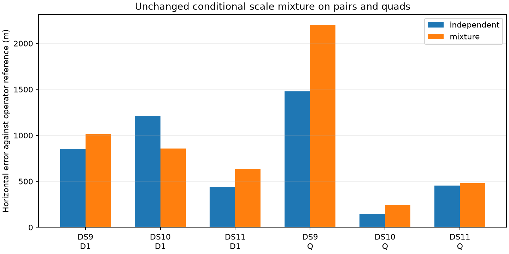

# Single-scan mixture gains do not carry over to pairs and quads

The unchanged equal-prior residual-scale mixture fails the predefined multi-scan expansion gate. All12 fits pass numerical audits and all6 independent controls reproduce their baselines, but only one pair improves; the other two pairs and every quad worsen. Retain the original independent-track model and do not expand this conditional mixture to the remaining panel.

| Window | Independent control error | Mixture error | Paired change |
|---|---:|---:|---:|
| DS9 pair | 852 m | 1,016 m | +164 m |
| DS10 pair | 1,215 m | 857 m | -359 m |
| DS11 pair | 438 m | 635 m | +197 m |
| DS9 quad | 1,479 m | 2,204 m | +725 m |
| DS10 quad | 146 m | 241 m | +95 m |
| DS11 quad | 455 m | 483 m | +27 m |

Errors use the admitted unsurveyed operator reference. Positive paired change means worse. All cases are the fixed B01-D1/B01-Q development windows, not independent held-out examples.

## Comparison across window sizes

| Size | Unique windows | Improved / worsened | Median paired change | Median error, control to mixture |
|---|---:|---:|---:|---:|
| Earlier singles | 3 | 3 / 0 | -173 m | 1,538 to 1,357 m |
| Pairs | 3 | 1 / 2 | +164 m | 852 to 857 m |
| Quads | 3 | 0 / 3 | +95 m | 455 to 483 m |

The median pair error looks nearly unchanged even though two of three pairs worsen: medians can switch which case supplies the central value. Paired changes and individual rows are necessary to see that effect. The windows overlap, so these nine rows are not nine independent experiments.

## Model and controlled extension

The model is unchanged from `MIXTURE_LOCALIZATION_RESULTS.md`: for each group, a fixed equal-prior normalized mixture of independent per-track Student-t4 densities and one shared-scale Student-t4 group density. All observations remain. The full mixture determines per-track effective gradient weights. Physical branch priors, location support, fixed height, covariance and independent scan nuisance blocks remain unchanged.

Here each group key includes scan ID and physical NORAD identity. Identical catalogue indices or NORAD values in different scans do not share residual scale. Background-assigned tracks retain original scores and labels. Both arms start from the same accepted optimized one-start parent, with fixed baseline identities and memberships. Thus this extends the conditional continuous model, not a cold search or a dynamic association algorithm.

The frozen plan allows64updates and60times scan-count seconds per arm, with90times scan-count seconds for the entire window process including real prerequisites, both fits and audits. All six processes finish within budget. No retry, cap increase, degree-of-freedom change, odds tuning or geographic group selection occurs. Final errors are calculated only after all planned outcomes have been sealed.

## Verification

Two grouping tests pass: repeated NORAD values across scans stay separate while same-scan members combine; duplicate or incomplete scan bindings fail. Every window verifies observation IDs, state-column bindings and prior precision against its parent. Independent and shared physical endpoint objective/gradient/metric checks pass, and mixture finite differences at both specified step sizes pass the0.005 criterion. Every fit passes objective reconstruction, monotonicity and stationarity checks. All independent controls pass1m position and1e-5 objective equivalence limits.

Scientific receipts include full group membership, prerequisite differences, both fits, audits, control equivalence and final responsibilities. Numerical acceptance is12/12; geographic success is1/6windows. This separates model performance from numerical convergence.

## What this changes

Positive conditional residual prediction and improved single-scan positions were insufficient to justify a general multi-scan improvement. Reweighting within groups changes how scans compromise on a shared location. The observed deterioration is consistent with that sensitivity, but this experiment does not prove its physical cause. It also does not identify which measurements or ephemerides are wrong.

The original joint independent-track model remains the multi-scan control. The mixture's singleton and gradient checks establish implementation correctness, not correctness of its reliability assumption. Avoid selecting the mixture only on datasets where its exposed geographic errors improved, or adjusting prior odds to reverse these particular losses.

A useful next diagnostic is to check whether fixed memberships remain locally consistent under the new coupled mixture objective after fitting. Changing one identity affects both the source and destination groups, so original per-track argmax scores alone cannot answer that question. Such a diagnostic should freeze a bounded candidate set without geography and report the full physical objective changes before any reassignment fit. If local label inconsistency is absent or too small to explain the effect, prioritize measurement/scan disagreement over further scale variants. No new model expansion is authorized by this negative result alone.

## Artifacts

`MIXTURE_WINDOW_PLAN.md` fixes cases, gates and budgets. `mixture_window_groups.py` and its tests bind scan-local identities. `run_mixture_windows.py` writes immutable per-window prerequisites and fit/audit receipts under `mixture-window-pilot-v1`; `evaluate_mixture_windows.py` verifies them and writes the geographic summary and figure. Earlier model, optimizer and single-pilot sources remain unchanged. No production change or RF collection occurred.
