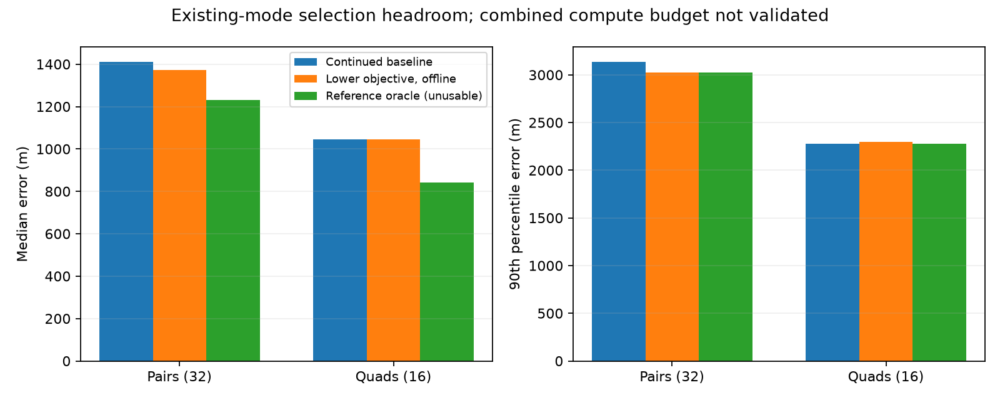

# Existing alternatives offer limited selection-only gains

An offline comparison of the already completed baseline/constituent pair and baseline/recursive quad fits helps separate candidate discovery from ranking. This uses only old-model, numerically accepted outputs; the new visibility model is not mixed into the comparison. No new fits were run.

| Selection from existing modes | Pair median / p90 | Pair within1km | Quad median / p90 | Quad within1km |
|---|---:|---:|---:|---:|
| Continued baseline | 1,410 / 3,135 m | 12/32 | 1,044 / 2,280 m | 8/16 |
| Lower objective among accepted modes | 1,372 / 3,022 m | 13/32 | 1,044 / 2,295 m | 8/16 |
| Reference-error oracle, diagnostic only | 1,230 / 3,022 m | 14/32 | 842 / 2,280 m | 9/16 |

The objective selector keeps the baseline when objective differences are within1e-6, selects the lower objective otherwise, and never selects a rejected mode. Decisions are computed before reading reference errors. All32pairs and16quads have an accepted continued baseline, so denominators stay fixed. Combining both proposal strategies would require additional computation; this offline comparison does not establish feasibility within the original time budgets or a deployable policy.

The geographic oracle deliberately chooses the smaller reference error among available accepted modes. It is an unattainable selector used only to measure the headroom in this candidate set. It must never enter inference, select starts, tune individual outputs or be presented as algorithm performance. Two tests verify the objective selector ignores geographic error and excludes rejected modes.

Even this oracle adds only two pairs and one quad within1km relative to the baseline. Seven pairs and one quad have an available mode more than100m better than the objective-selected mode. Thus ranking errors exist, especially for pairs, but choosing between these two existing solutions alone will not deliver a large sub-kilometer success increase. The oracle's unchanged quad p90 also means the current candidate set does not improve the high-error tail through selection alone.

This argues against spending the next campaign solely on more retries from the same proposals. More useful hypotheses include residual-model mismatch, additional informative track evidence and spatially different candidate modes. Those hypotheses require separate frozen experiments. The current visibility repair addresses numerical continuity; its success should not be confused with resolving these accuracy limits.

The [sealed diagnostic](mode-ranking-diagnostic-v1.json) includes each case and binds the complete prior pair/quad summaries and their source receipts. Results remain exposed development evidence, with correlated windows and an unsurveyed operator reference. The oracle is limited to these recorded candidate modes and is not a bound on what a better model or search can achieve.
