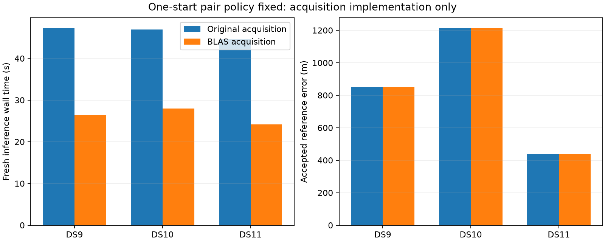

# Optimized acquisition on pairs: all six fits pass

The first pair from each dataset passes every process, numerical and equivalence gate. Holding the one-start policy fixed, optimized acquisition reduces observed inference wall time by 40–46%, with identical fitted geographic errors. The result supports the already planned quad stage; it does not establish a full-panel speed distribution or a change in localization accuracy.

| Pair | Original / optimized wall time | Original / optimized CPU time | Wall reduction | Error in both arms |
|---|---:|---:|---:|---:|
| DS9-B01-D1 | 47.34 / 26.44 s | 47.30 / 26.41 s | 44.1% | 852 m |
| DS10-B01-D1 | 46.97 / 27.96 s | 46.94 / 27.93 s | 40.5% | 1,215 m |
| DS11-B01-D1 | 44.70 / 24.13 s | 44.67 / 24.10 s | 46.0% | 438 m |

## Controlled comparison

The [frozen extension plan](ONE_START_BLAS_WINDOW_PLAN.md) retains the physical likelihood, eight-point track evidence, Sacramento prior, fixed 100 ft MSL height, independent scan nuisance parameters, optimizer and 64-iteration limit. Both arms acquire anew, initialize nuisance parameters to zero and fit only the first acquired seed. The wrapper substitutes matrix-product acquisition scoring while preserving the original adaptive search and startup timer. The order is optimized/original on DS9, original/optimized on DS10 and optimized/original on DS11. All processes run sequentially under the shared lock, with separate 180-second inference and audit caps. No retry or tolerance relaxation occurred.

This isolates acquisition implementation from the earlier one-versus-three-start experiment. In particular, DS9's 852 m here is the one-start result; its earlier three-start result was 806 m. Identical errors in this comparison do not claim that reducing start count is universally accuracy neutral.

## Verification

Two stage-policy tests pass, including rejection of missing, duplicate, rejected or incorrectly bound previous-stage rows. The completed single stage is verified before pair fitting. All source/input bindings and seals are checked before launch and after workers finish.

Prerequisites cover every track appearance in each pair: 96 on DS9, 93 on DS10 and 96 on DS11, or 285 in total. At nine fixed prior locations plus original acquired seeds, finite and visibility masks match exactly. Maximum per-track score errors are 8.00e-11 / 1.01e-10 / 1.30e-10. Summed marginalized acquisition score errors are 2.60e-10 / 2.61e-10 / 4.37e-10. Complete optimized acquisitions reproduce proposal seeds, requested/unique counts and spacing exactly, with proposal scores inside the fixed 1e-6 tolerance. Checking the aggregate window proposal matters because agreement on separate scans would not establish identical shared-window search decisions.

All six cold fits and all six separate audits finish within their process budgets. Every comparison passes all seventeen equivalence flags, including exact assignments, state agreement within 1e-5, objective agreement within 1e-6 and reproduction of the saved original first fit. The original objective, gradient and stationarity audit runs before geographic scoring. The summary verifies receipt/launch/audit seals and frozen dependencies. Geographic error changes are exactly zero in the recorded comparisons.

## Scope and next stage

These are three previously exposed development pairs at one unsurveyed operator reference site. Each arm has one timing observation; alternating order does not control host load or caches. Reported inference time includes process startup and work from prepared inputs, but excludes earlier extraction, prerequisite checks and the separately measured audits. CPU reductions are similar to wall reductions. Do not add these percentages to historical start-count savings.

All pair gates passed, enabling the predeclared first-quad stage. Before quad fits, all three quad prerequisites passed across 569 track appearances, with maximum per-track error 1.52e-10 and maximum aggregate score error 4.78e-10; every complete proposal check passed. Quad fit outcomes will be reported separately after completion. No production implementation is promoted by this pilot.

Artifacts: [sealed pair summary](one-start-blas-window-pair-summary-v1.json), [prerequisite checker](check_one_start_blas_window_prerequisite.py), [comparison driver](check_one_start_blas_window.py), [stage-policy tests](test_blas_window_stage_policy.py), [summarizer](summarize_one_start_blas_windows.py), and sealed receipts under `one-start-blas-window-cold-v1/DS*-B01-D1/`.
