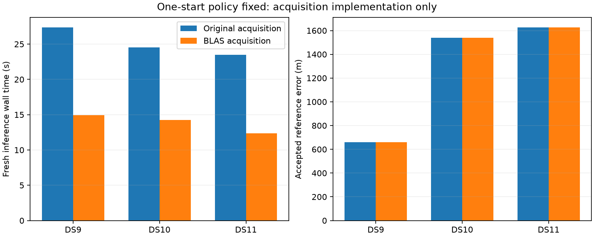

# One start plus optimized acquisition: six cold fits pass

The composed implementation passes all six numerical audits and every proposal/fit equivalence check. With the one-start policy held fixed, matrix-product acquisition reduces observed cold inference wall time by 42–47% in the first single of DS9, DS10 and DS11. Geographic errors are exactly equal in each recorded pair. This supports a bounded pair/quad extension, not a production or full-panel performance claim.

| First single | Original / optimized wall time | Original / optimized CPU time | Error in both arms |
|---|---:|---:|---:|
| DS9-B01-S1 | 27.39 / 14.92 s | 27.37 / 14.91 s | 659 m |
| DS10-B01-S1 | 24.54 / 14.26 s | 24.52 / 14.23 s | 1,538 m |
| DS11-B01-S1 | 23.51 / 12.35 s | 23.48 / 12.33 s | 1,628 m |

Observed wall-time reductions are 45.5%, 41.9% and 47.5%, respectively. These are newly paired measurements; we do not add them to the previous start-count savings to infer an unmeasured combined speedup.

## Controlled change

Both arms use the unchanged one-start worker, acquire from scratch and initialize nuisance parameters to zero. The wrapper changes only the acquisition function and preserves the process-start timer. The matrix-product implementation replaces tensor contractions in geometric acquisition scoring. The adaptive search policy, physical likelihood used by the fitter, eight-point observations, priors, fixed height, hard associations, optimizer and 64-iteration limit remain unchanged. Every inference and separate audit has a 90-second external cap.

The [plan](ONE_START_BLAS_PLAN.md) was fixed before these fits. Order is original/optimized on DS9, optimized/original on DS10, original/optimized on DS11. All runs are sequential under the shared lock. No fitted parent location or geographic error initializes or selects an arm. No retry or tolerance relaxation occurred.

## Prerequisites and verification

Two tests pass: the existing structural isolation test for the start-count worker and a wrapper test proving that CLI arguments and the fitter remain untouched while acquisition and the startup timer are substituted.

Before fitting, all 142 tracks across the three singles were checked at nine fixed prior locations plus each scan's original acquisition seeds. Finite and visibility masks match exactly. Maximum absolute score differences are 7.02e-11 / 8.38e-11 / 1.30e-10, below the unchanged 1e-6 score tolerance. Complete optimized acquisitions reproduce the original proposal seeds, requested/unique-point counts and spacing exactly, and proposal scores within 1e-6. Prerequisite processes were capped at 90 seconds each and acquisition calls at 50 seconds; all completed. They did not run localization fits or geographic scoring.

Every cold comparison then independently verifies one fit and seed limit one in each arm; exact proposal seeds/counts/spacing and score tolerance; first-fit states within absolute 1e-5; exact assignment equality; and objectives within 1e-6. Both arms also reproduce the saved original first fit under those tolerances. The original numerical audit checks objective consistency, active-coordinate gradients and stationarity before geographic scoring. The final summary verifies process gates, receipt/launch/audit seals and all frozen source/input bindings. All six outcomes pass, and all processes are terminal.

## Interpretation and next gate

This is a computational improvement, not evidence of a better statistical model or improved location accuracy. The time measurements include startup and inference from prepared inputs, excluding original observation/orbit extraction, coordinator prerequisites and separate audits. There is one observation per arm with fixed alternating order and uncontrolled host/cache effects. CPU measurements show similar reductions, but no stable speed distribution is established. These are previously exposed development scans at one unsurveyed operator reference site.

Next, version the prerequisite and composition driver for first pairs and quads from each dataset, with unchanged source components and model. Verify aggregate proposals before fitting; per-scan proposal equivalence alone does not prove a shared-window acquisition will make identical discrete choices. Freeze the membership, orders and cost limits before that extension, stage pairs before quads, and retain failed outcomes. The original and one-start baseline results remain preserved; production is unchanged.

Artifacts: [cold summary](one-start-blas-cold-summary-v1.json), [wrapper](run_one_start_blas.py), [comparison driver](check_one_start_blas.py), [prerequisite checker](check_one_start_blas_prerequisite.py), [summarizer](summarize_one_start_blas.py), and sealed prerequisites/receipts under `one-start-blas-prerequisite-v1/` and `one-start-blas-cold-v1/`. Earlier [cross-dataset start-count results](CROSS_DATASET_COLD_RESULTS.md) remain a separate experiment.
