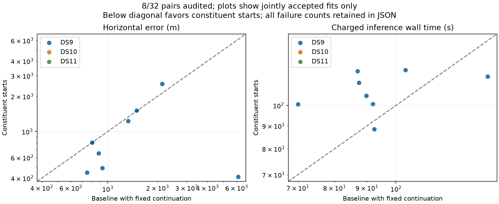

# Eight constituent-start pairs evaluated

The unchanged full-panel policy has completed the first eight pairs, all from DS9, with all eight passing their numerical audits. Twenty-four of the fixed 32 pairs remain pending in this snapshot. This ordered partial panel is not representative of all three datasets.

| Same eight pairs | Accepted | Median error | 90th percentile | Maximum error | Within 3 km | Median charged wall time |
|---|---:|---:|---:|---:|---:|---:|
| Original baseline | 8/8 | 1,127 m | 3,337 m | 6,139 m | 7/8 | 90.9 s |
| Constituent starts | 8/8 | 729 m | 1,825 m | 2,552 m | 8/8 | 108.8 s |

Five pairs improve by more than one metre, two worsen, and one changes by less than one metre. Median paired change is −164 m. Two of these eight were in the original pilot, including the deliberately selected difficult DS9-B03-D2 case. The sealed snapshot separately reports the six completed pairs outside that pilot; none are held-out data. Original and continuation-baseline comparisons coincide on these eight because all original fits converged.

The objective and geographic error do not always agree. DS9-B01-D2 lowers the objective by 13.710 but worsens from 2,136 to 2,552 m. DS9-B02-D1 improves from 927 to 487 m despite raising the objective by 1.545. DS9-B04-D2 lowers the objective by 2.932 but slightly worsens from 1,494 to 1,514 m. These are observed disagreements, not a basis for selecting fits using reference location. More thorough mode search may help missed minima, but it cannot by itself guarantee that the fitted physical/statistical model ranks locations correctly.

The next fixed batch includes DS9-B05-D1, whose second constituent is the 46 km converged single. Its inclusion follows the same numerical admission rule as every other pair. Complete the remaining DS9, DS10 and DS11 results before deciding whether the policy improves full-panel reliability. Predictive checks, model mismatch and reference/height limitations remain possible follow-up directions; no new correction is introduced into this arm.

The [snapshot](full-pairs-eight-v1.json) binds input receipts and includes every pending pair, per-dataset summaries, original-pilot membership, objective changes and separate failure transitions. The new comparison test passes and checks pending counts, failed-runtime inclusion, asymmetric acceptance and the one-metre reporting tolerance. [The experiment plan](FULL_PAIR_PLAN.md) and source hashes remain unchanged.
