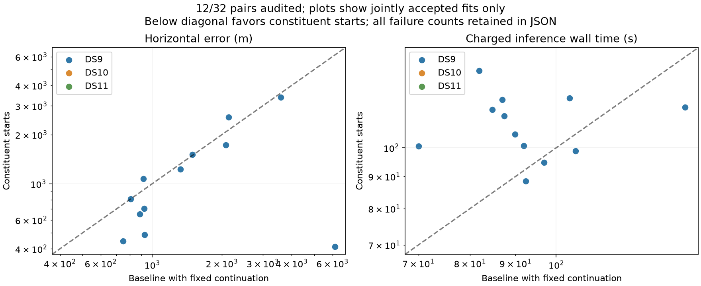

# All twelve DS9 constituent-start pairs

The full DS9 stratum is complete: all twelve constituent-start pairs pass their numerical audits. DS10 and DS11 remain pending in this snapshot. The unchanged policy improves eight DS9 pairs by more than one metre, worsens three and leaves one effectively unchanged.

| Same twelve DS9 pairs | Original baseline | Constituent starts |
|---|---:|---:|
| Accepted | 12/12 | 12/12 |
| Median error | 1,127 m | 939 m |
| 90th percentile | 3,440 m | 2,470 m |
| Maximum error | 6,139 m | 3,380 m |
| Within 1 km | 6/12 | 6/12 |
| Within 3 km | 10/12 | 11/12 |
| Median charged wall time | 90.9 s | 108.8 s |

The ten DS9 pairs outside the original pilot have median errors of 1,127 m for baseline and 1,151 m for constituent starts. Thus the pooled median improvement does not establish a median gain beyond the pilot cases. The original pilot includes the deliberately selected difficult pair. All results are exposed development data, with correlated pairs within quad blocks.

## What changed in the fitted modes

A new read-only diagnostic compares receipts only after confirming identical observation, candidate-input, column-map and prior bindings. Eleven of twelve winning solutions change at least one track assignment; the remaining pair reproduces the original solution within 0.02 m in the fitted ENU chart. The diagnostic compares branch indices within those identical ports, not satellite identities established from independent labels.

For DS9-B03-D2, the improved 411 m solution changes nine of 94 assignments and lowers the objective by 20.311. This supports the hypothesis that constituent starts find different association modes, rather than merely polishing the same continuous fit. However, the objective/error disagreements recorded in the previous update remain: lower objective does not necessarily mean lower geographic error.

DS9-B05-D1 includes the independently converged 46 km single as its second starting location. Both pair starts now converge; the first start wins by 29.765 objective units and gives 706 m error. The second start also moves to a nearby location in the fitted chart, about 678 m from the winner. This case shows that the joint observations can correct a poor single-scan start; it does not prove that arbitrary bad starts are safe. Selection uses objective only, with no reference-based veto.

DS9-B05-D2 illustrates another distinction: one start reaches 64 iterations, while the second converges to a slightly lower objective and the pair passes its audit at 1,073 m. The policy still chooses the lowest objective among all starts; it has not been changed to discard unresolved winners or select whichever location looks best.

## Evidence and next step

The [sealed snapshot](full-pairs-twelve-v1.json) retains twenty pending pairs and the separate non-pilot subgroup. The [mode diagnostic](constituent-modes-twelve-v1.json) records assignment changes and both starts' convergence/objectives without accessing geographic reference errors. Its test verifies that mismatched candidate inputs prevent comparison; the test passes after correcting a syntax error during development. No scientific runner or frozen input was changed.

The next bounded batch is running on DS10. Finish all 32 pairs before deciding whether to promote the policy or invest in a recursive pair-to-quad arm. A future hybrid acquisition strategy might retain both aggregate and constituent modes, but its extra work must fit the same budget and its geographic performance must be tested separately.
