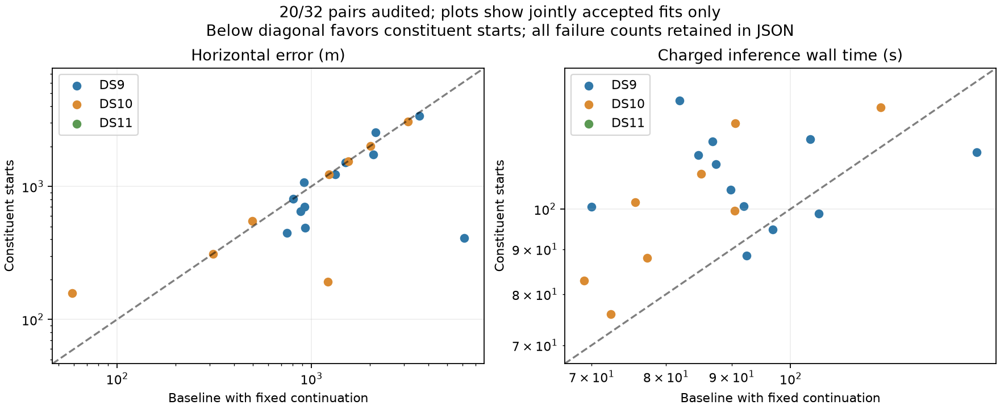

# Twenty pairs complete; recursive quad transfer tested

The constituent-start arm has completed twelve DS9 and eight DS10 pairs, all numerically accepted. Twelve fixed pairs remain pending. On the same twenty windows, median error changes from 1,223 to 939 m, p90 from 3,182 to 2,603 m, and maximum from 6,139 to 3,380 m. Within-3-km outcomes increase from 17/20 to 18/20; within-1-km outcomes increase from 9/20 to 10/20. Median charged runtime increases from 88.6 to 103.4 seconds.

Ten pairs improve by more than one metre, five worsen and five remain within one metre. Median paired error change is only −39 m: the change in the distribution's median is not the median improvement of individual windows. The partial panel contains three original pilot cases, and all DS11 pairs are still pending. Keep subgroup comparisons and the fixed completion denominator visible rather than extrapolating a pooled partial result.

The first four DS10 results illustrate mixed behavior: B01-D1 improves from 1,215 to 193 m, B01-D2 worsens from 496 to 552 m, B02-D1 worsens from 59 to 158 m, and B02-D2 remains at 312 m. Three of the next four DS10 pairs are essentially unchanged. No policy changes or geographic vetoes were made in response to these outcomes. The next batch covers DS10-B05 and DS11-B01.

Across the seventeen completed pairs outside the original pilot, median error is nearly unchanged: 1,231 m for baseline and 1,230 m for constituent starts. That comparison limits the broader improvement claim suggested by the pooled median.

## Preparing a distinct quad experiment

The [recursive quad plan](RECURSIVE_QUAD_PLAN.md) specifies two starts from the fixed disjoint constituent pairs, preserving every scan's nuisance parameters and recomputing all target assignments. It uses the same quad likelihood, priors, numerical audit and 360-second total allowance. Pair launch totals already contain single-scan work and are charged once; missing inputs or less than ten seconds remaining produce explicit policy failures. This is a separately versioned warm-replay experiment, not an unmeasured production speed claim.

A pure transfer helper now supports scan-identity mapping from two pair states into the quad layout. Three tests pass for unequal scan dimensions, reordered pair inputs, copy independence, duplicate/incomplete mappings and recursive budget accounting. These tests do not establish real-data compatibility or estimator performance. A real receipt/input/prior preflight and a supervised runner remain necessary before quad fits; none have run yet. The published pair runners remain source-frozen and unchanged.

The [sealed twenty-pair snapshot](full-pairs-twenty-v1.json) contains all planned/pending counts, dataset and non-pilot subgroups, runtime accounting and paired objective differences. Original and continued baseline agree on these completed windows; the separate comparisons will retain any difference when the previously unresolved DS11 pair is reached.
