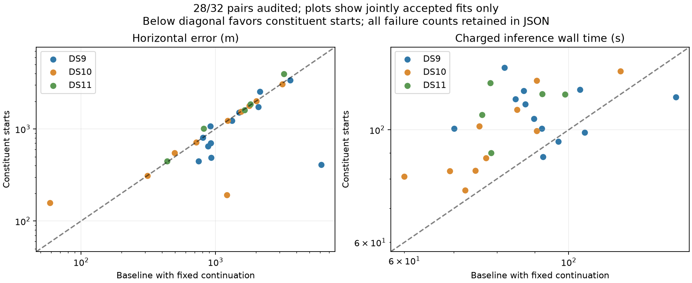

# Twenty-eight pairs: independent audit rejects one converged fit

Twenty-eight of the fixed 32 constituent-start pairs have completed. Twenty-seven pass the numerical audit. DS11-B03-D2 is reported converged by the optimizer but fails the independent finite-difference check: maximum gradient disagreement is 0.994 against the 0.005 threshold, and the numerical squared decrement is 0.357 against 0.00001. Preserve it as a rejected outcome with no geographic error statistic. Its baseline fit was accepted. The cause has not yet been diagnosed; this result alone does not identify a derivative bug or visibility discontinuity.

| Same 28 evaluated pairs | Original baseline | Constituent starts |
|---|---:|---:|
| Numerically accepted | 28/28 | 27/28 |
| Median accepted error | 1,279 m | 1,073 m |
| 90th percentile accepted error | 3,163 m | 2,755 m |
| Maximum accepted error | 6,139 m | 3,965 m |
| Within 1 km / evaluated | 12/28 | 12/28 |
| Within 3 km / evaluated | 24/28 | 24/28 |
| Median charged wall time | 86.2 s | 105.7 s |

The lower conditional error quantiles are not a reliability improvement: threshold success counts are unchanged and one additional numerical failure has appeared. Among 27 jointly accepted pairs, eleven improve by more than one metre, nine worsen and seven remain within one metre; median paired change is effectively zero. Four final DS11 pairs remain pending. The [sealed snapshot](full-pairs-twentyeight-v1.json) separates the failure, all pending cases, dataset strata and the 24 evaluated cases outside the original pilot.

## Recursive quad preflight

The first-block pilot in each dataset passes the real-data admission and state-transfer preflight. It verifies pair audit/launch/receipt/source hashes, prepared inputs, prior equality and exact preservation of every scan's nuisance coordinates in the target quad layout. No quad optimization or geographic scoring runs during this check.

| Quad pilot | Joint dimensions | Tracks | Charged pair work | Remaining from 360 s |
|---|---:|---:|---:|---:|
| DS9-B01-Q | 4,557 | 191 | 220.58 s | 139.42 s |
| DS10-B01-Q | 4,529 | 188 | 234.67 s | 125.33 s |
| DS11-B01-Q | 4,508 | 190 | 207.63 s | 152.37 s |

The [sealed preflight](recursive-quad-preflight-v1.json) binds the actual input receipts. The [recursive plan](RECURSIVE_QUAD_PLAN.md) requires charging each pair total once, since it already contains its singles. A supervised worker/admission runner still needs implementation and budget/admission tests. Avoid placing expensive preparation outside the charged work: either do lightweight constituent admission in the supervisor and full preparation in the timed worker, or charge any duplicate preparation explicitly. No recursive quad result is claimed.

Under the proposed fixed rule, the rejected DS11-B03-D2 constituent will cause its recursive quad to fail admission. That is an outcome to retain, not a reason to substitute another pair fit or remove the quad. Complete all pairs, diagnose the finite-difference failure separately, and keep any repaired model or audit change in a new experimental arm.
