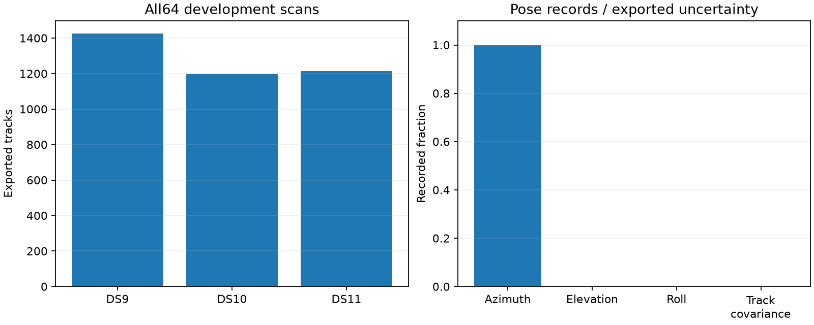

# Next direction: recover detector evidence before adding another likelihood

The scale-mixture family is closed after its multi-scan and one-move reassignment results. A read-only review of the64development scans identifies a concrete information gap: the exported frequency tracks omit quality fields available in the pinned public projection. Recovering these fields with exact observation binding is a stronger next prerequisite than inventing another residual-scale rule or imposing an uncalibrated antenna boundary.

| Dataset | Scans | Exported tracks | Exported frequency observations | Tracks with supplied covariance |
|---|---:|---:|---:|---:|
| DS9 | 24 | 1,426 | 63,820 | 0 |
| DS10 | 20 | 1,197 | 60,220 | 0 |
| DS11 | 20 | 1,213 | 63,396 | 0 |
| Total | 64 | 3,836 | 187,436 | 0 |

Counts are from the prepared exports before independent-track filtering and eight-point retention. They are not the numbers of independent observations in the localization likelihood. All128receiver pose records have an azimuth, no measured elevation or roll, and provisional software-to-connector mapping. All64share the same pose revision; altitude and directed RF phase-center baseline remain unrecorded.

## Evidence already used and omitted

`window_inputs.py` constructs physical tracks from frequency, time, receiver identity, RF frequency and observation IDs. The covariance is supplied by the development physics configuration; it is not a measured per-track covariance read from the exported evidence. The evidence explicitly marks covariance unavailable. Track exports contain channel/visit identity but none of the audited quality-field names (SNR, amplitude/power, coherence, peak width or uncertainty). The exporter source confirms the narrow field projection. This is absence from these exports, not proof that the archive or IQ lacks quality information.

Read-only inspection of the pinned public `project_scanner_candidates` implementation verifies availability of candidate-level exact score, control score, fractional margin, rank, support geometry and standard uncertainty. Its standard uncertainty is a heuristic combining a400Hz term with the capture timing-bracket width; it is not an empirically calibrated per-observation frequency variance. Margin is likewise detector evidence, not automatically an SNR or posterior probability. Neither quantity should be inserted directly as inverse variance without a measured predictive check.

The public projection filters on the fractional margin gate and suppresses overlapping probes before forming candidates. A quality overlay therefore must preserve candidate provenance and explain selection; it cannot treat absent rows as known noise examples. `tools/ds7_export_baseline.py` already joins projected candidate IDs to reconstructed tracks and verifies numerical timestamps. A separate versioned overlay should follow that exact public-port route while leaving the frozen frequency/orbit inputs unchanged.

## Why a hard beam constraint is not supported

The existing sky audit (`2026_09_30_rx_sky_coverage/README.md`) already examined DS9/10/11 and found conditional upper-sky support on both sides for both receivers. Nominal opposing10degree tilts imply20degree axis separation only under the level-mount/feed-alignment assumptions; actual elevation, gain pattern and roll are unmeasured. A rectangular detection histogram would not establish a calibrated rectangular beam. Do not use receiver azimuth alone to reject candidates or infer roll.

Earlier nominal-beam cross-validation (`2026_09_28_rx_nominal_beam_cv/README.md`) reported reception-window gains that reversed on later windows. The temporal beam extension (`2026_09_28_rx_beam_crossing/REPORT.md`) also failed its aggregate improvement criterion. Those are different reused datasets and reception endpoints, not geographic validations of this panel. They nevertheless show that directional reception has already been investigated and that adding an uncalibrated beam prior is not an unexplored easy fix.

## Proposed next bounded experiment

First export a quality overlay only for the first single of DS9/DS10/DS11 through the same pinned public reader and graph configuration. Bind source/analysis manifests, candidate IDs, track IDs, receiver/channel/visit, support timestamps and measured frequencies; require exact matches to the frozen export, and account for ambiguous or missing joins. Do not read raw IQ, collect RF, replace golden inputs, or use geographic answers. Verify the deployed reader module digests before and after. A fixed90second cap per scan is sufficient as an initial budget; failed joins remain failures.

If binding succeeds, inspect detector margin/control contrast and support geometry against residual consistency at the original accepted fitted states. Split calibration/evaluation by whole scan blocks before fitting any mapping; the first three exposed cases are feasibility data only. A useful candidate model is a predeclared quality-conditioned covariance or signal/background prior with an unchanged/no-quality control. Keep covariance and association-prior effects separate, because a detector confidence score is not inherently frequency precision. Any mapping must predict measurements on other blocks before an accuracy campaign.

This review does not claim that quality weighting improves localization, that any source frequency is wrong, or that the recorded antenna axes are inaccurate. It identifies recoverable information currently absent from the research inputs and a controlled path to test it.

## Verification and artifacts

`inventory_physical_evidence.py` checks all64session/manifest bindings, observation hashes in evidence and orbit metadata, and embedded admitted pose copies. It writes `physical-evidence-inventory-v1.json` with per-scan field counts and source/input hashes. The figure summarizes those counts. `probe_public_quality_fields.py` verifies all5pinned reader module hashes and snapshots the public projection source into `public-quality-source-v1.json`. This source probe loads no capture data. Both scientific records have SHA256 sidecars. No location fits, geographic comparisons, production changes or new RF were run in this review.
