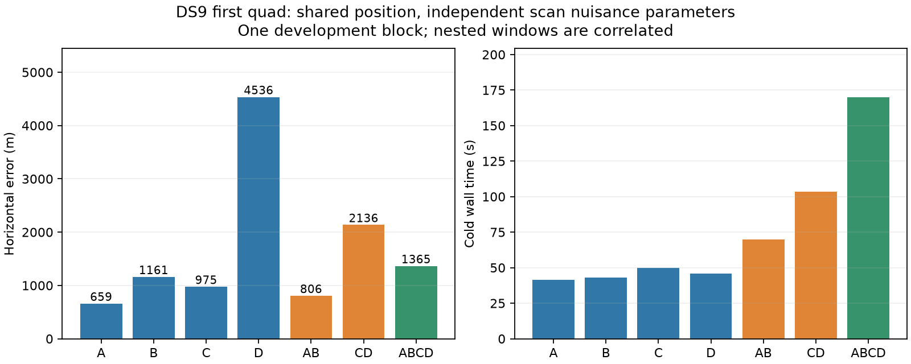

# First shared-position window pilot

The shared-position model converges on real single, dual and quad inputs, but adding scans does not automatically improve geographic accuracy. On the first metadata-selected DS9 block, the matched A → AB → ABCD progression is **659 → 806 → 1,365 m**. All seven evaluations passed numerical audits. This is one development block, not a benchmark-wide improvement claim.

## Hypothesis and model

Hypothesis: additional consecutive scans supply different satellite geometry and observations that can constrain a common stationary receiver location more strongly. Counter-hypothesis: persistent orbit or measurement errors, association mistakes, or inappropriate nuisance independence can pull the shared estimate away from the reference even when the joint fit converges.

The implemented model minimizes, for common location x and independent scan nuisance vectors z_j,

    sum_j [ -sum_track log p(y_track, assigned_satellite | x, z_j)
            + clock_j²/(2 * 1s²)
            + sum_receiver drift_j,r²/(2 * (0.5Hz/s)²)
            + sum_satellite epoch_j,s²/(2 * 0.5s²) ]

Each scan retains its own UTC origin, causal orbit bank and satellite ordering. Only east/north are shared. This is joint continuous maximum-a-posteriori fitting with alternating hard satellite assignments and Student-t4 track residuals. It profiles nuisance parameters; it does not integrate them or multiply independently approximated position posteriors. A uniform Sacramento-centered 250 km disk and fixed 30.48 m MSL height apply once per window. All windows use fresh aggregate acquisition and up to three location starts with zero initial nuisance values.

## Measurements

| Window | Scans | Horizontal error | Cold wall time | Accepted |
|---|---|---:|---:|---|
| A | DS9-F001 | 659 m | 41.3 s | Yes |
| B | DS9-F002 | 1,161 m | 43.1 s | Yes |
| C | DS9-F003 | 975 m | 50.0 s | Yes |
| D | DS9-F004 | 4,536 m | 45.9 s | Yes |
| AB | F001–F002 | 806 m | 70.0 s | Yes |
| CD | F003–F004 | 2,136 m | 103.5 s | Yes |
| ABCD | F001–F004 | 1,365 m | 170.1 s | Yes |

The quad improves upon D and CD, but is worse than A, B, C and AB. That is compatible with a compromise among inconsistent scan constraints; this experiment does not yet identify the physical source of the inconsistency. A larger window provides more evidence without guaranteeing less bias. Do not select the “best” subset using GPS.

Compute limits were proportional to input count: external 90/180/360 s for singles/duals/quads, internal limits 5 s shorter. The quad's measured 170 s runtime is about 4.1 times A's runtime. No constant-latency claim is made. Recorded wall/CPU times cover inference from prepared observations, including fresh acquisition, rather than raw-IQ analysis. At most two fits ran concurrently. Seven nested windows in one block are correlated measurements, not seven independent validation examples.

## Validation and provenance

Five numerical component tests pass: one-scan exact solver parity; joint fits with opposing clock shifts and different time origins against closed-form Gaussian solutions; scan/port-order invariance; finite-difference mapped Jacobians with disjoint satellite nuisance blocks; duplicate-observation and malformed-layout rejection. Eight dataset selector tests also pass.

The real A input has the same selected observation IDs, measurements and satellite catalogue as the original DS9-F001 baseline; its position agrees exactly. All seven pilot outcomes pass source/input bindings, identity consistency, physical-observation uniqueness, objective reconstruction, monotonicity, finite state/support checks, and finite-difference stationarity checks before geographic scoring. Maximum derivative discrepancy is 2.34e-5 and maximum numerical metric decrement squared is 5.50e-8, below the frozen thresholds of 0.005 and 1e-5. The known visibility/background discontinuity remains a possible rejection reason in later blocks; acceptance thresholds were not relaxed.

All 12 scans in the first DS9/DS10/DS11 blocks have prepared observations and verified causal orbit inputs. Existing capture-bound pose companions were separately recovered and verified for all 64 selected scans. Their operator-reported location is constant within all 16 quads. This resolves the missing-companion issue in the original dataset manifests but is not a survey or physical movement measurement. Reference uncertainty remains unquantified.

An initial batch supervisor failed before launching any fits because height metadata was incorrectly passed to a file-digest verifier. That failed preparation remains under `independent-v1`; corrected supervision and the seven measured runs are under `independent-v2`. No inference retry or uncharged continuation was used to obtain the reported acceptance.

The published [evaluation](independent-v2/DS9-B01/evaluation.json) and its hash sidecar contain exact errors, timings, acceptance checks and receipt hashes. Full fitted receipts and their source freeze are published alongside it. [Selection](selection.json) binds the new 16-block population. Large observation/orbit inputs and prototype implementation remain in the research workspace/cache; this report publication does not install the prototype into the production pipeline.

## Next experiments and ablations

1. Run the unchanged seven-unit pilot on DS10-B01 and DS11-B01 before making performance decisions. Their inputs are already admitted.
2. Inspect reference-free disagreement between scan likelihood surfaces and nuisance estimates. Test whether repeated satellite/TLE errors persist across a quad rather than treating every scan's epoch correction as independent.
3. Compare independent scan epochs with shared NORAD-and-TLE-snapshot epoch terms; retain per-scan clocks/drifts initially. This tests a specific correlation hypothesis without introducing arbitrary scan rejection.
4. Assess one versus three acquisition starts and common versus independent clock structure as separate ablations. Count every acquisition and fit in the runtime budget.
5. Expand validated arms unchanged to all 16 blocks. Report 64/32/16 aggregate views and the 16 matched prefix progressions, keeping whole quads together for all tuning and uncertainty calculations.

These further experiments are pending. No improved algorithm, calibrated uncertainty, full-panel result, or held-out generalization is claimed yet.
