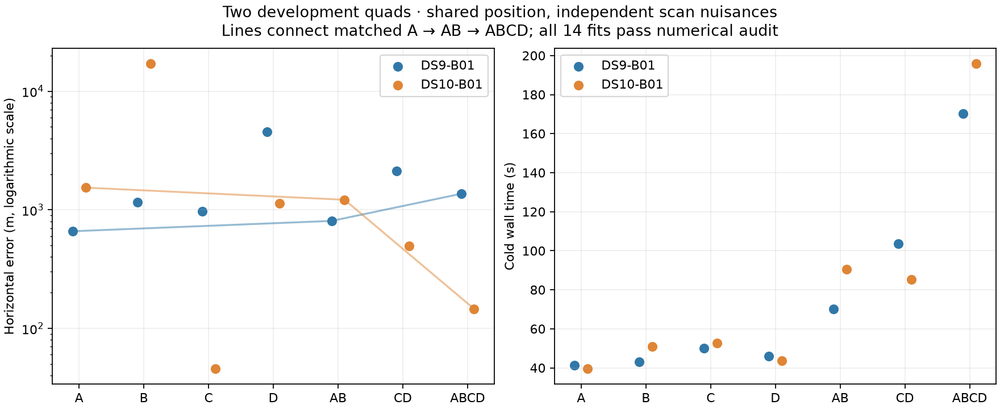

# Second quad: joint fitting resolves a large standalone error

The unchanged model improves the matched DS10 prefix from **1,538 m → 1,215 m → 146 m** as A → AB → ABCD are added. This contrasts with DS9's **659 m → 806 m → 1,365 m**. All 14 windows across these two blocks passed the same numerical audit. These are two development blocks; broader evaluation remains necessary.

| Window | DS9 error | DS10 error | DS10 cold wall time |
|---|---:|---:|---:|
| A | 659 m | 1,538 m | 39.7 s |
| B | 1,161 m | 17,038 m | 51.0 s |
| C | 975 m | 46 m | 52.7 s |
| D | 4,536 m | 1,138 m | 43.7 s |
| AB | 806 m | 1,215 m | 90.5 s |
| CD | 2,136 m | 496 m | 85.2 s |
| ABCD | 1,365 m | 146 m | 195.8 s |

The quad is not averaging the individual point estimates. It fits one shared location to all retained tracks, with joint continuous nuisance fitting and fresh hard satellite assignment updates. DS10 B alone is about 17 km from the operator reference, yet the full quad is 146 m away. This supports testing joint inference as a way to resolve some standalone failures. It does not prove that additional scans always help, nor that the resulting uncertainty is calibrated. The reference remains unsurveyed, so the 46 m result is not evidence of independently established survey-grade accuracy.

## What the diagnostics changed

Reference-free objective decompositions show that association changes matter. In DS9, C changes four track assignments and has an 8.66 lower objective contribution inside the quad than at its saved single-scan solution. A negative difference is possible because these are different local hard-association optima; it is not a negative statistical divergence. D changes three assignments and pays 8.56 more objective units in the quad. Their spatial gradients largely oppose one another, with the combined spatial gradient near zero at the audited solution.

In DS10, B changes seven assignments and pays 28.85 more objective units under the common position, while the other scans constrain the solution close to the reference. Its standalone likelihood preference and geographic error disagree. These diagnostics argue against assuming that an individually well-converged fit must be geographically correct. They do not justify choosing or dropping scans using GPS.

The proposed shared-satellite-epoch model has little active coupling to exploit here: DS9 has 83 active satellite/TLE-snapshot groups and DS10 has 87, with **zero groups repeated across scans** in either fitted quad. DS9 has no clutter-assigned tracks; DS10 has two. With fixed signal assignments, sharing epoch parameters cannot alter the active per-scan timing corrections when none repeat. A fresh search could still alter alternative assignments or visibility-dependent background scores, so this is a local conclusion.

## Next ablation

Prioritize a common clock across a window while keeping satellite epoch corrections and receiver drifts scan-specific. The hypothesis is that an actual receiver UTC offset may persist across consecutive captures; independent clocks may instead absorb scan-specific model errors. Each individual clock keeps marginal sigma=1 s, but cross-scan dependence changes from independent clocks to a single shared offset with one prior penalty. This may also worsen accuracy if the assumption is false.

[CLOCK_ABLATION_PLAN.md](CLOCK_ABLATION_PLAN.md) fixes the model and comparison. Its state mapping and runner are implemented locally; two common-clock layout tests and nine shared-epoch layout tests pass. No common-clock fit has been run or selected on these results. DS11's unchanged baseline pilot is the next prerequisite. Existing numerical acceptance thresholds, source seals and runtime accounting remain unchanged.

The full model and budget definitions are in [PILOT_REPORT.md](PILOT_REPORT.md). Exact DS10 [evaluation](independent-v2/DS10-B01/evaluation.json), fitted receipts, source freeze, per-scan objective decomposition and satellite-overlap audit accompany this update. Diagnostics and input preparation are excluded from reported inference wall times and are not hidden solver continuation.
