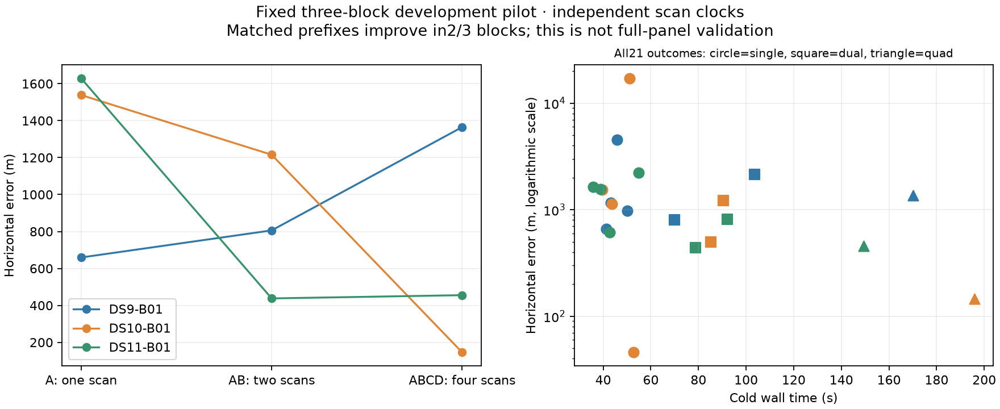
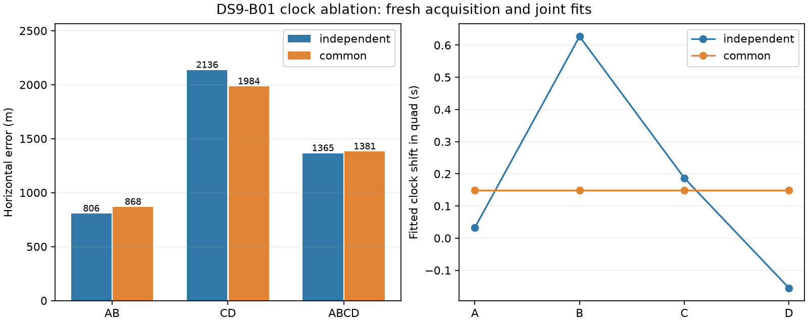

# Three-block baseline complete; first common-clock ablation is mixed

All 21 baseline fits passed the unchanged numerical audit. Combining scans improves the matched first-scan progression on DS10 and DS11, while DS9 worsens. This pilot uses the first selected quad from each dataset: 12 scans in three blocks, not the earlier dispersed 12-scan panel or the full new 64-scan panel.

| Block | A single | AB double | ABCD quad |
|---|---:|---:|---:|
| DS9-B01 | 659 m | 806 m | 1,365 m |
| DS10-B01 | 1,538 m | 1,215 m | 146 m |
| DS11-B01 | 1,628 m | 438 m | 455 m |

| All windows in these three blocks | Accepted | Median error | 90th percentile | Within 1 km | Median cold wall time |
|---|---:|---:|---:|---:|---:|
| Singles | 12/12 | 1,349 m | 4,304 m | 4/12 | 43.4 s |
| Doubles | 6/6 | 811 m | 1,676 m | 4/6 | 87.9 s |
| Quads | 3/3 | 455 m | 1,183 m | 2/3 | 170.1 s |

These quantiles are descriptive, especially with only three quads. The nested outcomes are correlated and use different counts; the matched table above isolates the same three starting blocks. No generalization, calibrated uncertainty, or full-panel performance claim follows. Errors are against unsurveyed operator coordinates. Budgets remain proportional to scan count, so improved accuracy also uses additional observation time and compute.

The baseline model shares east/north position, while every scan has independent clock, receiver drift and satellite epoch parameters. It uses fresh aggregate acquisition, up to three starts, hard satellite association updates and joint Student-t4 continuous fitting. One uniform Sacramento prior and fixed 100 ft MSL height apply per window. See [the model report](PILOT_REPORT.md) for the objective and limits.

## Common-clock hypothesis and first result

The ablation replaces independent c_j ~ N(0,1 s²) with one common c ~ N(0,1 s²), counted once. This changes cross-scan dependence while preserving each scan's marginal clock prior. Receiver drifts and satellite epochs stay scan-specific. A one-scan window is exactly the same model and reuses the baseline result; doubles and quads receive new cold fits, including acquisition, under the original budgets.

Hypothesis: a persistent receiver UTC error should be shared, reducing nuisance freedom that could absorb mismodeling. Counter-hypothesis: the independent clocks are compensating for real per-capture timing differences or other errors, and forcing equality can bias position.

| DS9-B01 window | Independent clocks | Common clock | Error change |
|---|---:|---:|---:|
| AB | 806 m | 868 m | +62 m |
| CD | 2,136 m | 1,984 m | −152 m |
| ABCD | 1,365 m | 1,381 m | +16 m |

All three new fits pass the same source, objective and finite-difference stationarity audits. Common-clock wall times are 72.9, 93.8 and 172.7 s; CPU times are 72.6, 93.0 and 168.3 s. The quad's common offset is +0.149 s, compared with independent +0.033, +0.627, +0.187 and −0.155 s offsets. Three component tests cover the common-clock map, counting its prior once, and the joint solver against a closed-form Gaussian solution.

This is a mixed result, with no basis to replace the baseline. Complete the same ablation on DS10 and DS11 before deciding. Do not choose per-block models from reference errors.

## Satellite overlap and expansion

All three accepted baseline quads have zero repeated active satellite/TLE-snapshot groups across scans: 83 distinct groups in DS9, 87 in DS10 and 89 in DS11. This deprioritizes shared-satellite epoch corrections for these fitted assignments. It does not rule out different identities under another search or changes to visibility-dependent background scores.

The next selected block, DS9-B02 (F017–F020), now has verified observations and causal orbit inputs. Sixteen of the new panel's 64 scans are prepared; 12 have baseline fits. Generic preparation and bounded window runners are ready for the remaining frozen blocks. Temporary exports for further blocks use `/var/tmp` because `/tmp` is nearly full; no source recordings were changed or collected.

Next steps: finish the common-clock pilot, retain or reject it using all three blocks, then expand validated models to additional frozen blocks while keeping every failure and all runtime costs. Hierarchical clock scatter remains a possible later model, not a fitted or selected result.

Exact evidence: [baseline summary](three-pilot-baseline-v1.json), [DS11 audit](independent-v2/DS11-B01/evaluation.json), [DS9 clock comparison](clock-comparison-DS9-B01-v1.json), and [common-clock audit](common-clock-v1/DS9-B01/evaluation.json). Fitted receipts, source freezes and hashes accompany the reports; large inputs and prototype implementation remain in the research workspace/cache.
