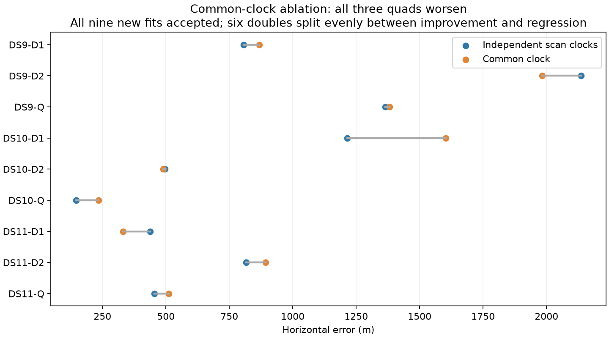

# Retain independent scan clocks; investigate equivalent faster acquisition

The common-clock pilot is complete. All nine new fits pass the same numerical checks, but none of the three quads improves and only three of six doubles improve. Keep the independent-clock model for the broader frozen development panel.

| Pilot windows | Independent-clock median | Common-clock median | Common-clock improvements |
|---|---:|---:|---:|
| Six doubles | 811 m | 880 m | 3/6 |
| Three quads | 455 m | 511 m | 0/3 |

| Quad | Independent clock per scan | One common clock |
|---|---:|---:|
| DS9-B01 | 1,365 m | 1,381 m |
| DS10-B01 | 146 m | 235 m |
| DS11-B01 | 455 m | 511 m |

The tested change was strictly cross-scan clock dependence: independent c_j ~ N(0,1 s²) versus one c ~ N(0,1 s²), counted once. Satellite epochs and receiver drifts remained scan-specific, with unchanged sigma=0.5 s and 0.5 Hz/s priors. Location is shared in both models. Each new double and quad used fresh acquisition, the same three-start policy, and the same proportional runtime limits. Singles are mathematically identical and reuse the baseline.

The result does not prove that the physical hardware clock changes between scans. Fitted clock coordinates can absorb other errors and are coupled to satellite timing. It does show that forcing equality is not an accuracy improvement on these three development blocks. Do not select different clock models per block using GPS, and do not tune an intermediate clock-scatter prior from these few outcomes. All inference errors remain referenced to unsurveyed operator coordinates.

Median wall times for independent/common clocks were 87.9/89.2 s for doubles and 170.1/172.7 s for quads. There is no clear runtime benefit either. [The sealed summary](clock-pilot-v1.json) includes all planned outcomes; these small correlated samples are not full-panel or held-out validation.

## Performance hypothesis and bounded experiment

Saved baseline timings indicate that preparation plus acquisition accounts for roughly two-thirds of the three quad runtimes. A 128-point acquisition microprofile on DS9-F001 took 2.44 s; NumPy tensor contractions accounted for 1.41 s of self time. Inspection confirmed that orbit interpolation is already cached, rejecting the initial idea of adding another orbit cache.

The implemented experiment substitutes matrix products for mathematically equivalent Cartesian dot products, contrast projection and residual quadratic forms. It changes no location prior, time shift, orbit input, likelihood, visibility rule, candidate ordering or optimizer. It is a numerical implementation experiment, not a new observation model.

Three geometry tests pass, including comparison with the original kernel on contiguous and strided arrays and rejection of invalid geometry. On 128 regional points and all 50 selected tracks, branch-support masks match and the maximum finite branch-score difference is 1.35e-10. Four alternating warm-cache timing repetitions give a median speed ratio of 1.21×, with substantial variability: original calls span 2.49–3.26 s and matrix-product calls 1.44–3.17 s. These measurements do not establish a stable cold-pipeline speedup.

A complete adaptive acquisition check for DS9-B01-S1 visits the same 1,355 unique points out of 1,513 requests, returns exactly the same seed coordinates and ordering, and differs in seed scores by at most 1.12e-10. The new proposal calculation takes 24.48 s wall / 23.99 s CPU, excluding preparation. No geographic fit was run with this optimized acquisition yet. The next gate is a bounded full cold-fit comparison, including acceptance and location parity, before using it in the larger benchmark.

Evidence: [microprofile](acquisition-profile-v1.json), [score parity and timing experiment](acquisition-blas-micro-v1.json), and [full proposal check](blas-proposal-DS9-B01-S1-v1.json). Large inputs and prototype source remain in the research workspace. Runtime samples are observations under the current host load, not hardware-independent guarantees.

## Expansion status

The first two frozen quads in each of DS9, DS10 and DS11 now have verified observation/orbit inputs: 24 of 64 selected scans. DS9-B02's seven baseline fits have converged and entered numerical audit; DS10-B02 is running. These expansion results are not included in this three-block clock comparison. Continue the remaining frozen blocks without replacing failures or retuning parameters from their location errors.

The broader objective remains incomplete: the full 64 singles / 32 doubles / 16 quads, further validated performance work, and uncertainty evaluation are outstanding. The independent-clock model remains the baseline; the common-clock model is not promoted.
