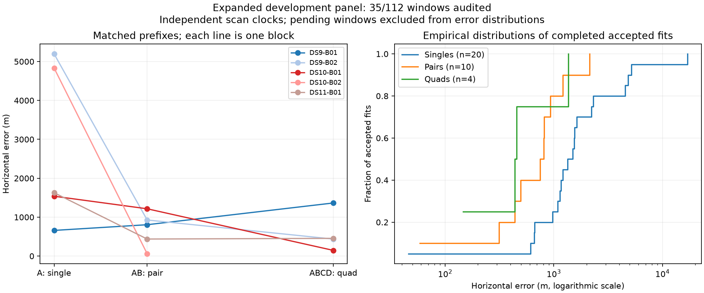

# Five blocks evaluated: pairs improve, one quad reaches its iteration limit

The unchanged independent-clock baseline has now evaluated five of the 16 frozen blocks: DS9-B01/B02, DS10-B01/B02 and DS11-B01. Numerical audits accept 34 of 35 windows. The new DS9 quad improves substantially; the new DS10 quad remains unresolved. Preserve that failure in all denominators.

| Window | Audited / full plan | Accepted / audited | Median error | 90th percentile | Within 1 km / audited | Median cold wall time |
|---|---:|---:|---:|---:|---:|---:|
| Single | 20/64 | 20/20 | 1,414 m | 4,869 m | 5/20 | 43.4 s |
| Pair | 10/32 | 10/10 | 778 m | 1,307 m | 8/10 | 87.2 s |
| Quad | 5/16 | 4/5 | 446 m | 1,092 m | 3/5 | 185.9 s |

Error quantiles condition on acceptance. The failed quad has no scored error; its runtime is included. The 77 pending windows are explicitly represented in the [sealed panel snapshot](panel-five-blocks-v1.json). These are correlated development observations, not held-out accuracy estimates. The reference is the existing unsurveyed operator coordinate.

The missing DS10-B02 quad endpoint represents an unresolved fit. The empirical distributions include accepted fits only; read them together with the acceptance table.

## New matched results

| Block | First scan A | First pair AB | Quad ABCD |
|---|---:|---:|---:|
| DS9-B02 | 5,197 m | 927 m | 437 m |
| DS10-B02 | 4,833 m | 59 m | Unresolved |

DS9-B02's second pair has 750 m error; DS10-B02's second pair has 312 m error. These outcomes support continuing the larger comparison, but do not establish that adding observations always improves a fit. DS9-B01 already showed the opposite matched-prefix trend.

## What failed in DS10-B02

The quad used 232.3 seconds wall time, below its 360-second external allowance. Its lowest-objective start reached the fixed 64-iteration limit. A different start converged, but with a worse objective: 9686.8113 versus 9685.9320. The frozen policy selects the lowest-objective result and requires convergence; it therefore correctly reports unresolved. There was no geographic rejection, missing input, or timeout in this case.

The best start spent many iterations making small improvements before a larger objective drop near iteration 55. At iteration 64 its objective was still falling. This suggests testing a bounded continuation selected by numerical status, without using reference error. It does not justify relabeling the baseline as successful or switching to the converged runner-up after seeing location errors. A separate continuation variant should account for total runtime, rerun the same numerical audit, and retain the original baseline outcome.

## Design and next work

The frozen 64 scans form 16 non-overlapping quads: six DS9, five DS10, five DS11. Each A/B/C/D block yields four singles, AB and CD, and ABCD. Every fit restarts from the same uniform 250 km Sacramento disk, with height fixed at 30.48 m MSL. Location is shared within a window; clocks, drifts and satellite epoch offsets remain scan-specific. Four consecutive recordings span about 26 minutes because normal inter-recording gaps are retained.

Twenty-eight scans now have admitted observations and causal orbit inputs. DS11-B02 is running, and DS9-B03 is ready. Thirteen selector and multi-window model tests pass. Continue the frozen baseline without replacement or parameter tuning, then evaluate bounded continuation and the separately verified acquisition optimization as distinct variants. Keep complete quads together in any development splits or resampling; nearby blocks may remain correlated. A new unseen dataset will ultimately be needed for a clean final evaluation.

The [previous report](PILOT_UPDATE_04.md) records the rejected common-clock ablation and the acquisition performance experiment. Neither changes this baseline. Full-panel evaluation, cold-fit speed verification and uncertainty calibration remain incomplete.
