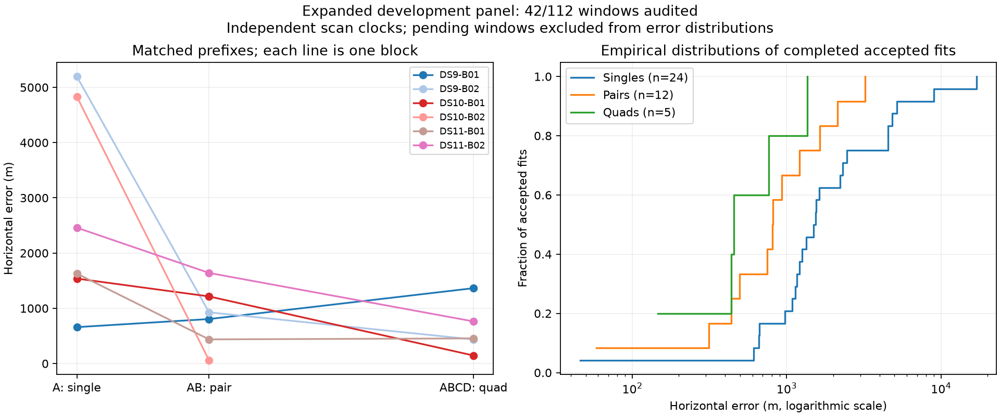

# Six blocks evaluated; bounded continuation resolves the first iteration failure

The frozen baseline now has 41 accepted outcomes among 42 evaluated windows. DS11-B02's quad passes the numerical audit at 763 m error, improving on its first scan's 2,460 m and first pair's 1,641 m. A separate continuation diagnostic resolves the previous DS10-B02 quad failure at 431 m error with three more iterations. Keep the baseline failure and diagnostic result separately recorded.

| Baseline window | Audited / full plan | Accepted / audited | Median error | 90th percentile | Within 1 km / audited | Median wall time |
|---|---:|---:|---:|---:|---:|---:|
| Single | 24/64 | 24/24 | 1,513 m | 5,088 m | 5/24 | 44.8 s |
| Pair | 12/32 | 12/12 | 811 m | 2,086 m | 8/12 | 87.2 s |
| Quad | 6/16 | 5/6 | 455 m | 1,124 m | 4/6 | 190.8 s |

Quantiles condition on accepted fits. Runtime includes unresolved outcomes. The [sealed snapshot](panel-six-blocks-v1.json) explicitly includes all 70 pending windows. These are six correlated development blocks, two per dataset, with an unsurveyed operator position as reference. They are not a final generalization estimate.

The missing DS10-B02 quad endpoint represents its unresolved baseline fit; the continuation is excluded from this baseline figure and table. DS11-B02's other singles have 1,257 / 4,531 / 9,013 m error, and its second pair has 3,224 m error. More observations help the quad here, but pairs are not uniformly accurate.

## Model and hypothesis

The model shares a two-dimensional position x across the window and retains scan-specific nuisance coordinates eta_j. Each track has a hard satellite-or-clutter assignment z_jt. The optimizer alternates assignment selection with a joint robust continuous fit:

\[
F(x,\eta,z)=\sum_{j,t}-\log p(y_{jt}\mid x,\eta_j,z_{jt})
 +\tfrac12\sum_j\eta_j^T\Lambda_j\eta_j,
\qquad \|x\|\le250\;\mathrm{km}.
\]

The signal residual likelihood is Student-t with four degrees of freedom. The geographic prior is uniform over the fixed Sacramento disk, and height is 30.48 m MSL. Each scan clock has sigma=1 s, each receiver drift sigma=0.5 Hz/s, and each satellite epoch correction sigma=0.5 s. The tested model has no cross-scan nuisance prior coupling. It uses three fresh acquisition starts; it is a joint continuous MAP fit with alternating hard associations, not a globally solved joint posterior.

The failure hypothesis was computational: the best DS10-B02 mode needed a few more iterations after a late objective drop. Its 64-iteration cap was reached with substantial wall-time allowance remaining. The hypothesis did not require a different likelihood, wider prior or reference-dependent selection.

## Continuation diagnostic

The fixed diagnostic resumes only the lowest-objective start when its termination reason is iteration_limit. It allows at most 32 further iterations and at most 60 extra seconds, shortened as needed to keep the sum of original cold launch time and continuation launch time within the original 90 seconds per scan. It performs no new acquisition and uses no reference coordinate in deciding whether or where to resume. Preparation overhead for the separate continuation process is included.

| DS10-B02 quad | Baseline | With diagnostic continuation |
|---|---:|---:|
| Best-start iterations | 64 | 64 + 3 |
| Objective | 9685.932016950 | 9685.932015003 |
| Numerical acceptance | Unresolved | Accepted |
| Horizontal error | Not scored | 430.91 m |
| Total inference wall time | 232.30 s | 242.45 s |

The first continuation objective matches the original final objective within 1e-6. The fit then terminates by the unchanged objective-stability criterion. The existing audit verifies current inputs and source hashes, exact assignment selection, monotone objective, finite state, geographic support, analytic-versus-finite-difference gradients and local stationarity. Maximum gradient discrepancy is 3.67e-5, and the numerical decrement squared is 2.18e-8, below the unchanged thresholds of 0.005 and 1e-5. The numerical audit takes an additional 20.57 s and is excluded from inference timing consistently with the baseline.

Evidence: [continuation evaluation](continuation-v1/DS10-B02-Q/evaluation.json), [receipt](continuation-v1/DS10-B02-Q/DS10-B02-Q.json), and [supervised launch with original and extra timings](continuation-v1/DS10-B02-Q/DS10-B02-Q.launch.json). The original baseline receipts remain intact. This is a warm failure-recovery diagnostic, not a fresh cold run or a full-panel continuation benchmark.

## Decisions and remaining work

Retain the model and frozen baseline. Carry this bounded continuation rule forward as a separate candidate policy, and evaluate all eligible failures without choosing cases by geographic error. A cold integrated version still needs equivalence and runtime verification. The result argues for reallocating unused optimization time before adding nuisance parameters; it does not show that other failures will be rescued.

DS9-B03 is running. DS10-B03 has admitted observations and causal orbits, bringing complete preparation to 32 scans; DS11-B03 preparation is underway. Continue all 16 frozen blocks, retain failures, and then compare recovery, accuracy, runtime and uncertainty. The separate matrix-product acquisition experiment also still needs its full cold-fit gate. Full-panel and held-out claims remain premature.
