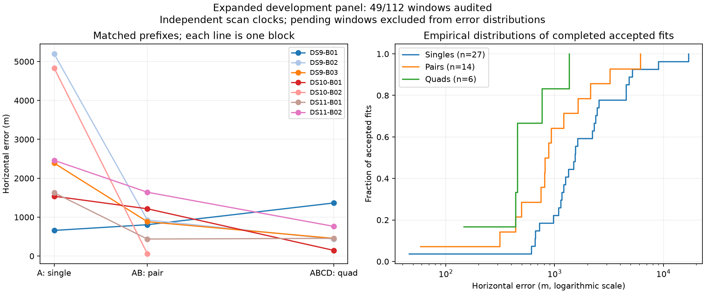

# Seven blocks: distinguish incomplete optimization from inaccurate converged fits

The frozen independent-clock baseline now has 47 accepted outcomes out of 49 evaluated windows. A second bounded continuation diagnostic succeeds, but a converged pair with 6.14 km error illustrates a different problem that continuation alone does not address.

| Baseline window | Audited / planned | Accepted / audited | Median error | 90th percentile | Within 1 km / audited |
|---|---:|---:|---:|---:|---:|
| Single | 28/64 | 27/28 | 1,538 m | 4,978 m | 6/28 |
| Pair | 14/32 | 14/14 | 849 m | 2,898 m | 9/14 |
| Quad | 7/16 | 6/7 | 455 m | 1,064 m | 5/7 |

Error quantiles include accepted fits only. All failures remain in threshold denominators; 63 pending windows are explicitly retained in the [sealed snapshot](panel-seven-blocks-v1.json). These are correlated development outcomes referenced to an unsurveyed operator coordinate.

## New DS9-B03 evidence

The matched first scan, first pair and quad have errors of 2,389 / 883 / 455 m. The quad takes 301.27 s, within the 360 s external limit, and passes all numerical checks. The second pair also passes those checks but has 6,139 m error. Its two converged starts have objectives 4916.6542 and 4922.1069; the remaining start reaches the iteration limit with a much worse objective of 5576.3959. The selected result is therefore not an iteration-limited winner.

This distinguishes two failure mechanisms. An iteration-limited best mode may simply need more computation. A numerically converged result can still have an incorrect association mode, weak geometry, or biased observation modeling. The present receipts establish the distinction but do not identify which cause explains the second pair. The quad's improvement is consistent with additional observations resolving ambiguity; proving that mechanism requires comparing assignments and likelihood contributions. Do not select the more accurate mode using reference error.

## Second continuation diagnostic

DS9-B03-S3 is unresolved after its baseline's 64 iterations. The unchanged continuation rule from [update06](PILOT_UPDATE_06.md) resumes the lowest-objective start, limits extra iterations to 32 and extra wall time to the lesser of 60 s or the remaining original window allowance, and then applies the same numerical audit.

| Diagnostic | Extra iterations | Extra inference time | Total inference time | Accepted error |
|---|---:|---:|---:|---:|
| DS10-B02-Q | 3 | 10.15 s | 242.45 s | 431 m |
| DS9-B03-S3 | 3 | 3.39 s | 59.90 s | 612 m |

Both eligible iteration-limited best fits encountered so far pass after continuation. This is two development diagnostics, not evidence that all future failures will resolve. The new single's gradient discrepancy is 9.89e-6 and numerical decrement squared is 1.14e-8, below the unchanged thresholds. Its audit adds 2.87 s, excluded from inference time consistently with the baseline. [The sealed evaluation](continuation-v1/DS9-B03-S3/evaluation.json) preserves the separate result; baseline tables and figures above exclude both diagnostic rescues.

## Execution and next hypotheses

Observation and causal orbit preparation is complete for 44 of 64 scans. A sequential queue is running DS10-B03, DS11-B03, DS9-B04 and DS10-B04 with the existing at-most-two-fit lock and per-fit deadlines. Each block is numerically audited after fitting. Existing batches are never restarted by the queue, and failed outcomes are retained. Remaining input preparation covers DS11-B04, DS9-B05/B06, DS10-B05 and DS11-B05.

Continue the unchanged full-panel baseline. Keep bounded continuation as a separate recovery policy, with all work charged and no reference-dependent choice. For inaccurate converged fits, investigate association and geometry evidence before increasing the iteration cap or adding nuisance coordinates. The common-clock ablation remains rejected, and the acquisition optimization still requires a full cold-fit check. Full-panel evaluation, uncertainty calibration and clean held-out testing remain outstanding.
