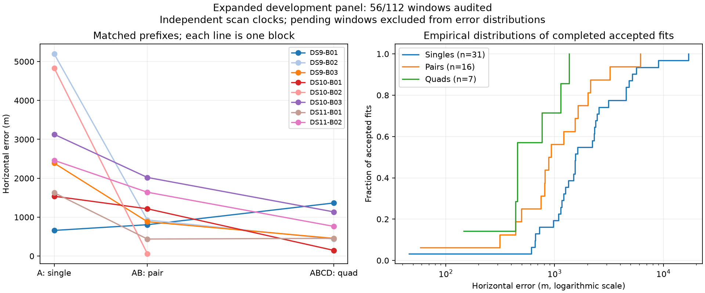

# Half-panel baseline and a reference-free demonstration of missed pair modes

Eight of the 16 frozen blocks are now evaluated. The independent-clock baseline accepts 54 of 56 windows. DS10-B03's seven windows all pass: its matched first scan, first pair and quad have errors of 3,129 / 2,021 / 1,136 m. Baseline results remain separate from the two successful continuation diagnostics.

| Baseline window | Audited / planned | Accepted / audited | Median error | 90th percentile | Within 1 km / audited |
|---|---:|---:|---:|---:|---:|
| Single | 32/64 | 31/32 | 1,549 m | 5,197 m | 6/32 |
| Pair | 16/32 | 16/16 | 905 m | 2,680 m | 9/16 |
| Quad | 8/16 | 7/8 | 455 m | 1,227 m | 5/8 |

Error quantiles condition on acceptance. The [sealed snapshot](panel-eight-blocks-v1.json) preserves all 56 pending windows and both baseline failures. These correlated development outcomes use an unsurveyed operator reference and do not establish held-out performance.

## Test the search before changing the observation model

Project an accepted quad state into each constituent pair's coordinate layout: keep the shared position and each included scan's own nuisance coordinates, discard the other scans, and recompute all hard assignments and the pair objective. This is a feasible-point test without refitting or reading reference coordinates. A lower value proves that the pair search missed a better available objective. A higher value is inconclusive about other unvisited modes.

| Pair | Original pair objective | Pair objective at quad state | Change | Changed assignments |
|---|---:|---:|---:|---:|
| DS9-B03-D1 | 4563.342 | 4554.686 | −8.656 | 3/89 |
| DS9-B03-D2 | 4916.654 | 4911.116 | −5.538 | 11/94 |
| DS11-B02-D1 | 5152.664 | 5155.155 | +2.491 | 1/93 |
| DS11-B02-D2 | 5108.339 | 5113.175 | +4.836 | 5/94 |

The DS9 second pair's accepted 6.14 km error is therefore accompanied by a demonstrated search failure: even without refitting its nuisances, a different feasible state scores better under its own observations. This does not prove global optimality, physically correct identities, or that better objective always means better geography. The DS11 result does not establish the same failure mechanism. These two blocks were selected for diagnosis after their results were seen; do not interpret the table as an unbiased prevalence estimate.

The quad state uses additional observations. It is not a valid initialization for a pair estimator and is not reported as a new localization result. Source/input bindings and sealed results are in [DS9 diagnostics](independent-v2/DS9-B03/pair-mode-diagnostic-v1.json) and [DS11 diagnostics](independent-v2/DS11-B02/pair-mode-diagnostic-v1.json).

## New candidate policy: starts from constituent fits

Use each constituent single-scan location as a start for the pair, preserving its own scan nuisance coordinates and then jointly refitting the complete pair objective. For a later quad extension, do the same with its two constituent pairs. This uses only the target window's observations and does not average fitted locations. All constituent inference work must be charged against the larger window's budget.

The [fixed pilot plan](CONSTITUENT_START_PLAN.md) specifies three metadata-selected first pairs plus the explicitly failure-selected DS9-B03-D2 diagnostic. It retains the existing objective, priors, numerical checks and geographic separation. No pilot fits have run yet. A pure coordinate-transfer helper is implemented with six passing component tests for nuisance preservation, independent output storage, scan-order invariance and rejection of overlapping, incomplete or malformed column maps. This verifies state transfer, not localization performance.

The hypothesis is that subset fits expose useful modes missed by aggregate acquisition. Risks include correlated wrong subset modes and insufficient time left for joint fitting. The pilot must retain these failures. Warm receipt reuse can test the idea and charge historical work; only a subsequent integrated cold run establishes end-to-end timing.

## Execution status

DS11-B04 inputs are admitted, bringing preparation to at least 48 of 64 scans. The remaining four input blocks are queued sequentially. The baseline queue has finished DS10-B03 and moved to DS11-B03, followed by DS9-B04 and DS10-B04. Both queues use the existing bounded operations; the fit queue retains the two-fit limit and automatic block audits.

Finish the unchanged baseline before launching competing fit experiments. The common-clock ablation remains rejected. Full-panel results, broader continuation evaluation, the constituent-start pilot, cold acquisition optimization and uncertainty calibration remain outstanding.
