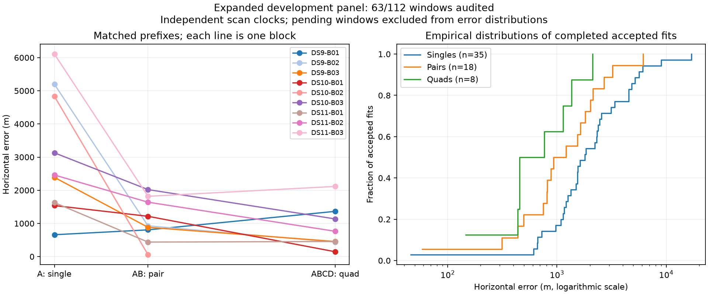

# All inputs admitted; nine baseline blocks audited

All 64 selected scans now have admitted observations and causal orbit inputs. Membership is unchanged and no scans were replaced. The baseline has evaluated nine blocks, accepting 61 of 63 windows. The current queue continues with DS9-B04 and DS10-B04; five further prepared blocks remain after that queue.

| Baseline window | Audited / planned | Accepted / audited | Median error | 90th percentile | Within 1 km / audited |
|---|---:|---:|---:|---:|---:|
| Single | 36/64 | 35/36 | 1,802 m | 5,453 m | 6/36 |
| Pair | 18/32 | 18/18 | 1,071 m | 2,849 m | 9/18 |
| Quad | 9/16 | 8/9 | 609 m | 1,590 m | 5/9 |

Error quantiles condition on acceptance. The [sealed snapshot](panel-nine-blocks-v1.json) preserves both baseline failures and all 49 pending windows. Both separate continuation diagnostics remain excluded from this baseline table. These correlated development results use the unsurveyed operator reference.

The new DS11-B03 block has matched first-scan / first-pair / quad errors of 6,107 / 1,818 / 2,116 m. Its quad passes the numerical audit but is less accurate than its first pair. The larger sample's higher medians reinforce the need to finish the frozen panel before drawing broad conclusions from the early pilots.

## Constituent-start implementation readiness

The [pilot plan](CONSTITUENT_START_PLAN.md) is implemented as a research runner. It binds audited constituent receipts, transfers scan-specific nuisance coordinates into two shared-position starts, recomputes assignments, and fits the unchanged joint objective. It uses the existing numerical audit and reads reference coordinates only for subsequent scoring. Historical constituent launch times, including any continuation, count toward the pair's total 180-second allowance. This is a warm replay policy; a later cold integrated run is necessary for end-to-end timing claims.

| Planned pair | Charged constituent time | Remaining pair budget |
|---|---:|---:|
| DS9-B01-D1 | 84.40 s | 95.60 s |
| DS10-B01-D1 | 90.64 s | 89.36 s |
| DS11-B01-D1 | 74.80 s | 105.20 s |
| DS9-B03-D2, failure-selected diagnostic | 98.63 s | 81.37 s |

The [real-input preflight](constituent-preflight-v1.json) verifies the selected physical scans, matching input hashes, column layouts and exact preservation of every nuisance coordinate at both starts. Eleven component tests pass across window mapping and constituent state transfer. The runner compiles, but **no constituent-start localization fits have run yet**. Input validation is not an accuracy or convergence result.

Preserve the pilot plan, unchanged priors and all failures when running the candidate. The failure-selected fourth pair is diagnostic and must not be pooled into an unbiased improvement estimate. The DS9 missed-mode evidence from [update08](PILOT_UPDATE_08.md) motivates this initialization policy without permitting the use of additional quad observations in a pair estimator.

## Remaining work

Finish the full 112-window baseline, including the remaining seven blocks. Evaluate eligible continuation failures separately, run the fixed constituent-start pilot under the shared fit limit, and complete cold acquisition-performance verification and uncertainty evaluation. Common-clock results remain negative. No new RF collection was needed for preparation.
