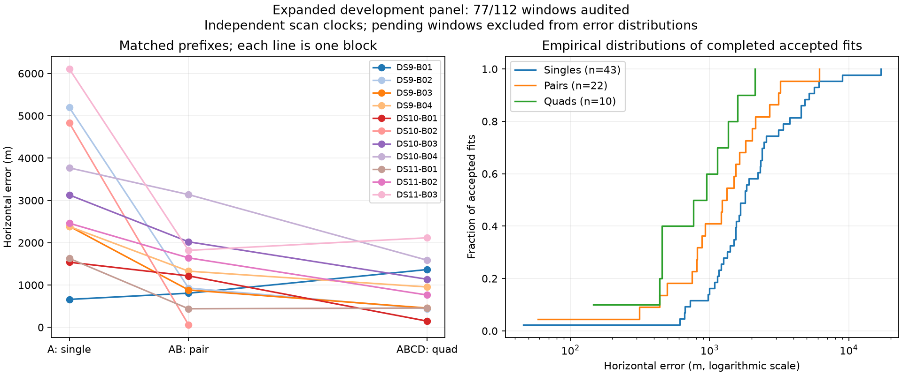
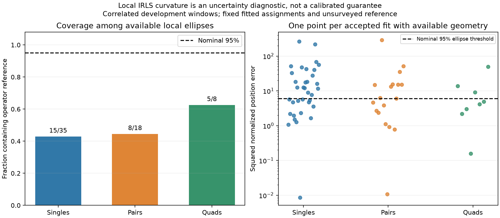

# Eleven baseline blocks; local uncertainty substantially under-covers

The baseline now accepts 75 of 77 evaluated windows across eleven frozen blocks. All selected inputs are admitted, and the final five-block queue is running. A separate diagnostic on the frozen nine-block snapshot finds that nominal 95% local ellipses cover the operator reference much less often than 95%. Improved joint-fit accuracy has not produced calibrated uncertainty.

| Baseline window | Audited / planned | Accepted / audited | Median error | 90th percentile | Within 1 km / audited |
|---|---:|---:|---:|---:|---:|
| Single | 44/64 | 43/44 | 1,802 m | 5,124 m | 7/44 |
| Pair | 22/32 | 22/22 | 1,279 m | 3,092 m | 9/22 |
| Quad | 11/16 | 10/11 | 858 m | 1,639 m | 6/11 |

Error quantiles condition on acceptance. The [sealed eleven-block snapshot](panel-eleven-blocks-v1.json) retains both baseline failures and 35 pending windows. Continuation diagnostics remain separate. DS9-B04 has matched first-scan / first-pair / quad errors of 2,383 / 1,327 / 953 m; DS10-B04 has 3,768 / 3,137 / 1,586 m. Both new blocks pass all seven numerical audits.

## Uncertainty diagnostic: frozen nine-block population

This analysis uses the earlier nine-block snapshot, not all eleven blocks above. It computes geometry for every accepted fit and retains rejected fits without an ellipse. No uncertainty scale is tuned from these outcomes.

| Window | Accepted fits / evaluated | Reference inside nominal 95% ellipse | Observed coverage among ellipses | Median nominal 95% major radius |
|---|---:|---:|---:|---:|
| Single | 35/36 | 15/35 | 42.9% | 1,974 m |
| Pair | 18/18 | 8/18 | 44.4% | 1,394 m |
| Quad | 8/9 | 5/8 | 62.5% | 937 m |

For each accepted fitted state, hold its selected satellite-or-clutter assignments fixed. Form the Student-t4 IRLS information approximation H from the observation Jacobians, robust residual weights and nuisance prior precision. Partition into position x and nuisance eta coordinates and calculate

\[
\Sigma_x=\left(H_{xx}-H_{x\eta}H_{\eta\eta}^{-1}H_{\eta x}\right)^{-1}.
\]

All 61 accepted fits yield valid positive geometry. The existing helper passes three tests covering agreement with the full inverse, nuisance-coordinate rescaling invariance, increased uncertainty from shared nuisance coupling, and explicit rejection of unidentified geometry. This is inverse local IRLS curvature, not an exact Student-t posterior covariance, full observed Hessian or multimodal posterior.

After all fitted-state geometry is fixed, map the operator reference into the same Sacramento-centered coordinates. Verify the geographic round trip and compute the squared normalized error d²=(x−x_ref)^T Sigma_x^-1 (x−x_ref). The nominal Gaussian 95% threshold in two dimensions is 5.99146. Points above the dashed line fail that nominal ellipse check. The major radius alone does not determine containment because the ellipses are anisotropic.

The [sealed uncertainty result](uncertainty-nine-blocks-v1.json) binds the snapshot, receipts, inputs and source files. Coverage is descriptive on correlated development windows with an unsurveyed reference. These fractions are not independent-trial confidence estimates. Both baseline failures remain explicit and contribute no successful coverage outcome.

## Interpretation and next work

The nominal ellipses shrink with added scans, but their coverage remains far below 95%. They must not be presented as calibrated 95% location guarantees. Local curvature omits remote association modes and may fail to represent systematic observation, orbit or timing errors; this diagnostic does not isolate their respective contributions. Simply treating the local fit as a single Gaussian is insufficient here.

Finish the unchanged baseline and the already fixed constituent-start pilot before making performance claims for a new estimator. Then assess uncertainty for the chosen estimator using complete-block grouping, with separate evaluation rather than tuning and reporting a scale on these same windows. Preserve failure counts and the uncertainty of the operator reference.

The original four-block queue has completed. A supervisor verified its sealed audits before launching DS11-B04, DS9-B05, DS10-B05, DS11-B05 and DS9-B06. It preserves the existing fit lock and per-window limits. Constituent-start fits, broader continuation results, cold acquisition optimization and calibrated uncertainty remain outstanding.
