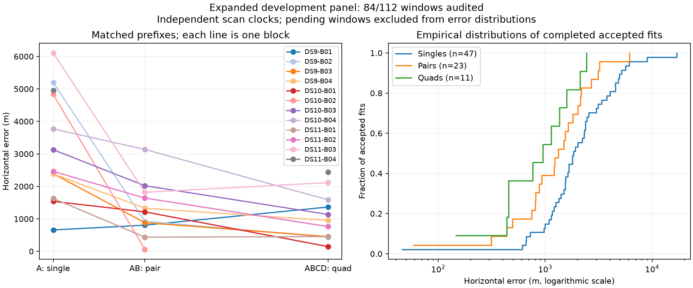

# Twelve blocks: a third iteration-limited baseline outcome

The unchanged baseline has evaluated twelve of sixteen blocks, accepting 81 of 84 windows. DS11-B04's first pair reaches its iteration limit; it remains a failure in the baseline. Its four singles, second pair and quad pass numerical audits. The remaining queue is running DS9-B05, DS10-B05, DS11-B05 and DS9-B06.

| Baseline window | Audited / planned | Accepted / audited | Median error | 90th percentile | Within 1 km / audited | Within 3 km / audited |
|---|---:|---:|---:|---:|---:|---:|
| Single | 48/64 | 47/48 | 1,845 m | 5,054 m | 7/48 | 34/48 |
| Pair | 24/32 | 23/24 | 1,327 m | 3,047 m | 9/24 | 20/24 |
| Quad | 12/16 | 11/12 | 953 m | 2,116 m | 6/12 | 11/12 |

Quantiles condition on acceptance. The [sealed snapshot](panel-twelve-blocks-v1.json) preserves all three baseline failures and 28 pending windows. Separate continuation diagnostics are excluded. These are correlated development results against the operator reference, not held-out accuracy estimates.

DS11-B04's first scan has 4,959 m error, its second pair 2,161 m and its quad 2,443 m. The unresolved first pair's lowest-objective start stops at 64 iterations after 104.33 seconds, below the 180-second allowance. Its final objective values continue to decrease. It is eligible for the same separately reported continuation diagnostic after the baseline queue finishes; no rescue is claimed yet.

## Pilot runner review and bounded next experiments

The constituent-start supervisor now has a versioned wrapper that records explicit failed evaluation rows if constituent admission fails or less than ten seconds of budget remains. A third test verifies that the joint launch receives only the remaining budget and that the reported total includes both constituent and joint work. Together with six coordinate-transfer tests, nine tests pass. The successful fit path reuses the original preflighted worker; the original source and preflight artifacts remain unchanged.

This changes failure accounting, not the numerical model or fixed pilot membership. It permits the constituent continuation already specified in the plan and does not add continuation to the target pair fit. No constituent-start localization trials have run yet. Research runners and component prototypes remain in the working research checkout.

A separate cold-fit gate is prepared for the matrix-product acquisition implementation on DS9-B01-S1, D1 and Q. It will run the original model with only the equivalent acquisition calculation substituted, under the original 90/180/360-second limits. Required comparisons include identical visited-point counts, seed locations and ordering, assignment equality, fitted-state agreement, objective agreement and numerical acceptance. The preliminary microbenchmark and proposal check do not replace this gate. Historical timing comparisons will remain qualified by host-load differences; no cold speedup is claimed yet.

Finish the baseline queue before launching these fit experiments. Then apply bounded continuation to all eligible failures, run the fixed constituent-start pilot, and execute the cold acquisition gate as separate variants. The [nine-block uncertainty audit](PILOT_UPDATE_10.md) remains unchanged: local ellipses substantially under-cover, so accuracy improvements must not be described as calibrated 95% location guarantees.
