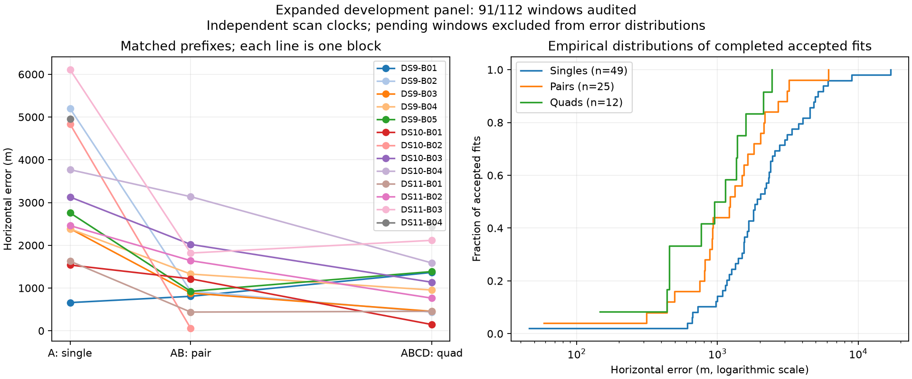

# Thirteen blocks audited; fixed variants queued after the baseline

The baseline accepts 86 of 91 evaluated windows across thirteen blocks. DS9-B05 adds two iteration-limited singles; its other two singles, both pairs and quad pass. The two pairs have 923 m and 916 m errors, while the quad has 1,385 m error. More scans do not guarantee a more accurate point estimate on each block.

| Baseline window | Audited / planned | Accepted / audited | Median error | 90th percentile | Within 1 km / audited |
|---|---:|---:|---:|---:|---:|
| Single | 52/64 | 49/52 | 1,920 m | 5,007 m | 7/52 |
| Pair | 26/32 | 25/26 | 1,231 m | 2,957 m | 11/26 |
| Quad | 13/16 | 12/13 | 1,044 m | 2,063 m | 6/13 |

Quantiles condition on acceptance; failures remain in threshold denominators. The [sealed snapshot](panel-thirteen-blocks-v1.json) records all five baseline failures and 21 pending windows. Continuation diagnostics are not substituted into these baseline results. Observations remain correlated development data with an unsurveyed reference.

## Execution frozen before further variant results

A [sealed post-baseline plan](post-baseline-v1/plan.json) now waits for the identified baseline supervisor to finish. Before any variant runs, it requires sealed audits for all sixteen blocks and all 112 planned windows. It then fixes continuation eligibility using numerical termination and remaining runtime only, without geographic selection.

The sequence is: evaluate each eligible unresolved iteration-limited winner under the existing bounded continuation rule; run the four fixed constituent-start cases; then run the three fixed cold acquisition equivalence checks. The two already sealed continuation diagnostics are reused, preserving their original evidence. All other runs use new output directories, the shared fit lock and bounded subprocesses. The completion marker will mean that scheduled experiments returned sealed outcomes, not that they improved the model.

The comparison summarizer is prepared to keep the original baseline alongside baseline-plus-continuation results. It separates the three metadata-selected constituent pilots from the failure-selected DS9-B03-D2 case, preserves failed variants, and reports known-runtime counts. Warm replay timings and historical cold timing comparisons remain qualified. No new variant results are claimed in this update.

## Additional timing-overlap evidence

Two more accepted quads have no repeated active satellite/TLE-snapshot groups across scans: DS9-B04 has 84 distinct active groups and DS11-B04 has 77. The latter includes six clutter-assigned tracks. This agrees with the first three pilot overlap checks and keeps shared satellite epoch timing lower priority for these fitted modes.

The check does not certify satellite identity or prove that a cold shared-epoch model would choose the same assignments. Visibility-dependent background terms may also change. Evidence: [DS9-B04 overlap](independent-v2/DS9-B04/epoch-overlap.json), [DS11-B04 overlap](independent-v2/DS11-B04/epoch-overlap.json). The numerical shared-epoch layout remains a prototype; no new shared-epoch fit is claimed.

The baseline queue continues with DS10-B05, DS11-B05 and DS9-B06. Full-panel comparison, recovery results beyond the first two diagnostics, the constituent-start pilot and cold acquisition gates remain outstanding. The [local uncertainty undercoverage finding](PILOT_UPDATE_10.md) remains unchanged.
